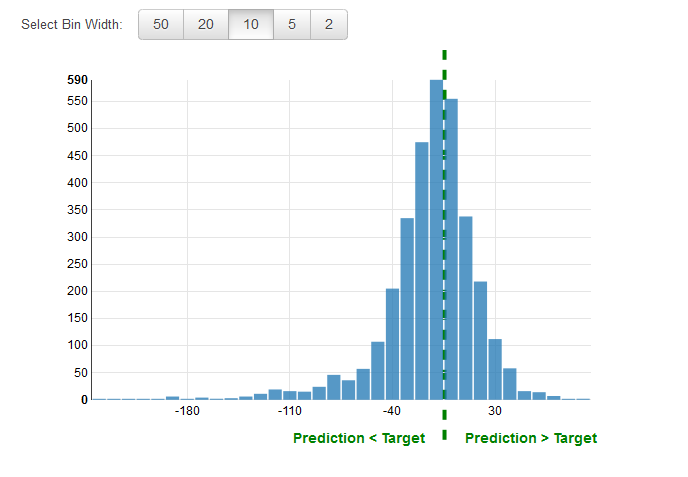

We are no longer updating the Amazon Machine Learning service or accepting
new users for it. This documentation is available for existing users, but we are
no longer updating it. For more information, see [What is Amazon Machine Learning](what-is-amazon-machine-learning.md "what-is-amazon-machine-learning.md").

# Regression

For regression tasks, the typical accuracy metrics are root mean square error (RMSE) and mean absolute
percentage error (MAPE). These metrics measure the distance between the predicted numeric target and
the actual numeric answer (ground truth). In Amazon ML, the RMSE metric is used to
evaluate the predictive accuracy of a regression model.

Figure 3: Distribution of residuals for a Regression model

It is common practice to review the _residuals_ for regression problems. A residual for an observation in the
evaluation data is the difference between the true target and the predicted target. Residuals represent the
portion of the target that the model is unable to predict. A positive residual indicates that the model is
underestimating the target (the actual target is larger than the predicted target). A negative residual
indicates an overestimation (the actual target is smaller than the predicted target). The histogram of the
residuals on the evaluation data when distributed in a bell shape and centered at zero indicates that the
model makes mistakes in a random manner and does not systematically over or under predict any particular
range of target values. If the residuals do not form a zero-centered bell shape, there is some structure in the
model’s prediction error. Adding more variables to the model might help the model capture the pattern that
is not captured by the current model.
