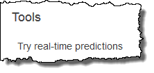
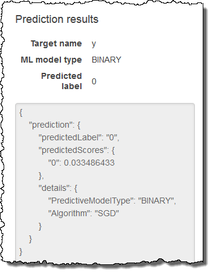
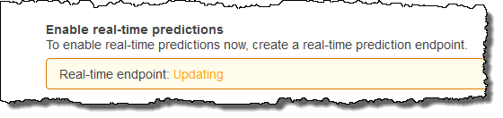
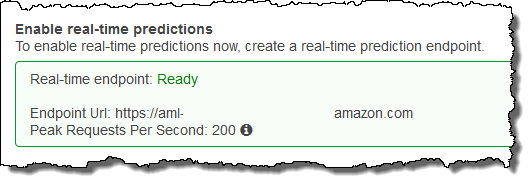

We are no longer updating the Amazon Machine Learning service or accepting
new users for it. This documentation is available for existing users, but we are
no longer updating it. For more information, see [What is Amazon Machine Learning](what-is-amazon-machine-learning.md "what-is-amazon-machine-learning.md").

# Requesting Real-time Predictions

A real-time prediction is a synchronous call to Amazon Machine Learning (Amazon ML).
The prediction is made when Amazon ML gets the request, and the response is returned immediately.
Real-time predictions are commonly used to enable predictive capabilities within interactive
web, mobile, or desktop applications. You can query an ML model created with Amazon ML
for predictions in real time by using the low-latency `Predict` API. The
`Predict` operation accepts a single input observation in the request payload, and
returns the prediction synchronously in the response. This sets it apart from the batch
prediction API, which is invoked with the ID of an Amazon ML datasource object that points to the
location of the input observations, and asynchronously returns a URI to a file that contains
predictions for all these observations. Amazon ML responds to most real-time prediction requests
within 100 milliseconds.

You can try real-time predictions without incurring charges in the Amazon ML console. If you
then decide to use real-time predictions, you must first create an endpoint for
real-time prediction generation. You can do this in the Amazon ML console or by using the
`CreateRealtimeEndpoint` API. After you have an endpoint, use the real-time
prediction API to generate real-time predictions.

###### Note

After you create a real-time endpoint for your model, you will start incurring a capacity
reservation charge that is based on the model's size. For more information, see [Pricing](http://aws.amazon.commachine-learning/pricing/ "http://aws.amazon.commachine-learning/pricing/"). If you create the
real-time endpoint in the console, the console displays a breakdown of the estimated charges
that the endpoint will accrue on an ongoing basis. To stop incurring the charge when you no
longer need to obtain real-time predictions from that model, remove the real-time endpoint by
using the console or the `DeleteRealtimeEndpoint` operation.

For examples of `Predict` requests and responses, see [Predict](../APIReference/API_Predict.md "../APIReference/API_Predict.md") in the _Amazon Machine Learning API Reference_.
To see an example of the exact response format that uses your model, see [Trying Real-Time Predictions](#testing-real-time-predictions "#testing-real-time-predictions").

###### Topics

- [Trying Real-Time Predictions](#testing-real-time-predictions "#testing-real-time-predictions")
- [Creating a Real-Time Endpoint](#creating-a-real-time-endpoint "#creating-a-real-time-endpoint")
- [Locating the Real-time Prediction Endpoint
  (Console)](#locate-endpoint-by-console "#locate-endpoint-by-console")
- [Locating the Real-time Prediction
  Endpoint (API)](#locating-the-real-time-prediction-endpoint "#locating-the-real-time-prediction-endpoint")
- [Creating a Real-time Prediction Request](#real-time-prediction-request-format "#real-time-prediction-request-format")
- [Deleting a Real-Time Endpoint](#delete-endpoint "#delete-endpoint")

## Trying Real-Time Predictions

To help you decide whether to enable real-time prediction, Amazon ML allows you to try
generating predictions on single data records without incurring the additional charges
associated with setting up a real-time prediction endpoint. To try real-time prediction,
you must have an ML model. To create real-time predictions on a larger scale, use the
[Predict](../APIReference/API_Predict.md "../APIReference/API_Predict.md") API in the
_Amazon Machine Learning API Reference_.

###### To try real-time predictions

1. Sign in to the AWS Management Console and open the Amazon Machine Learning console at
   [https://console.aws.amazon.com/machinelearning/](https://console.aws.amazon.com/machinelearning/ "https://console.aws.amazon.com/machinelearning/").
2. In the navigation bar, in the **Amazon Machine Learning** drop down,
   choose **ML models**.
3. Choose the model that you want to use to try real-time predictions, such as the
   `Subscription propensity model` from the tutorial.
4. On the ML model report page, under **Predictions**, choose
   **Summary**, and then choose **Try real-time
   predictions**.



Amazon ML shows a list of the variables that made up the data records that Amazon ML used to train your model. 5. You can proceed by entering data in each of the fields in the form or by pasting a single data
record, in CSV format, into the text box.

To use the form, for each **Value** field, enter the data that you want to
use to test your real-time predictions. If
the data record you are entering does not contain values for one or more data attributes,
leave the entry fields blank.

To provide a data record, choose **Paste a record**. Paste a
single CSV-formatted row of data into the text field, and choose **Submit**.
Amazon ML auto-populates the **Value** fields for you.

###### Note

The data in the data record must have the same number of columns as the training data,
and be arranged in the same order. The only exception is that you should omit the target
value. If you include a target value, Amazon ML ignores it. 6. At the bottom of the page, choose **Create prediction**. Amazon ML returns
the prediction immediately.

In the **Prediction results** pane, you see the prediction object
that the `Predict` API call returns, along with the ML model type, the
name of the target variable, and the predicted class or value. For information about
interpreting the results, see [Interpreting the Contents of Batch Prediction Files for a Binary Classification ML
model](reading-the-batchprediction-output-files.md#interpreting-the-contents-of-batch-prediction-files-for-a-binary-classification-ml-model "reading-the-batchprediction-output-files.md#interpreting-the-contents-of-batch-prediction-files-for-a-binary-classification-ml-model").



## Creating a Real-Time Endpoint

To generate real-time predictions, you need to create a real-time endpoint.
To create a real-time endpoint, you must already have an ML model for which you want to
generate real-time predictions. You can create a real-time endpoint by using the
Amazon ML console or by calling the `CreateRealtimeEndpoint` API. For more
information on using the `CreateRealtimeEndpoint` API, see
[https://docs.aws.amazon.com/machine-learning/latest/APIReference/API_CreateRealtimeEndpoint.html](../APIReference/API_CreateRealtimeEndpoint.md "../APIReference/API_CreateRealtimeEndpoint.md") in the Amazon Machine Learning API Reference.

###### To create a real-time endpoint

1. Sign in to the AWS Management Console and open the Amazon Machine Learning console at
   [https://console.aws.amazon.com/machinelearning/](https://console.aws.amazon.com/machinelearning/ "https://console.aws.amazon.com/machinelearning/").
2. In the navigation bar, in the **Amazon Machine Learning** drop down,
   choose **ML models**.
3. Choose the model for which you want to generate real-time predictions.
4. On the **ML model summary** page, under
   **Predictions**, choose **Create real-time
   endpoint**.

A dialog box that explains how real-time predictions are priced appears. 5. Choose **Create**. The real-time endpoint request is sent to Amazon ML and
entered into a queue. The status of the real-time endpoint is **Updating**.

 6. When the real-time endpoint is ready, the status changes to
**Ready**, and Amazon ML displays the endpoint URL. Use the endpoint URL to
create real-time prediction requests with the `Predict` API. For more
information about using the `Predict` API, see
[https://docs.aws.amazon.com/machine-learning/latest/APIReference/API_Predict.html](../APIReference/API_Predict.md "../APIReference/API_Predict.md") in the Amazon Machine Learning API Reference.



## Locating the Real-time Prediction Endpoint

(Console)

To use the Amazon ML console to find the endpoint URL for an ML model navigate to the model's
**ML model summary** page.

###### To locate a real-time endpoint URL

1. Sign in to the AWS Management Console and open the Amazon Machine Learning console at
   [https://console.aws.amazon.com/machinelearning/](https://console.aws.amazon.com/machinelearning/ "https://console.aws.amazon.com/machinelearning/").
2. In the navigation bar, in the **Amazon Machine Learning** drop down,
   choose **ML models**.
3. Choose the model for which you want to generate real-time predictions.
4. On the **ML model summary** page, scroll down until you see the
   **Predictions** section.
5. The endpoint URL for the model is listed in **Real-time prediction**.
   Use the URL as the **Endpoint Url** URL for your real-time prediction
   calls. For information on how to use the endpoint to generate predictions, see
   [https://docs.aws.amazon.com/machine-learning/latest/APIReference/API_Predict.html](../APIReference/API_Predict.md "../APIReference/API_Predict.md") in the Amazon Machine Learning API Reference.

## Locating the Real-time Prediction

Endpoint (API)

When you
create a real-time endpoint by using the `CreateRealtimeEndpoint` operation, the
URL and status of the endpoint is returned to you in the response. If you created the
real-time endpoint by using the console or if you want to retrieve the URL and status of an
endpoint that you created earlier, call the `GetMLModel` operation with the ID of
the model that you want to query for real-time
predictions. The endpoint information is contained in the `EndpointInfo` section of
the response. For a model that has a real-time endpoint associated with it, the
`EndpointInfo` might look like this:

```
"EndpointInfo":{
    "CreatedAt": 1427864874.227,
    "EndpointStatus": "READY",
    "EndpointUrl": "https://endpointUrl",
    "PeakRequestsPerSecond": 200
}
```

A model without a real-time endpoint would return the following:

```
EndpointInfo":{
    "EndpointStatus": "NONE",
    "PeakRequestsPerSecond": 0
}
```

## Creating a Real-time Prediction Request

A sample `Predict` request payload might look like this:

```
{
    "MLModelId": "model-id",
    "Record":{
        "key1": "value1",
        "key2": "value2"
    },
    "PredictEndpoint": "https://endpointUrl"
}
```

The `PredictEndpoint` field must correspond to the `EndpointUrl`
field of the `EndpointInfo` structure. Amazon ML uses this field to route the request to the
appropriate servers in the real-time prediction fleet.

The `MLModelId` is the identifier of a previously trained model with a
real-time endpoint.

A `Record` is a map of variable names to variable values. Each pair represents
an observation. The `Record` map contains the inputs to your Amazon ML model. It is
analogous to a single row of data in your training data set, without the target variable.
Regardless of the type of values in the training data, `Record` contains a
string-to-string mapping.

###### Note

You can omit variables for which you do not have a value, although this
might reduce the accuracy of your prediction. The more variables you can include,
the more accurate your model is.

The format of the response returned by `Predict` requests depends on the type
of model that is being queried for prediction. In all cases, the `details` field
contains information about the prediction request, notably including the
`PredictiveModelType` field with the model type.

The following example shows a response for a binary model:

```
{
    "Prediction":{
        "details":{
            "PredictiveModelType": "BINARY"
        },
        "predictedLabel": "0",
        "predictedScores":{
            "0": 0.47380468249320984
        }
    }
}
```

Notice the `predictedLabel` field that contains the predicted label, in this
case 0. Amazon ML computes the predicted label by comparing the prediction score against the
classification cut-off:

- You can obtain the classification cut-off that is currently associated with an ML
  model by inspecting the `ScoreThreshold` field in the response of the
  `GetMLModel` operation, or by viewing the model information in the Amazon ML
  console. If you do not set a score threshold, Amazon ML uses the default value of 0.5.
- You can obtain the exact prediction score for a binary classification model by
  inspecting the `predictedScores` map. Within this map, the predicted label is
  paired with the exact prediction score.

For more information about binary predictions, see [Interpreting the Predictions](binary-model-insights.md#interpreting-the-predictions "binary-model-insights.md#interpreting-the-predictions").

The following example shows a response for a regression model. Notice that the predicted
numeric value is found in the `predictedValue` field:

```
{
    "Prediction":{
        "details":{
            "PredictiveModelType": "REGRESSION"
        },
        "predictedValue": 15.508452415466309
    }
}
```

The following example shows a response for a multiclass model:

```
{
    "Prediction":{
        "details":{
            "PredictiveModelType": "MULTICLASS"
        },
        "predictedLabel": "red",
        "predictedScores":{
            "red": 0.12923571467399597,
            "green": 0.08416014909744263,
            "orange": 0.22713537514209747,
            "blue": 0.1438363939523697,
            "pink": 0.184102863073349,
            "violet": 0.12816807627677917,
            "brown": 0.10336143523454666
        }
    }
}
```

Similar to binary classification models, the predicted label/class is found in the
`predictedLabel` field. You can further understand how strongly the prediction is
related to each class by looking at the `predictedScores` map. The higher the score
of a class within this map, the more strongly the prediction is related to the class, with the
highest value ultimately being selected as the `predictedLabel`.

For more information about multiclass predictions, see [Multiclass Model Insights](multiclass-model-insights.md "multiclass-model-insights.md").

## Deleting a Real-Time Endpoint

When you've completed your real-time predictions, delete the real-time endpoint to avoid
incurring additional charges. Charges stop accruing as soon as you delete your endpoint.

###### To delete a real-time endpoint

1. Sign in to the AWS Management Console and open the Amazon Machine Learning console at
   [https://console.aws.amazon.com/machinelearning/](https://console.aws.amazon.com/machinelearning/ "https://console.aws.amazon.com/machinelearning/").
2. In the navigation bar, in the **Amazon Machine Learning** drop down,
   choose **ML models**.
3. Choose the model that no longer requires real-time predictions.
4. On the ML model report page, under **Predictions**, choose
   **Summary**.
5. Choose **Delete real-time endpoint**.
6. In the **Delete real-time endpoint** dialog box, choose
   **Delete**.
