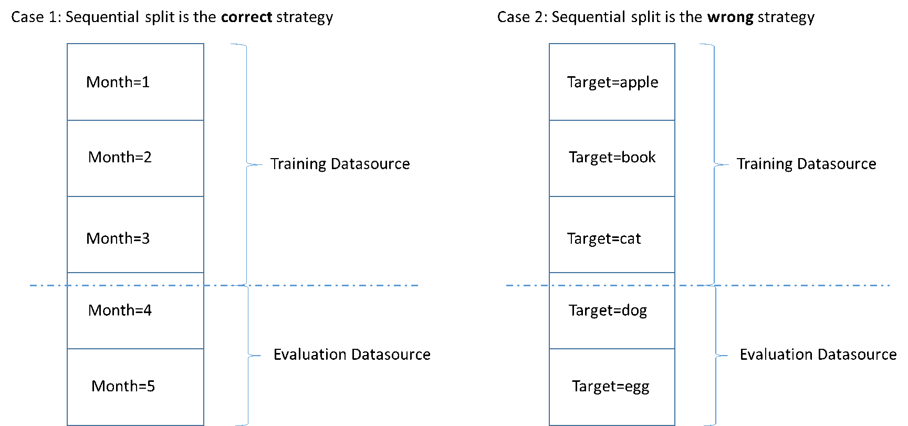
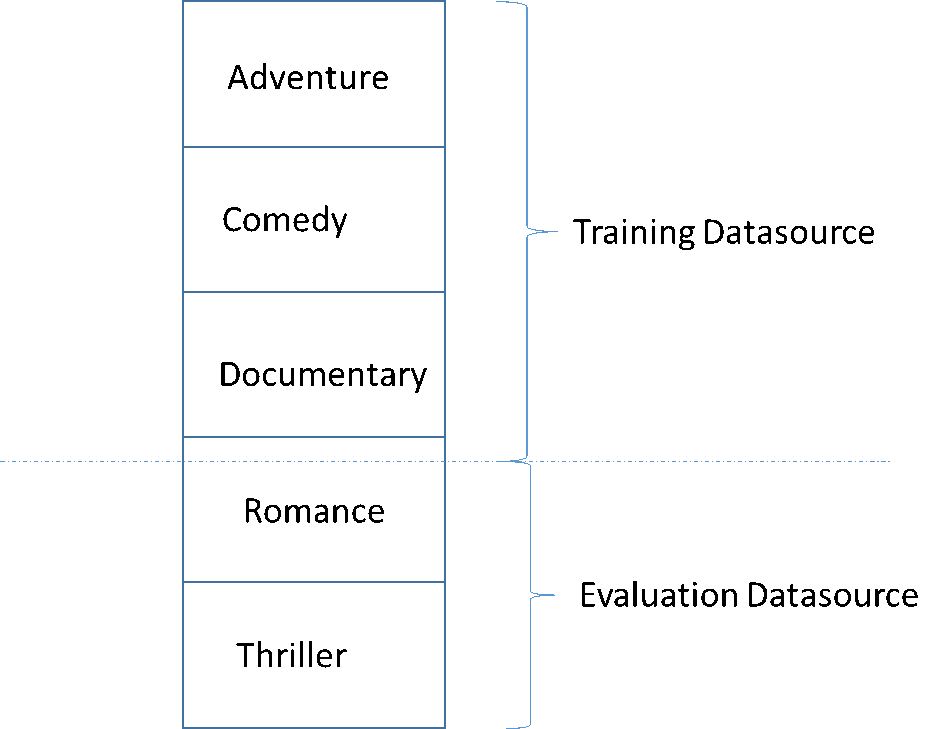

We are no longer updating the Amazon Machine Learning service or accepting
new users for it. This documentation is available for existing users, but we are
no longer updating it. For more information, see [What is Amazon Machine Learning](what-is-amazon-machine-learning.md "what-is-amazon-machine-learning.md").

# Splitting Your Data

The fundamental goal of an ML model is to make accurate predictions on future data
instances beyond those used to train models. Before using an ML model to make predictions, we
need to evaluate the predictive performance of the model. To estimate the quality of an ML
models predictions with data it has not seen, we can reserve, or split, a portion of the data
for which we already know the answer as a proxy for future data and evaluate how well the ML
model predicts the correct answers for that data. You split the datasource into a portion for
the training datasource and a portion for the evaluation
datasource.

Amazon ML provides three options for splitting your data:

- **Pre-split the data** - You can split the data into two
  data input locations, before uploading them to Amazon Simple Storage Service (Amazon S3) and creating two separate
  datasources with them.
- **Amazon ML sequential split** - You can tell Amazon ML to split
  your data sequentially when creating the training and evaluation datasources.
- **Amazon ML random split** - You can tell Amazon ML to split your
  data using a seeded random method when creating the training and evaluation
  datasources.

## Pre-splitting Your Data

If you want explicit control over the data in your training and evaluation datasources,
split your data into separate data locations, and create a separate datasources for the
input and evaluation locations.

## Sequentially Splitting Your Data

A simple way to split your input data for training and evaluation is to select
non-overlapping subsets of your data while preserving the order of the data records. This
approach is useful if you want to evaluate your ML models on data for a certain date or
within a certain time range.
For
example, say that you have customer engagement data for the past five months, and you want
to use this historical data to predict customer engagement in the next month. Using the
beginning of the range for training, and the data from the end of the range for evaluation
might produce a more accurate estimate of the model’s quality than using records data drawn
from the entire data range.

The following figure shows examples of when you should use a sequential splitting
strategy versus when you should use a random strategy.

When you create a datasource, you can choose to split your datasource sequentially, and
Amazon ML uses the first 70 percent of your data for training and the remaining 30 percent of the
data for evaluation. This is the default approach when you use the Amazon ML console to split
your data.

## Randomly Splitting Your Data

Randomly splitting the input data into training and evaluation datasources ensures that
the distribution of the data is similar in the training and evaluation datasources. Choose
this option when you don't need to preserve the order of your input data.

Amazon ML uses a seeded pseudo-random number generation method to split your data. The seed
is based partly on an input string value and partially on the content of the data itself. By
default, the Amazon ML console uses the S3 location of the input data as the string. API users
can provide a custom string. This means that given the same S3 bucket and data, Amazon ML splits
the data the same way every time. To change how Amazon ML splits the data, you can use the
`CreateDatasourceFromS3`, `CreateDatasourceFromRedshift`, or
`CreateDatasourceFromRDS` API and provide a value for the seed string. When
using these APIs to create separate datasources for training and evaluation, it is important
to use the same seed string value for both datasources and the complement flag for one
datasource, to ensure that there is no overlap between the training and evaluation
data.

A common pitfall in developing a high-quality ML model is evaluating the ML model on
data that is not similar to the data used for training. For example, say you are using ML to
predict the genre of movies, and your training data contains movies from the Adventure,
Comedy, and Documentary genres. However, your evaluation data contains only data from the
Romance and Thriller genres. In this case, the ML model did not learn any information about
the Romance and Thriller genres, and the evaluation did not evaluate how well the model
learned patterns for the Adventure, Comedy, and Documentary genres. As a result, the genre
information is useless, and the quality of the ML model predictions for all of the genres is
compromised. The model and evaluation are too dissimilar (have extremely different
descriptive statistics) to be useful. This can happen when input data is sorted by one of
the columns in the dataset, and then split sequentially.

If your training and evaluation datasources have different data distributions, you will
see an evaluation alert in your model evaluation. For more information about evaluation
alerts, see [Evaluation Alerts](evaluation-alerts.md "evaluation-alerts.md").

You do not need to
use random splitting in Amazon ML if you have already randomized your input data, for example, by
randomly shuffling your input data in Amazon S3, or by using a Amazon Redshift SQL query's
`random()` function or a MySQL SQL query's `rand()` function when
creating the datasources. In these cases, you can rely on the sequential split option to
create training and evaluation datasources with similar distributions.
