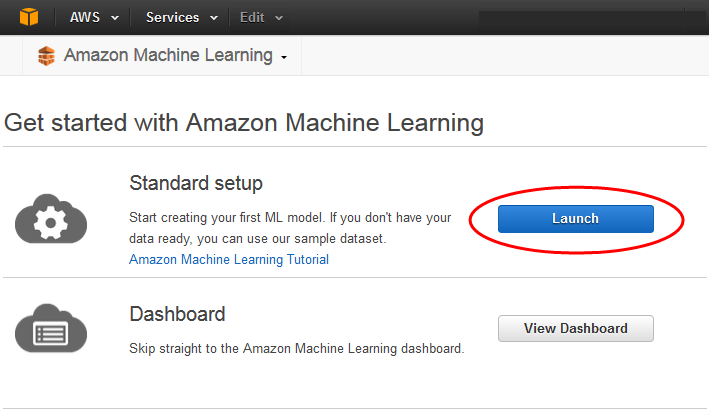
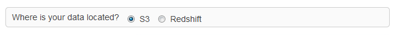
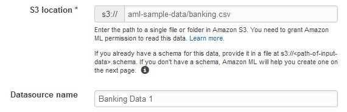
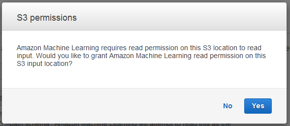
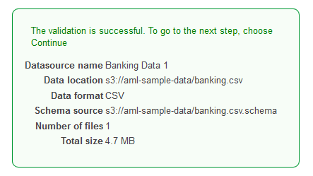
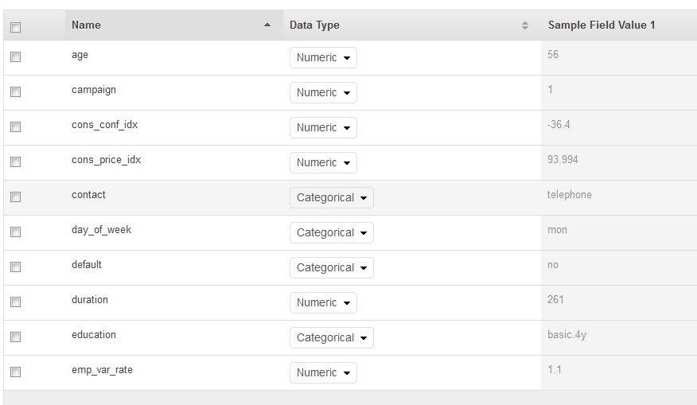
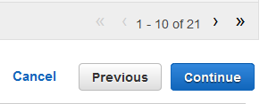
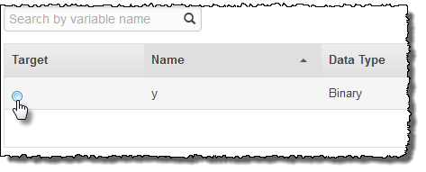

We are no longer updating the Amazon Machine Learning service or accepting
new users for it. This documentation is available for existing users, but we are
no longer updating it. For more information, see [What is Amazon Machine Learning](what-is-amazon-machine-learning.md "what-is-amazon-machine-learning.md").

# Step 2: Create a Training Datasource

After you upload the `banking.csv` dataset to your Amazon Simple Storage Service (Amazon S3) location, you
use it to create a training datasource. A datasource is an Amazon Machine Learning (Amazon ML) object that contains
the location of your input data and important metadata about your input data. Amazon ML uses the
datasource for operations like ML model training and
evaluation.

To create a datasource, provide the following:

- The Amazon S3 location of your data and permission to access the data
- The schema, which includes the names of the attributes in the data and the type of each
  attribute (Numeric, Text, Categorical, or Binary)
- The name of the attribute that contains the answer that you want Amazon ML to learn to
  predict, the target attribute

###### Note

The datasource doesn't actually store your data, it only references it. Avoid moving or
changing the files stored in Amazon S3. If you do move or change them, Amazon ML can't access them to
create an ML model, generate evaluations, or generate predictions.

###### To create the training datasource

1. Open the Amazon Machine Learning console at
   [https://console.aws.amazon.com/machinelearning/](https://console.aws.amazon.com/machinelearning/ "https://console.aws.amazon.com/machinelearning/").
2. Choose **Get started**.

###### Note

This tutorial assumes that this is your first time using Amazon ML. If you have used Amazon ML
before, you can use the **Create new...** drop down list on the Amazon ML
dashboard to create a new datasource. 3. On the **Get started with Amazon Machine Learning** page, choose
**Launch**.

 4. On the **Input Data** page, for **Where is your data
located**?, make sure that **S3** is selected.

 5. For **S3 Location**, type the full location of the `banking.csv` file from Step 1: Prepare Your Data. For example:
`your-bucket``/banking.csv`. Amazon ML prepends
s3:// to your bucket name for you. 6. For **Datasource name**, type `Banking Data
 1`.

 7. Choose **Verify**. 8. In the **S3 permissions** dialog box, choose **Yes**.

 9. If Amazon ML can access and read the data file at the S3 location, you will see a page
similar to the following. Review the properties, and then choose
**Continue**.

Next, you establish a schema. A _schema_ is the information Amazon ML needs to
interpret the input data for an ML model, including attribute names and their assigned data
types, and the names of special attributes. There are two ways to provide Amazon ML with a schema:

- Provide a separate schema file when you upload your Amazon S3 data.
- Allow Amazon ML to infer the attribute types and create a schema for you.
  In this tutorial, we'll ask Amazon ML to infer the schema.

For information about creating a separate schema file, see [Creating a Data Schema for Amazon ML](creating-a-data-schema-for-amazon-ml.md "creating-a-data-schema-for-amazon-ml.md").

###### To allow Amazon ML to infer the schema

1. On the **Schema** page, Amazon ML shows you the schema that it inferred.
   Review the data types that Amazon ML inferred for the attributes. It is important that attributes
   are assigned the correct data type to help Amazon ML ingest the data correctly
   and to enable the correct feature processing on the attributes.
   - Attributes that have only two possible states, such as yes or no, should be marked as
     **Binary**.
   - Attributes that are numbers or strings that are used to denote a category should
     be marked as **Categorical**.
   - Attributes that are numeric quantities for which the order is meaningful should be
     marked as **Numeric**.
   - Attributes that are strings that you would like to treat as words delimited by
     spaces should be marked as **Text**.

 2. In this tutorial, Amazon ML has correctly identified the data types for all of the attributes, so choose
**Continue**.
Next, select a target attribute.

Remember that the target is the attribute that the ML model must learn to predict. Attribute
**y** indicates whether an individual has subscribed to a campaign in the past: 1 (yes) or 0 (no).

###### Note

Choose a target attribute only if you will use the datasource for training and
evaluating ML models.

###### To select y as the target attribute

1. In the lower right of the table, choose the single arrow to advance to the last page of
   the table, where the attribute named `y` appears.

 2. In the **Target** column, select `y`.

Amazon ML confirms that **y** is selected as your target. 3. Choose **Continue**. 4. On the **Row ID** page, for **Does your data contain an
identifier?** , make sure that **No**, the default, is selected. 5. Choose **Review**, and then choose **Continue**.
Now that you have a training datasource, you're ready to [create your model](step-3-create-an-ml-model.md "step-3-create-an-ml-model.md").
