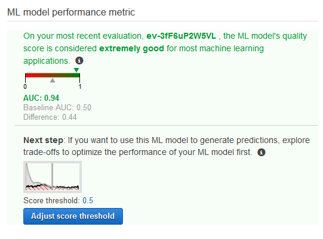
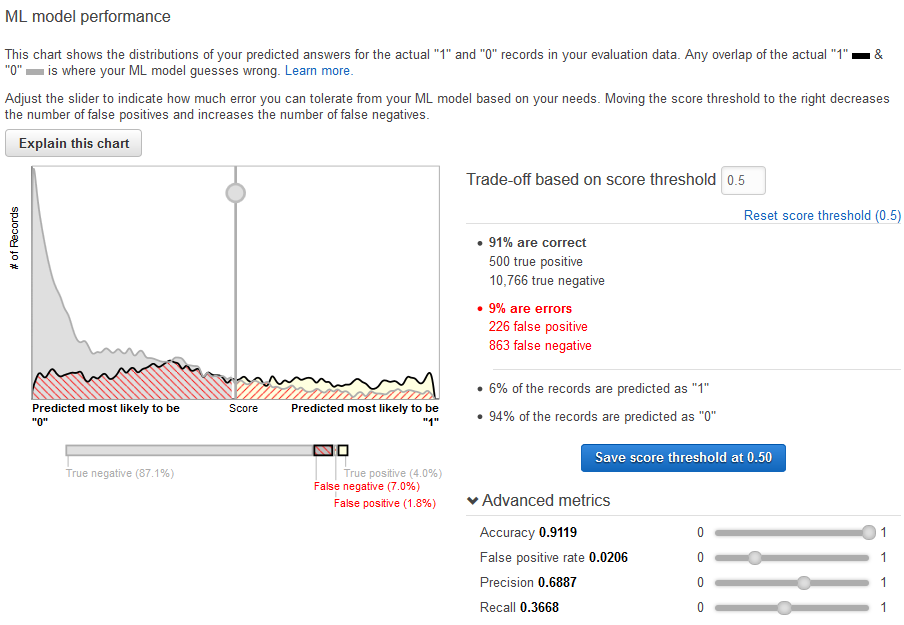
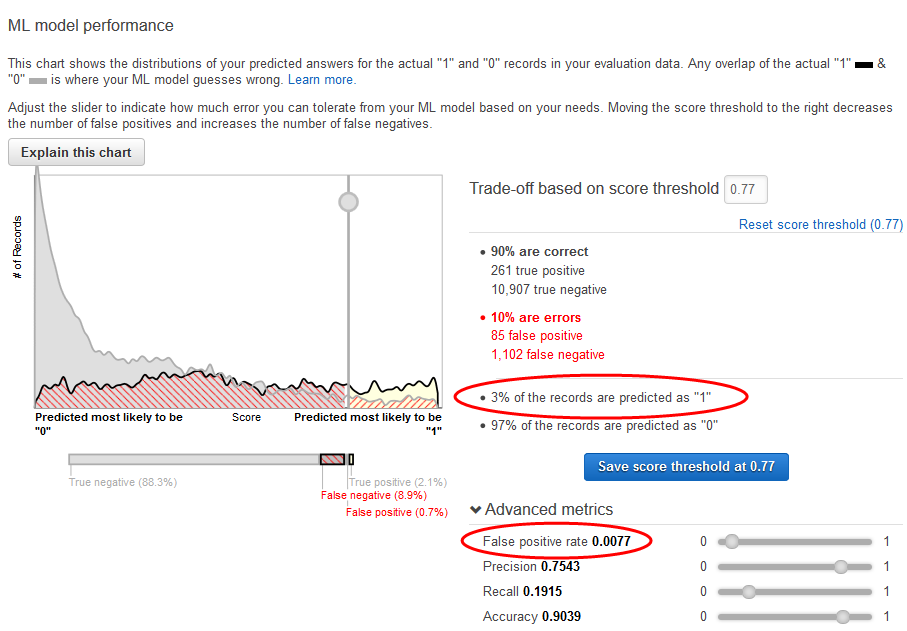

We are no longer updating the Amazon Machine Learning service or accepting
new users for it. This documentation is available for existing users, but we are
no longer updating it. For more information, see [What is Amazon Machine Learning](what-is-amazon-machine-learning.md "what-is-amazon-machine-learning.md").

# Step 4: Review the ML Model's Predictive

Performance and Set a Score Threshold

Now that you've created your ML model and Amazon Machine Learning (Amazon ML) has evaluated it, let's see if it
is good enough to put to use. During evaluation, Amazon ML computed an industry-standard quality
metric, called the Area Under a Curve (AUC) metric, that expresses the performance quality of
your ML model. Amazon ML also interprets the AUC metric to tell you if the quality of the ML model is
adequate for most machine learning applications. (Learn more about AUC in [Measuring ML Model Accuracy](binary-model-insights.md#measuring-ml-model-accuracy "binary-model-insights.md#measuring-ml-model-accuracy").) Let's
review the AUC metric, and then adjust the score threshold or cut-off to optimize your model's
predictive performance.

###### To review the AUC metric for your ML model

1. On the **ML model summary** page, in the **ML model
   report** navigation pane, choose **Evaluations**, choose
   **Evaluation: ML model: Banking model 1**, and then choose **Summary**.
2. On the **Evaluation summary** page, review the evaluation summary,
   including the model's AUC performance metric.

The ML model generates numeric prediction scores for each record in
a
prediction datasource, and then applies a threshold to convert these scores
into binary labels of 0 (for no) or 1 (for yes). By changing the _score
threshold_, you can adjust how the ML model assigns these labels. Now, set the score
threshold.

**To set a score threshold for your ML model**

1. On the **Evaluation Summary** page, choose **Adjust Score
   Threshold.**

You can fine-tune your ML model performance metrics by adjusting the
score threshold. Adjusting this value changes the level of confidence that the model must have
in a prediction before it considers the prediction to be positive. It also changes how many
false negatives and false positives you are willing to tolerate in your predictions.

You can
control the cutoff for what the model considers a positive prediction by increasing the score
threshold until it considers only the predictions with the highest likelihood of being true
positives as positive. You can also reduce the score threshold until you no longer have any
false negatives. Choose your cutoff to reflect your business needs. For this tutorial, each
false positive costs campaign money, so we want a high ratio of true positives to false
positives. 2. Let's say you want to target the top 3% of the customers that will subscribe to the
product. Slide the vertical selector to set the score threshold to a value that corresponds to
**3% of the records are predicted as "1"**.

Note the impact of this score threshold on the ML model's performance: the false positive
rate is 0.007. Let's assume that that false positive rate is acceptable. 3. Choose **Save score threshold at 0.77**.
Every time you use this ML model to make predictions, it will predict records with scores
over 0.77 as "1", and the rest of the records as "0".

To learn more about the score threshold, see [Binary Classification](binary-classification.md "binary-classification.md").

Now you are ready to [create predictions using your model](step-5-create-predictions.md "step-5-create-predictions.md").
