We are no longer updating the Amazon Machine Learning service or accepting
new users for it. This documentation is available for existing users, but we are
no longer updating it. For more information, see [What is Amazon Machine Learning](what-is-amazon-machine-learning.md "what-is-amazon-machine-learning.md").

# Step 5: Use the ML Model to Generate

Predictions

Amazon Machine Learning (Amazon ML) can generate two types of predictions—batch and real-time.

A _real-time prediction_ is a prediction for a single observation that
Amazon ML generates on demand. Real-time predictions are ideal for mobile apps, websites, and other
applications that need to use results interactively.

A _batch prediction_ is a set of predictions for a group of
observations. Amazon ML processes the records in a batch prediction together, so processing can
take some time. Use batch predictions for applications that require predictions for set of observations or predictions
that don't use
results interactively.

For this tutorial, you will generate a real-time prediction that predicts whether one
potential customer will subscribe to the new product. You will also generate predictions for a
large batch of potential customers. For the batch prediction, you will use the
`banking-batch.csv` file that you uploaded in [Step 1: Prepare Your Data](step-1-download-edit-and-upload-data.md "step-1-download-edit-and-upload-data.md").

Let's start with a real-time prediction.

###### Note

For applications that require real-time predictions, you must create a real-time endpoint
for the ML model. You accrue charges while a real-time endpoint is available. Before you
commit to using real-time predictions and begin incurring the cost associated with them, you
can try using the real-time prediction feature in your web browser,
without creating a real-time endpoint. That's what we'll do for this tutorial.

###### To try a real-time prediction

1. In the **ML model report** navigation pane, choose **Try
   real-time predictions**.

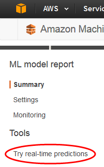 2. Choose **Paste a record**.

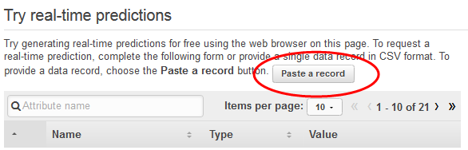 3. In the **Paste a record** dialog box, paste the following
observation:

```
32,services,divorced,basic.9y,no,unknown,yes,cellular,dec,mon,110,1,11,0,nonexistent,-1.8,94.465,-36.1,0.883,5228.1
```

4. In the **Paste a record** dialog box, choose
   **Submit** to confirm that you want to generate a prediction for this
   observation. Amazon ML populates the values in the real-time prediction form.

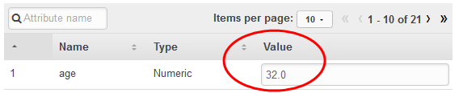

###### Note

You can also populate the **Value** fields by typing in individual
values. Regardless of the method you choose, you should provide an observation that wasn't
used to train the model. 5. At the bottom of the page, choose **Create prediction**.

The prediction appears in the **Prediction results** pane on the right.
This prediction has a **Predicted label** of `0`, which means
that this potential customer is unlikely to respond to the campaign. A **Predicted
label** of `1` would mean that the customer is likely to respond to
the campaign.


Now, create a batch prediction. You will provide Amazon ML with the name of the ML model you are
using; the Amazon Simple Storage Service (Amazon S3) location of the input data for which you want to generate predictions
(Amazon ML will create a batch prediction datasource from this data); and the Amazon S3 location for
storing the results.

###### To create a batch prediction

1. Choose **Amazon Machine Learning**, and then choose **Batch
   Predictions**.

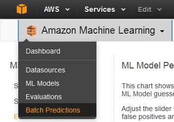 2. Choose **Create new batch prediction**. 3. On the **ML model for batch predictions** page, choose **ML
model: Banking Data 1**.

Amazon ML displays the ML model name, ID, creation time, and the associated datasource ID. 4. Choose **Continue**. 5. To generate predictions, you need to provide Amazon ML the data that you need predictions
for. This is called the _input data_. First, put the input data into a
datasource so that Amazon ML can access it.

For **Locate the input data**, choose **My data is in S3, and I
need to create a datasource**.

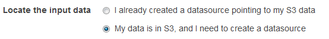 6. For **Datasource name**, type `Banking Data 2`. 7. For **S3 Location**, type the full location of the
`banking-batch.csv` file:
`your-bucket``/banking-batch.csv`. 8. For **Does the first line in your CSV contain the column names?**,
choose **Yes**. 9. Choose **Verify**.

Amazon ML validates the location of your data. 10. Choose **Continue**. 11. For **S3 destination**, type the name of the Amazon S3 location where you
uploaded the files in Step 1: Prepare Your Data. Amazon ML uploads the prediction results
there. 12. For **Batch prediction name**, accept the default,
`Batch prediction: ML model: Banking Data
 1`. Amazon ML
chooses the default name based on the model it will use to create predictions. In this
tutorial, the model and the predictions are named after the training datasource,
`Banking Data 1`. 13. Choose **Review**. 14. In the **S3 permissions** dialog box, choose
**Yes**.

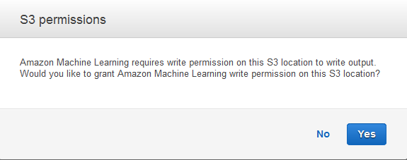 15. On the **Review** page, choose **Finish**.

The batch prediction request is sent to Amazon ML and entered into a queue. The time it takes
Amazon ML to process a batch prediction depends on the size of your datasource and the complexity
of your ML model. While Amazon ML processes the request, it reports a status of
**In Progress**. After the batch prediction has completed, the request's
status changes to **Completed**. Now, you can view the results.

###### To view the predictions

1. Choose **Amazon Machine Learning**, and then choose
   **Batch
   Predictions**.

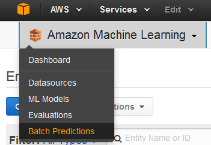 2. In the list of predictions, choose **Batch prediction: ML model: Banking Data
1**. The **Batch prediction info** page appears.

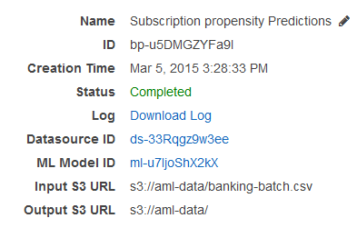 3. To view the results of the batch prediction, go to the Amazon S3 console at [https://console.aws.amazon.com/s3/](https://console.aws.amazon.com/s3/ "https://console.aws.amazon.com/s3/")
and navigate to the Amazon S3 location referenced in the **Output S3 URL** field. From
there, navigate to the results folder, which will have a name similar to
`s3://aml-data/batch-prediction/result`.

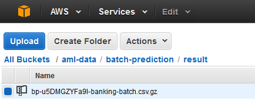

The prediction is stored in a compressed .gzip file with the .gz extension. 4. Download the prediction file to your desktop, uncompress it, and open it.

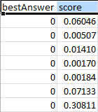

The file has two columns, **bestAnswer** and
**score**, and a row for each observation in your datasource. The results
in the **bestAnswer** column are based on the score threshold of 0.77 that
you set in [Step 4: Review the ML Model's Predictive
Performance and Set a Score Threshold](step-4-review-model-and-set-cutoff.md "step-4-review-model-and-set-cutoff.md"). A
**score** greater than 0.77 results in a **bestAnswer**
of 1, which is a positive response or prediction, and a **score** less than
0.77 results in a **bestAnswer** of 0, which is a negative response or
prediction.

The following examples show positive and negative predictions based on the score threshold
of 0.77.
Positive prediction:

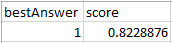
In this example, the value for **bestAnswer** is 1, and the value of
**score** is 0.8228876. The value for **bestAnswer** is 1
because the **score** is greater than the score threshold of 0.77. A
**bestAnswer** of 1 indicates that the customer is likely to purchase your
product, and is, therefore, considered a positive prediction.

Negative prediction:

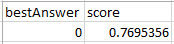
In this example, the value of **bestAnswer** is 0 because the
**score** value is 0.7695356, which is less than the score threshold of 0.77.
The **bestAnswer** of 0 indicates that the customer is unlikely to purchase
your product, and is, therefore, considered a negative prediction.

Each row of the batch result corresponds to a row in your batch input (an observation in your datasource).

After analyzing the predictions, you can execute your targeted marketing campaign; for
example, by sending fliers to everyone with a predicted score of `1`.

Now that you have created, reviewed, and used your model, [clean up the data and AWS resources you created](step-6-clean-up.md "step-6-clean-up.md") to avoid incurring unnecessary charges and to keep your workspace
uncluttered.
