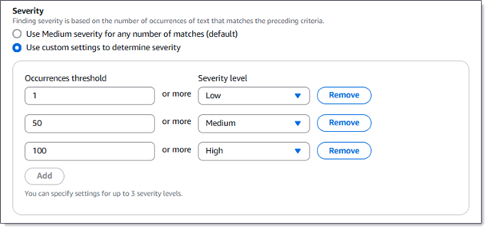

# Configuration options for custom data identifiers

By using custom data identifiers, you can define custom criteria for detecting sensitive
data in Amazon Simple Storage Service (Amazon S3) objects. You can supplement the [managed data identifiers](managed-data-identifiers.md "managed-data-identifiers.md") that Amazon Macie
provides, and detect sensitive data that reflects your organization's particular
scenarios, intellectual property, or proprietary data.

Each custom data identifier specifies detection criteria and, optionally, severity
settings for findings that the identifier produces. The detection criteria specify a
regular expression that defines a text pattern to match in an S3 object. The criteria
can also specify character sequences and a proximity rule that refine the results. The
severity settings specify which severity to assign to findings. Severity can be based on
the number of occurrences of text that match the identifier's detection criteria.

###### Topics

- [Detection
  criteria](#cdis-detection-criteria "#cdis-detection-criteria")
- [Severity settings for
  findings](#cdis-finding-severity "#cdis-finding-severity")

## Detection criteria

When you create a custom data identifier, you specify a regular expression
(_regex_) that defines a text pattern to match.
You can also specify character sequences, such as words and phrases, and a proximity
rule that refine the results. The character sequences can be: _keywords_, which are words or phrases that must be in
proximity of text that matches the regex, or _ignore
words_, which are words or phrases to exclude from results.

For the regex, Amazon Macie supports a subset of the pattern syntax provided by the
[Perl Compatible Regular Expressions (PCRE)
library](https://www.pcre.org/ "https://www.pcre.org/"). Of the constructs provided by the PCRE library, Macie doesn’t
support the following pattern elements:

- Backreferences
- Capturing groups
- Conditional patterns
- Embedded code
- Global pattern flags, such as `/i`, `/m`, and
  `/x`
- Recursive patterns
- Positive and negative look-behind and look-ahead zero-width assertions,
  such as `?=`, `?!`, `?<=`, and
  `?<!`

The regex can contain as many as 512 characters.

To create an effective regex pattern for a custom data identifier, note the
following tips and recommendations:

- Use anchors (`^` or `$`) only if you expect the
  pattern to appear at the beginning or end of a file, not the beginning or
  end of a line.
- For performance reasons, Macie limits the size of bounded repeat groups.
  For example, `\d{100,1000}` won’t compile in Macie. To
  approximate this functionality, you can use an open-ended repeat such as
  `\d{100,}`.
- To make parts of a pattern case insensitive, you can use the
  `(?i)` construct instead of the `/i` flag.
- There’s no need to optimize prefixes or alternations manually. For
  example, changing `/hello|hi|hey/` to
  `/h(?:ello|i|ey)/` won’t improve performance.
- For performance reasons, Macie limits the number of repeated wildcards.
  For example, `a*b*a*` won’t compile in Macie.

To protect against malformed or long-running expressions, Macie automatically tests regex
patterns against a collection of sample text when you create a custom data
identifier. If there's an issue with the regex, Macie returns an error that
describes the issue.

In addition to the regex, you can optionally specify character sequences and a proximity
rule to refine the results.

**Keywords**

These are specific character sequences that must be in proximity of
text that matches the regex pattern. The proximity requirements vary
based on an S3 object's storage format or file type:

- **Structured columnar data** – Macie includes a
  result if the text matches the regex pattern and a keyword is in
  the name of the field or column that stores the text, or the
  text is preceded by and within the maximum match distance of a
  keyword in the same field or cell value. This is the case for
  Microsoft Excel workbooks, CSV files, and TSV files.
- **Structured record-based data** – Macie includes
  a result if the text matches the regex pattern and the text is
  within the maximum match distance of a keyword. The keyword can
  be in the name of an element in the path to the field or array
  that stores the text, or it can precede and be part of the same
  value in the field or array that stores the text. This is the
  case for Apache Avro object containers, Apache Parquet files,
  JSON files, and JSON Lines files.
- **Unstructured data** –
  Macie includes a result if the text matches the regex pattern
  and the text is preceded by and within the maximum match
  distance of a keyword. This is the case for Adobe Portable
  Document Format files, Microsoft Word documents, email messages,
  and non-binary text files other than CSV, JSON, JSON Lines, and
  TSV files. This includes any structured data, such as tables, in
  these types of files.

You can specify as many as 50 keywords. Each keyword can contain
3–90 UTF-8 characters. Keywords aren't case sensitive.

**Maximum match distance**

This is a character-based proximity rule for keywords. Macie uses this
setting to determine whether a keyword precedes text that matches the
regex pattern. The setting defines the maximum number of characters that
can exist between the end of a complete keyword and the end of text that
matches the regex pattern. Macie includes a result if the text:

- Matches the regex pattern,
- Occurs after at least one complete keyword, and
- Occurs within the specified distance of the keyword.

Otherwise, Macie excludes the text from results.

You can specify a distance of 1–300 characters. The default distance is 50
characters. For best results, this distance should be greater than the
minimum number of characters of text that the regex is designed to
detect. If only part of the text is within the maximum match distance of
a keyword, Macie doesn’t include it in results.

**Ignore words**

These are specific character sequences to exclude from results. If text matches the
regex pattern but it contains an ignore word, Macie doesn't include it
in results.

You can specify as many as 10 ignore words. Each ignore word can
contain 4–90 UTF-8 characters. Ignore words are case
sensitive.

###### Note

Before you create a custom data identifier, we strongly recommend that you test and refine
its detection criteria with sample data. Because custom data identifiers are
used by sensitive data discovery jobs, you can't change a custom data identifier
after you create it. This helps ensure that you have an immutable history of sensitive data findings and discovery results for data privacy and protection audits or investigations that you perform.

You can test detection criteria by using the Amazon Macie console or the Amazon Macie API. To
test the criteria by using the console, use the options in the
**Evaluate** section while you're creating the custom data
identifier. To test the criteria programmatically, use the [TestCustomDataIdentifier](../APIReference/custom-data-identifiers-test.md "../APIReference/custom-data-identifiers-test.md") operation of the Amazon Macie API. If you're
using the AWS Command Line Interface, run the [test-custom-data-identifier](../../../cli/latest/reference/macie2/test-custom-data-identifier.md "../../../cli/latest/reference/macie2/test-custom-data-identifier.md") command to test the criteria.

For a demonstration of how keywords can help you find
sensitive data and avoid false positives, watch the following video:

## Severity settings for findings

When you create a custom data identifier, you can also specify custom severity
settings for sensitive data findings that the identifier produces. By default,
Amazon Macie assigns the _Medium_ severity to all the
findings that a custom data identifier produces. If an S3 object contains at least
one occurrence of text that matches the detection criteria, Macie automatically
assigns the _Medium_ severity to the resulting
finding.

With custom severity settings, you specify which severity to assign based on the number of
occurrences of text that match the detection criteria. You can define _occurrences thresholds_ for as many as three severity
levels: _Low_ (least severe), _Medium_, and _High_
(most severe). An _occurrences threshold_ is the
minimum number of matches that must exist in an S3 object to produce a finding with
the specified severity. If you specify more than one threshold, the thresholds must
be in ascending order by severity, moving from _Low_ to _High_.

For example, the following image shows severity settings that specify three
occurrences thresholds, one for each severity level that Macie supports.

The following table indicates the severity of the findings that the custom data
identifier produces.

| Occurrences threshold | Severity level | Result                                                                                                                                             |
| --------------------- | -------------- | -------------------------------------------------------------------------------------------------------------------------------------------------- |
| 1                     | Low            | If an S3 object contains 1–49 occurrences of text that match the detection criteria, the severity of the resulting finding is _Low_.         |
| 50                    | Medium         | If an S3 object contains 50–99 occurrences of text that match the detection criteria, the severity of the resulting finding is _Medium_.     |
| 100                   | High           | If an S3 object contains 100 or more occurrences of text that match the detection criteria, the severity of the resulting finding is _High_. |

You can also use severity settings to specify whether to create a finding at all.
If an S3 object contains fewer occurrences than the lowest occurrences threshold,
Macie doesn't create a finding.
