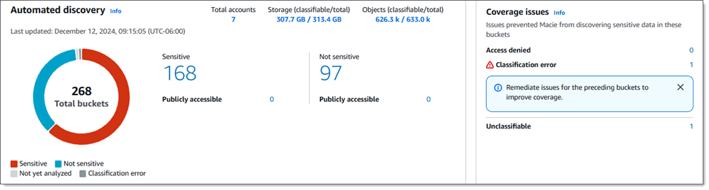
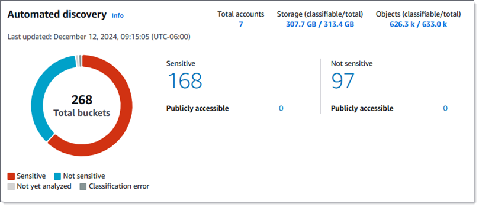
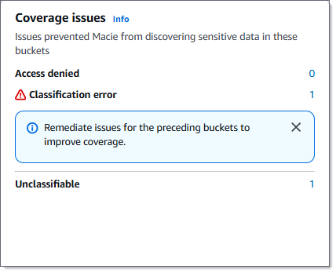

# Reviewing data sensitivity statistics on

the Summary dashboard

On the Amazon Macie console, the **Summary** dashboard provides a snapshot of
aggregated statistics and findings data for your Amazon Simple Storage Service (Amazon S3) data in the current
AWS Region. It's designed to help you assess the overall security posture of your Amazon S3
data.

Dashboard statistics include data for key security metrics such as the number of S3 general
purpose buckets that are publicly accessible or shared with other AWS accounts. The dashboard
also displays groups of aggregated findings data for your account—for example, the buckets
that generated the most findings during the preceding seven days. If you're the Macie administrator for
an organization, the dashboard provides aggregated statistics and data for all the accounts in
your organization. You can optionally filter the data by account.

If automated sensitive data discovery is enabled, the **Summary** dashboard includes additional
statistics. The statistics capture the status and results of automated discovery activities that Macie has
performed thus far for your Amazon S3 data. The following image shows an example of these statistics.

The statistics are organized primarily into two sections, **Automated discovery**
and **Coverage issues**. Statistics in the **Automated discovery**
section provide a snapshot of the current status and results of automated sensitive data discovery activities. Statistics
in the **Coverage issues** section indicate whether issues prevented Macie from
analyzing objects in individual S3 buckets. The statistics don't include data for sensitive data discovery jobs
that you create and run. However, remediating coverage issues for automated sensitive data discovery is likely to also
increase coverage by jobs that you subsequently run.

###### Topics

- [Displaying the
  dashboard](#discovery-asdd-results-s3-dashboard-view "#discovery-asdd-results-s3-dashboard-view")
- [Understanding
  statistics on the dashboard](#discovery-asdd-results-s3-dashboard-statistics "#discovery-asdd-results-s3-dashboard-statistics")

## Displaying the Summary

dashboard

Follow these steps to display the **Summary** dashboard on the Amazon Macie
console. To query the statistics programmatically, use the [GetBucketStatistics](../APIReference/datasources-s3-statistics.md "../APIReference/datasources-s3-statistics.md")
operation of the Amazon Macie API.

###### To display the Summary dashboard

1. Open the Amazon Macie console at [https://console.aws.amazon.com/macie/](https://console.aws.amazon.com/macie/ "https://console.aws.amazon.com/macie/").
2. In the navigation pane, choose **Summary**. Macie displays the
   **Summary** dashboard.
3. To drill down and review the supporting data for an item on the dashboard, choose the
   item.

If you're the Macie administrator for an organization, the dashboard displays aggregated statistics
and data for your account and member accounts in your organization. To display data for only a
particular account, enter the account's ID in the **Account** box above the
dashboard.

## Understanding sensitive data

discovery statistics on the Summary dashboard

The **Summary** dashboard includes aggregated statistics that can help you
monitor automated sensitive data discovery for your Amazon S3 data. It provides a snapshot of the current status and results
of the analyses for your Amazon S3 data in the current AWS Region. For example, you can use
dashboard statistics to quickly determine how many S3 buckets Amazon Macie has found sensitive data
in, and how many of those buckets are publicly accessible. You can also assess coverage of your
Amazon S3 data. Coverage statistics can help you identify issues that prevent Macie from analyzing
objects in individual S3 buckets.

On the dashboard, statistics for automated sensitive data discovery are organized into the following
sections:

- [Storage and
  sensitive data discovery](#discovery-asdd-results-s3-dashboard-storage-statistics "#discovery-asdd-results-s3-dashboard-storage-statistics")
- [Automated discovery](#discovery-asdd-results-s3-dashboard-sensitivity-statistics "#discovery-asdd-results-s3-dashboard-sensitivity-statistics")
- [Coverage
  issues](#discovery-asdd-results-s3-dashboard-coverage-statistics "#discovery-asdd-results-s3-dashboard-coverage-statistics")

Individual statistics in each section are as follows. For information about statistics in
other sections of the dashboard, see [Understanding components of
the Summary dashboard](monitoring-s3-dashboard.md#monitoring-s3-dashboard-components-main "monitoring-s3-dashboard.md#monitoring-s3-dashboard-components-main").

### Storage and sensitive

data discovery

At the top of the dashboard, statistics indicate how much data you store in Amazon S3, and how
much of that data Amazon Macie can analyze to detect sensitive data. The following image shows an
example of these statistics for an organization with seven accounts.

Individual statistics in this section are:

- **Total accounts** – This field appears if you're the
  Macie administrator for an organization or you have a standalone Macie account. It indicates the
  total number of AWS accounts that own buckets in your bucket inventory. If you're a
  Macie administrator, this is the total number of Macie accounts that you manage for your
  organization. If you have a standalone Macie account, this value is _1_.

**Total S3 buckets** – This field appears if you have a member
account in an organization. It indicates the total number of general purpose buckets in your
inventory, including buckets that don't store any objects.

- **Storage** – These statistics provide information about the
  storage size of objects in your bucket inventory:

      + **Classifiable** – The total storage size of all the objects
       that Macie can analyze in the buckets.
      + **Total** – The total storage size of all the objects in the
       buckets, including objects that Macie can’t analyze.

  If any of the objects are compressed files, these values don’t reflect the actual size
  of those files after they’re decompressed. If versioning is enabled for any of the buckets,
  these values are based on the storage size of the latest version of each object in those
  buckets.

- **Objects** – These statistics provide information about the
  number of objects in your bucket inventory:
  - **Classifiable** – The total number of objects that Macie can
    analyze in the buckets.
  - **Total** – The total number of objects in the buckets,
    including objects that Macie can’t analyze.

In the preceding statistics, data and objects are _classifiable_ if they use a supported Amazon S3 storage class and they have a file name
extension for a supported file or storage format. You can detect sensitive data in the objects
by using Macie. For more information, see [Supported storage classes and
formats](discovery-supported-storage.md "discovery-supported-storage.md").

Note that **Storage** and **Objects** statistics don't
include data about objects in buckets that Macie isn't allowed to access. To identify buckets
where this is the case, choose the **Access denied** statistic in the
**Coverage issues** section of the dashboard.

### Automated discovery

This section captures the status and results of automated sensitive data discovery activities that Amazon Macie has
performed thus far for your Amazon S3 data. The following image shows an example of the statistics
that this section provides.

Individual statistics in this section are as follows.

**Total buckets**

The doughnut chart indicates the total number of buckets in your bucket inventory. The
chart groups the buckets into categories based on each bucket's current sensitivity score:

- **Sensitive** (_red_) – The
  total number of buckets whose sensitivity score ranges from _51_ through _100_.
- **Not sensitive** (_blue_) –
  The total number of buckets whose sensitivity score ranges from _1_ through _49_.
- **Not yet analyzed** (_light gray_)
  – The total number of buckets whose sensitivity score is _50_.
- **Classification error** (_dark
  gray_) – The total number of buckets whose sensitivity score is _-1_.

For details about the range of sensitivity scores and labels that Macie defines, see
[Sensitivity scoring for S3 buckets](discovery-scoring-s3.md "discovery-scoring-s3.md").

To review additional statistics for a group, hover over the group:

- **Buckets** – The total number of buckets.
- **Publicly accessible** – The total number of buckets that
  allow the general public to have read or write access to the bucket.
- **Classifiable bytes** – The total storage size of all the
  objects that Macie can analyze in the buckets. These objects use supported Amazon S3 storage
  classes and they have file name extensions for supported file or storage formats. For more
  information, see [Supported storage classes and
  formats](discovery-supported-storage.md "discovery-supported-storage.md").
- **Total bytes** – The total storage size of all the
  buckets.

In the preceding statistics, storage size values are based on the storage size of the
latest version of each object in the buckets. If any of the objects are compressed files,
these values don’t reflect the actual size of those files after they’re decompressed.

**Sensitive**

This area indicates the total number of buckets that currently have a sensitivity score
ranging from _51_ through _100_. Within this group, **Publicly accessible** indicates the
total number of buckets that also allow the general public to have read or write access to
the bucket.

**Not sensitive**

This area indicates the total number of buckets that currently have a sensitivity score
ranging from _1_ through _49_. Within this group, **Publicly accessible** indicates the
total number of buckets that also allow the general public to have read or write access to
the bucket.

To determine and calculate values for **Publicly accessible** statistics,
Macie analyzes a combination of account- and bucket-level settings for each bucket, such as the
block public access settings for the account and bucket, and the bucket policy for the bucket.
Macie does this for up to 10,000 buckets for an account. For more information, see [How Macie monitors Amazon S3 data
security](monitoring-s3-how-it-works.md "monitoring-s3-how-it-works.md").

Note that statistics in the **Automated discovery** section don't include the
results of sensitive data discovery jobs that you create and run.

### Coverage

issues

In this section, statistics indicate whether certain types of issues prevented Amazon Macie
from analyzing objects in individual S3 buckets. The following image shows an example of the
statistics that this section provides.

Individual statistics in this section are:

- **Access denied** – The total number of buckets that Macie isn't
  allowed to access. Macie can't analyze any objects in these buckets. The buckets' permissions
  settings prevent Macie from accessing the buckets and the buckets' objects.
- **Classification error** – The total number of buckets that
  Macie hasn't analyzed yet due to object-level classification errors. Macie tried to analyze
  one or more objects in these buckets. However, Macie couldn't analyze the objects due to
  issues with object-level permissions settings, object content, or quotas.
- **Unclassifiable** – The total number of buckets that don't
  store any classifiable objects. Macie can't analyze any objects in these buckets. All the
  objects use Amazon S3 storage classes that Macie doesn't support, or they have file name
  extensions for file or storage formats that Macie doesn't support.

Choose the value for a statistic to display additional details and, as applicable,
remediation guidance. If you remediate access issues and classification errors, you can
increase coverage of your Amazon S3 data during subsequent analysis cycles. For more information,
see [Assessing automated sensitive data discovery coverage](discovery-coverage.md "discovery-coverage.md").

Note that statistics in the **Coverage issues** section don't explicitly
include data for sensitive data discovery jobs that you create and run. However, remediating coverage issues
that affect automated sensitive data discovery is likely to also increase coverage by jobs that you subsequently
run.
