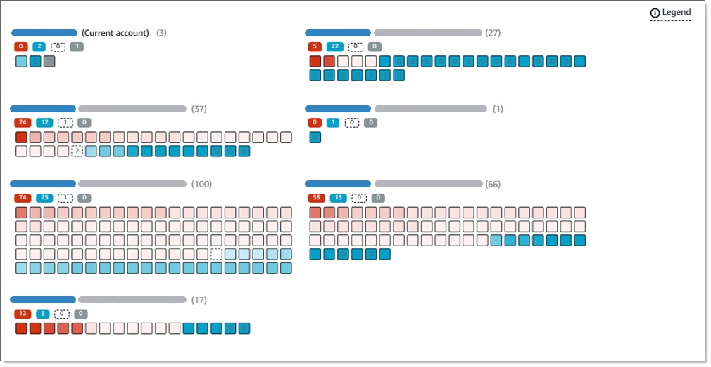

# Performing automated sensitive data discovery

For broad visibility into where sensitive data might reside in your Amazon Simple Storage Service (Amazon S3) data
estate, configure Amazon Macie to perform automated sensitive data discovery for your account or organization. With
automated sensitive data discovery, Macie continually evaluates your S3 bucket inventory and uses sampling techniques to
identify and select representative S3 objects in your buckets. Macie then retrieves and analyzes
the selected objects, inspecting them for sensitive data.

By default, Macie selects and analyzes objects from all of your S3 general purpose buckets.
If you're the Macie administrator for an organization, this includes objects in buckets that your member
accounts own. You can adjust the scope of the analyses by excluding specific buckets. For example,
you might exclude buckets that typically store AWS logging data. If you're a Macie administrator, an
additional option is to enable or disable automated sensitive data discovery for individual accounts in your organization
on a case-by-case basis.

You can tailor the analyses to focus on specific types of sensitive data. By default, Macie
analyzes S3 objects by using the set of managed data identifiers that we recommend for automated sensitive data discovery.
To tailor the analyses, you can configure Macie to use specific [managed data identifiers](managed-data-identifiers.md "managed-data-identifiers.md") that Macie provides, [custom data identifiers](custom-data-identifiers.md "custom-data-identifiers.md") that you define, or a
combination of the two. You can also refine the analyses by configuring Macie to use [allow lists](allow-lists.md "allow-lists.md") that you specify.

As the analysis progresses each day, Macie produces records of the sensitive data that it
finds and the analysis that it performs: _sensitive data
findings_, which report sensitive data that Macie finds in individual S3 objects, and
_sensitive data discovery results_, which log details about the
analysis of individual S3 objects. Macie also updates statistics, inventory data, and other
information that it provides about your Amazon S3 data. For example, an interactive heat map on the
console provides a visual representation of data sensitivity across your data estate:

These features are designed to help you evaluate data sensitivity across your Amazon S3 data
estate, and drill down to investigate and assess individual accounts, buckets, and objects. They
can also help you determine where to perform deeper, more immediate analysis by [running sensitive data discovery jobs](discovery-jobs.md "discovery-jobs.md"). Combined with information
that Macie provides about the security and privacy of your Amazon S3 data, you can also use these
features to identify cases where immediate remediation might be necessary—for example, a
publicly accessible bucket that Macie found sensitive data in.

To configure and manage automated sensitive data discovery, you must be the Macie administrator for an organization or have a
standalone Macie account.

###### Topics

- [How automated sensitive data discovery works](discovery-asdd-how-it-works.md "discovery-asdd-how-it-works.md")
- [Configuring automated sensitive data discovery](discovery-asdd-account-manage.md "discovery-asdd-account-manage.md")
- [Reviewing automated sensitive data discovery results](discovery-asdd-results-s3.md "discovery-asdd-results-s3.md")
- [Assessing automated sensitive data discovery coverage](discovery-coverage.md "discovery-coverage.md")
- [Adjusting sensitivity scores for S3
  buckets](discovery-asdd-s3bucket-manage.md "discovery-asdd-s3bucket-manage.md")
- [Sensitivity scoring for S3 buckets](discovery-scoring-s3.md "discovery-scoring-s3.md")
- [Default settings for automated sensitive data discovery](discovery-asdd-settings-defaults.md "discovery-asdd-settings-defaults.md")
