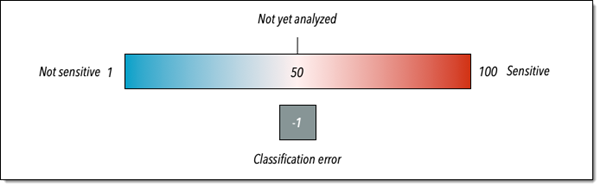

# Sensitivity scoring for S3 buckets

If automated sensitive data discovery is enabled, Amazon Macie automatically calculates and assigns a sensitivity score to
each Amazon Simple Storage Service (Amazon S3) general purpose bucket that it monitors and analyzes for an account or
organization. A _sensitivity score_ is a quantitative representation
of the amount of sensitive data that an S3 bucket might contain. Based on that score, Macie also
assigns a sensitivity label to each bucket. A _sensitivity label_
is a qualitative representation of a bucket's sensitivity score. These values can serve as
reference points for determining where sensitive data might reside in your Amazon S3 data estate, and
identifying and monitoring potential security risks for that data.

By default, an S3 bucket's sensitivity score and label reflect the results of automated sensitive data discovery
activities that Macie has performed thus far for the bucket. They don't reflect the results of
sensitive data discovery jobs that you create and run. In addition, neither the score nor the label implies or
otherwise indicates the criticality or importance that a bucket or a bucket's objects might have
for you or your organization. However, you can override a bucket's calculated score by manually
assigning the maximum score (_100_) to the bucket. This also
assigns the _Sensitive_ label to the bucket. To override a
calculated score, you must be the Macie administrator for the account that owns the bucket, or have a
standalone Macie account.

###### Topics

- [Sensitivity scoring dimensions and
  ranges](#discovery-scoring-s3-dimensions "#discovery-scoring-s3-dimensions")
- [Monitoring sensitivity scores](#discovery-scoring-s3-monitoring "#discovery-scoring-s3-monitoring")

## Sensitivity scoring dimensions and

ranges

If it's calculated by Amazon Macie, an S3 bucket's sensitivity score is a quantitative measure of
the intersection of two primary dimensions:

- The amount of sensitive data that Macie has found in the bucket. This derives primarily
  from the nature and number of sensitive data types that Macie has found in the bucket, and the
  number of occurrences of each type.
- The amount of data that Macie has analyzed in the bucket. This derives primarily from the
  number of unique objects that Macie has analyzed in the bucket relative to the total number of
  unique objects in the bucket.

An S3 bucket's sensitivity score also determines which sensitivity label Macie assigns to the
bucket. The sensitivity label is a qualitative representation of the score—for example,
_Sensitive_ or _Not
sensitive_. On the Amazon Macie console, a bucket's sensitivity score also determines which
color Macie uses to represent the bucket in data visualizations, as shown in the following
image.

Sensitivity scores range from _-1_ through _100_, as described in the following table. To assess inputs to an S3
bucket's score, you can refer to sensitive data discovery statistics and other details that Macie provides about the
bucket.

| Sensitivity score | Sensitivity label    | Additional information                                                                                                                                                                                                                                                                                                                                                                                                                                                                                                                                                                                                                                                                                                                                                                                                                                                                                                               |
| ----------------- | -------------------- | ------------------------------------------------------------------------------------------------------------------------------------------------------------------------------------------------------------------------------------------------------------------------------------------------------------------------------------------------------------------------------------------------------------------------------------------------------------------------------------------------------------------------------------------------------------------------------------------------------------------------------------------------------------------------------------------------------------------------------------------------------------------------------------------------------------------------------------------------------------------------------------------------------------------------------------ |
| -1                | Classification error | Macie hasn't successfully analyzed any of the bucket's objects yet due to object-level classification errors—issues with object-level permissions settings, object content, or quotas. When Macie tried to analyze one or more objects in the bucket, errors occurred. For example, an object is a malformed file, or an object is encrypted with a key that Macie can't access or isn't allowed to use. Coverage data for the bucket can help you investigate and remediate the errors. For more information, see [Assessing automated sensitive data discovery coverage](discovery-coverage.md "discovery-coverage.md"). Macie will continue to try to analyze objects in the bucket. If Macie analyzes an object successfully, Macie will update the bucket's sensitivity score and label to reflect the results of the analysis.                                                                      |
| 1-49              | Not sensitive        | In this range, a higher score, such as _49_, indicates that Macie has analyzed relatively few objects in the bucket. A lower score, such as _1_, indicates that Macie has analyzed many objects in the bucket (relative to the total number of objects in the bucket) and detected relatively few types and occurrences of sensitive data in those objects. A score of \*1 • can also indicate that the bucket doesn't store any objects or all the objects in the bucket contain zero (0) bytes of data. Object statistics in the bucket's details can help you determine if this is the case. For more information, see [Reviewing S3 bucket details](discovery-asdd-results-s3-inventory-details.md "discovery-asdd-results-s3-inventory-details.md").                                                                                                                                              |
| 50                | Not yet analyzed     | Macie hasn't tried to analyze or analyzed any of the bucket's objects yet. Macie automatically assigns this score when automated discovery is initially enabled or a bucket is added to the bucket inventory for an account. In an organization, a bucket can also have this score if automated discovery has never been enabled for the account that owns the bucket. A score of \*50 • can also indicate that the bucket's permissions settings prevent Macie from accessing the bucket or the bucket’s objects. This is typically due to a restrictive bucket policy. The bucket's details can help you determine if this is the case because Macie can provide only a subset of information about the bucket. For information about how to address this issue, see [Allowing Macie to access S3 buckets and objects](monitoring-restrictive-s3-buckets.md "monitoring-restrictive-s3-buckets.md"). |
| 51-99             | Sensitive            | In this range, a higher score, such as _99_, indicates that Macie has analyzed many objects in the bucket (relative to the total number of objects in the bucket) and detected many types and occurrences of sensitive data in those objects. A lower score, such as _51_, indicates that Macie has analyzed a moderate number of objects in the bucket (relative to the total number of objects in the bucket) and detected at least a few types and occurrences of sensitive data in those objects.                                                                                                                                                                                                                                                                                                                                                                                                              |
| 100               | Sensitive            | The score was manually assigned to the bucket, overriding the calculated score. Macie doesn't assign this score to buckets.                                                                                                                                                                                                                                                                                                                                                                                                                                                                                                                                                                                                                                                                                                                                                                                                       |

## Monitoring sensitivity scores

When automated sensitive data discovery is initially enabled for an account, Amazon Macie automatically assigns a
sensitivity score of _50_ to each S3 bucket that the account owns.
Macie also assigns this score to a bucket when the bucket is added to the bucket inventory for an
account. Based on that score, each bucket's sensitivity label is _Not yet
analyzed_. The exception is an empty bucket, which is a bucket that doesn't store any
objects or all the objects in the bucket contain zero (0) bytes of data. If this is the case for
a bucket, Macie assigns a score of _1_ to the bucket and the
bucket's sensitivity label is _Not sensitive_.

As automated sensitive data discovery progresses each day, Macie updates sensitivity scores and labels for S3
buckets to reflect the results of its analysis. For example:

- If Macie doesn't find sensitive data in an object, Macie decreases the bucket's
  sensitivity score and updates the sensitivity label as necessary.
- If Macie finds sensitive data in an object, Macie increases the bucket's sensitivity score and
  updates the sensitivity label as necessary.
- If Macie finds sensitive data in an object that's subsequently changed, Macie removes
  sensitive data detections for the object from the bucket's sensitivity score and updates the
  sensitivity label as necessary.
- If Macie finds sensitive data in an object that's subsequently deleted, Macie removes
  sensitive data detections for the object from the bucket's sensitivity score and updates the
  sensitivity label as necessary.
- If an object is added to a bucket that was previously empty and Macie finds sensitive data
  in the object, Macie increases the bucket's sensitivity score and updates the sensitivity label as
  necessary.
- If a bucket's permissions settings prevent Macie from accessing or retrieving information
  about the bucket or the bucket’s objects, Macie changes the bucket's sensitivity score to _50_ and changes the bucket's sensitivity label to _Not yet analyzed_.

Analysis results can begin to appear within 48 hours of enabling automated sensitive data discovery for an
account.

If you're the Macie administrator for an organization or you have a standalone Macie account, you
can adjust sensitivity scoring settings for your organization or account:

- To adjust the settings for subsequent analyses of all S3 buckets, change the settings for
  your account. You can start including or excluding specific managed data identifiers, custom
  data identifiers, or allow lists. You can also exclude specific buckets. For more information,
  see [Configuring automated discovery
  settings](discovery-asdd-account-configure.md "discovery-asdd-account-configure.md").
- To adjust the settings for individual S3 buckets, change the settings for each bucket. You
  can include or exclude specific types of sensitive data from a bucket's score. You can also
  specify whether to assign an automatically calculated score to a bucket. For more information,
  see [Adjusting sensitivity scores for S3
  buckets](discovery-asdd-s3bucket-manage.md "discovery-asdd-s3bucket-manage.md").

If you disable automated sensitive data discovery, the effect varies for existing sensitivity scores and labels. If
you disable it for a member account in an organization, existing scores and labels persist for S3
buckets that the account owns. If you disable it for an organization overall or a standalone
Macie account, existing scores and labels persist for only 30 days. After 30 days, Macie resets
scores and labels for all the buckets that the organization or account owns. If a bucket stores
objects, Macie changes the score to _50_ and assigns the
_Not yet analyzed_ label to the bucket. If a bucket is empty,
Macie changes the score to _1_ and assigns the _Not sensitive_ label to the bucket. After this reset, Macie stops
updating sensitivity scores and labels for the buckets, unless you enable automated sensitive data discovery for the
organization or account again.
