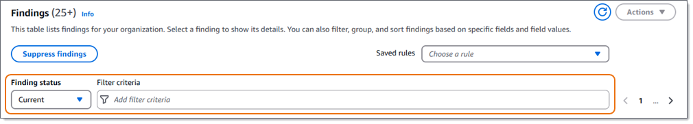
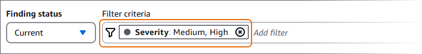

# Creating and applying filters to Macie

findings

To identify and focus on findings that have specific characteristics, you can filter
findings on the Amazon Macie console and in queries that you submit programmatically using the
Amazon Macie API. When you create a filter, you use specific attributes of findings to define
criteria for including or excluding findings from a view or from query results. A _finding attribute_ is a field that stores specific data for a finding,
such as severity, type, or the name of the resource that a finding applies to.

In Macie, a filter consists of one or more conditions. Each condition, also referred to as a
_criterion_, consists of three parts:

- An attribute-based field, such as **Severity** or **Finding
  type**.
- An operator, such as _equals_ or _not equals_.
- One or more values. The type and number of values depends on the field and operator that
  you choose.
  How you define and apply filter conditions depends on whether you use the Amazon Macie console
  or the Amazon Macie API.

###### Topics

- [Filtering findings by using
  the console](#findings-filter-procedure-console "#findings-filter-procedure-console")
- [Filtering findings
  programmatically](#findings-filter-procedure-api "#findings-filter-procedure-api")

## Filtering findings by using the Amazon Macie

console

If you use the Amazon Macie console to filter findings, Macie provides options to help you
choose fields, operators, and values for individual conditions. You access these options by
using filter settings on **Findings** pages, as shown in the following
image.



By using the **Finding status** menu, you can specify whether to include
findings that were suppressed (automatically archived) by a [suppression rule](findings-suppression.md "findings-suppression.md"). By using the **Filter
criteria** box, you can enter filter conditions.

When you place your cursor in the **Filter criteria** box, Macie displays
a list of fields that you can use in filter conditions. The fields are organized by logical
category. For example, the **Common fields** category includes fields that
apply to any type of finding, and the **Classification fields** category
includes fields that apply only to sensitive data findings. The fields are sorted
alphabetically within each category.

To add a condition, start by choosing a field from the list. To find a field, browse the
complete list, or enter part of the field's name to narrow the list of fields.

Depending on the field that you choose, Macie displays different options. The options
reflect the type and nature of the field that you choose. For example, if you choose the
**Severity** field, Macie displays a list of values to choose
from—**Low**, **Medium**, and
**High**. If you choose the **S3 bucket name** field,
Macie displays a text box in which you can enter a bucket name. Whichever field you choose,
Macie guides you through the steps to add a condition that includes the required settings for
the field.

After you add a condition, Macie applies the criteria for the condition and adds the
condition to a filter token in the **Filter criteria** box, as shown in the
following image.



In this example, the condition is configured to include all medium-severity and
high-severity findings, and to exclude all low-severity findings. It returns findings where
the value for the **Severity** field _equals_
**Medium** or **High**.

###### Tip

For many fields, you can change a condition's operator from _equals_ to _not equals_ by choosing the equals
icon (

) in the filter token for the condition. If you do this, Macie
changes the operator to _not equals_ and displays the not
equals icon (

) in the token. To switch to the _equals_ operator again, choose the not equals icon.

As you add more conditions, Macie applies their criteria and adds them to tokens in the
**Filter criteria** box. You can refer to the box at any time to determine
which criteria you've applied. To remove a condition, choose the remove condition icon
(

) in the token for the condition.

###### To filter findings by using the console

1.  Open the Amazon Macie console at [https://console.aws.amazon.com/macie/](https://console.aws.amazon.com/macie/ "https://console.aws.amazon.com/macie/").
2.  In the navigation pane, choose **Findings**.
3.  (Optional) To first pivot on and review findings by a predefined logical group, choose
    **By bucket**, **By type**, or **By
    job** in the navigation pane (under **Findings**). Then choose
    an item in the table. In the details panel, choose the link for the field to pivot
    on.
4.  (Optional) To display findings that were suppressed by a [suppression rule](findings-suppression.md "findings-suppression.md"), change the **Filter
    status** setting. Choose **Archived** to display only
    suppressed findings, or choose **All** to display both suppressed and
    unsuppressed findings. To hide suppressed findings, choose
    **Current**.
5.  To add a filter condition:
    1. Place your cursor in the **Filter criteria** box, and then choose
       the field to use for the condition. For information about the fields that you can use,
       see [Fields for filtering Macie findings](findings-filter-fields.md "findings-filter-fields.md").
    2. Enter the appropriate type of value for the field. For detailed information about
       the different types of values, see [Specifying values for fields](findings-filter-basics.md#findings-filter-basics-value-types "findings-filter-basics.md#findings-filter-basics-value-types").

    Array of text (strings)

    For this type of value, Macie often provides a list of values to choose
    from. If this is the case, select each value that you want to use in the
    condition.

    If Macie doesn't provide a list of values, enter a complete, valid value for
    the field. To specify additional values for the field, choose
    **Apply**, and then add another condition for each additional
    value.

    Note that values are case sensitive. In addition, you can’t use partial
    values or wildcard characters in values. For example, to filter findings for an
    S3 bucket named _my-S3-bucket_, enter
    `my-S3-bucket` as the value for the **S3 bucket
    name** field. If you enter any other value, such as
    `my-s3-bucket` or `my-S3`, Macie
    won’t return findings for the bucket.

    Boolean

    For this type of value, Macie provides a list of values to choose from.
    Select the value that you want to use in the condition.

    Date/Time (time ranges)

    For this type of value, use the **From** and
    **To** boxes to define an inclusive time range:

        * To define a fixed time range, use the **From** and
         **To** boxes to specify the first date and time and the
         last date and time in the range, respectively.
        * To define a relative time range that starts at a certain date and time
         and ends at the current time, enter the start date and time in the
         **From** boxes, and delete any text in
         **To** boxes.
        * To define a relative time range that ends at a certain date and time,
         enter the end date and time in the **To** boxes, and delete
         any text in the **From** boxes.

    Note that time values use 24-hour notation. If you use the date picker to
    choose dates, you can refine the values by entering text directly in the
    **From** and **To** boxes.

    Number (numeric ranges)

    For this type of value, use the **From** and
    **To** boxes to enter one or more integers that define an
    inclusive, fixed or relative numeric range.

    Text (string) values

    For this type of value, enter a complete, valid value for the field.

    Note that values are case sensitive. In addition, you can’t use partial
    values or wildcard characters in values. For example, to filter findings for an
    S3 bucket named _my-S3-bucket_, enter
    `my-S3-bucket` as the value for the **S3 bucket
    name** field. If you enter any other value, such as
    `my-s3-bucket` or `my-S3`, Macie
    won’t return findings for the bucket. 3. When you finish adding values for the field, choose **Apply**.
    Macie applies the filter criteria and adds the condition to a filter token in the
    **Filter criteria** box.

6.  Repeat step 5 for each additional condition that you want to add.
7.  To remove a condition, choose the remove condition icon (
    
    ) in the
    filter token for the condition.
8.  To change a condition, remove the condition by choosing the remove condition icon
    (
    
    ) in the filter token for the condition. Then repeat step 5 to add a
    condition with the correct settings.

###### Tip

If you want to subsequently use this set of conditions again, you can save the set as a
filter rule. To do this, choose **Save rule** in the **Filter
criteria** box. Then enter a name and, optionally, a description for the rule.
When you finish, choose **Save**.

## Filtering findings programmatically with the

Amazon Macie API

To filter findings programmatically, specify filter criteria in queries that you submit
using the [ListFindings](../APIReference/findings.md "../APIReference/findings.md") or [GetFindingStatistics](../APIReference/findings-statistics.md "../APIReference/findings-statistics.md") operation of the Amazon Macie API. The
**ListFindings** operation returns an array of finding IDs, one ID for each
finding that matches the filter criteria. The **GetFindingStatistics**
operation returns aggregated statistical data about all the findings that match the filter
criteria, grouped by a field that you specify in your request.

Note that the **ListFindings** and **GetFindingStatistics**
operations are different from operations that you use to [suppress findings](findings-suppression.md "findings-suppression.md"). Unlike suppression operations, which also specify filter
criteria, the **ListFindings** and **GetFindingStatistics**
operations only query findings data. They don't perform any action on findings that match
filter criteria. To suppress findings, use the [CreateFindingsFilter](../APIReference/findingsfilters.md "../APIReference/findingsfilters.md") operation of
the Amazon Macie API.

To specify filter criteria in a query, include a map of filter conditions in your request.
For each condition, specify a field, an operator, and one or more values for the field. The
type and number of values depends on the field and operator that you choose. For information
about the fields, operators, and types of values that you can use in a condition, see [Fields for filtering Macie findings](findings-filter-fields.md "findings-filter-fields.md"), [Using operators in conditions](findings-filter-basics.md#findings-filter-basics-operators "findings-filter-basics.md#findings-filter-basics-operators"), and [Specifying values for fields](findings-filter-basics.md#findings-filter-basics-value-types "findings-filter-basics.md#findings-filter-basics-value-types").

The following examples show you how to specify filter criteria in queries that you submit
using the [AWS Command Line Interface (AWS CLI)](../../../cli/latest/userguide/cli-chap-welcome.md "../../../cli/latest/userguide/cli-chap-welcome.md"). You can also do this by using a current version of another AWS command line tool or an AWS
SDK, or by sending HTTPS requests directly to Macie. For information about AWS tools and SDKs,
see [Tools to Build on AWS](https://aws.amazon.com/developer/tools/ "https://aws.amazon.com/developer/tools/").

###### Examples

- [Filter findings based on
  severity](#findings-filter-procedure-api-ex1 "#findings-filter-procedure-api-ex1")
- [Filter findings based on
  sensitive data category](#findings-filter-procedure-api-ex2 "#findings-filter-procedure-api-ex2")
- [Filter findings based on a
  fixed time range](#findings-filter-procedure-api-ex3 "#findings-filter-procedure-api-ex3")
- [Filter findings based on
  suppression status](#findings-filter-procedure-api-ex4 "#findings-filter-procedure-api-ex4")
- [Filter findings based on
  multiple fields and types of values](#findings-filter-procedure-api-ex5 "#findings-filter-procedure-api-ex5")

The examples use the [list-findings](../../../cli/latest/reference/macie2/list-findings.md "../../../cli/latest/reference/macie2/list-findings.md") command. If an
example runs successfully, Macie returns a `findingIds` array. The array lists the
unique identifier for each finding that matches the filter criteria, as shown in the following
example.

```
`{
 "findingIds": [
 "1f1c2d74db5d8caa76859ec52example",
 "6cfa9ac820dd6d55cad30d851example",
 "702a6fd8750e567d1a3a63138example",
 "826e94e2a820312f9f964cf60example",
 "274511c3fdcd87010a19a3a42example"
 ]
}`
```

If no findings match the filter criteria, Macie returns an empty `findingIds`
array.

```
`{
 "findingIds": []
}`
```

### Example 1: Filter findings based on

severity

This example retrieves finding IDs for all high-severity and medium-severity findings in
the current AWS Region.

For Linux, macOS, or Unix:

```
`$` `aws macie2 list-findings --finding-criteria '{"criterion":{"`severity.description`":{"`eq`":["`High`","`Medium`"]}}}'`
```

For Microsoft Windows:

```
`C:\>` `aws macie2 list-findings --finding-criteria={\"criterion\":{\"`severity.description`\":{\"`eq`\":[\"`High`\",\"`Medium`\"]}}}`
```

Where:

- `severity.description` specifies the JSON name of the
  **Severity** field.
- `eq` specifies the _equals_ operator.
- `High` and `Medium` are an array
  of enumerated values for the **Severity** field.

### Example 2: Filter findings based on

sensitive data category

This example retrieves finding IDs for all sensitive data findings that are in the
current Region and report occurrences of financial information (and no other categories of
sensitive data) in S3 objects.

For Linux, macOS, or Unix, using the backslash (\) line-continuation character to improve readability:

```
`$` `aws macie2 list-findings \
--finding-criteria '{"criterion":{"`classificationDetails.result.sensitiveData.category`":{"`eqExactMatch`":["`FINANCIAL_INFORMATION`"]}}}'`
```

For Microsoft Windows, using the caret (^) line-continuation character to improve readability:

```
`C:\>` `aws macie2 list-findings ^
--finding-criteria={\"criterion\":{\"`classificationDetails.result.sensitiveData.category`\":{\"`eqExactMatch`\":[\"`FINANCIAL_INFORMATION`\"]}}}`
```

Where:

- `classificationDetails.result.sensitiveData.category`
  specifies the JSON name of the **Sensitive data category**
  field.
- `eqExactMatch` specifies the _equals
  exact match_ operator.
- `FINANCIAL_INFORMATION` is an enumerated value for the
  **Sensitive data category** field.

### Example 3: Filter findings based on a

fixed time range

This example retrieves finding IDs for all findings that are in the current Region and
were created between 07:00 UTC October 5, 2020, and 07:00 UTC November 5, 2020
(inclusively).

For Linux, macOS, or Unix:

```
`$` `aws macie2 list-findings --finding-criteria '{"criterion":{"`createdAt`":{"`gte`":`1601881200000`,"`lte`":`1604559600000`}}}'`
```

For Microsoft Windows:

```
`C:\>` `aws macie2 list-findings --finding-criteria={\"criterion\":{\"`createdAt`\":{\"`gte`\":`1601881200000`,\"`lte`\":`1604559600000`}}}`
```

Where:

- `createdAt` specifies the JSON name of the
  **Created at** field.
- `gte` specifies the _greater than or
  equal to_ operator.
- `1601881200000` is the first date and time (as a Unix
  timestamp in milliseconds) in the time range.
- `lte` specifies the _less than or
  equal to_ operator.
- `1604559600000` is the last date and time (as a Unix
  timestamp in milliseconds) in the time range.

### Example 4: Filter findings based on

suppression status

This example retrieves finding IDs for all findings that are in the current Region and
were suppressed (automatically archived) by a suppression rule.

For Linux, macOS, or Unix:

```
`$` `aws macie2 list-findings --finding-criteria '{"criterion":{"`archived`":{"`eq`":["`true`"]}}}'`
```

For Microsoft Windows:

```
`C:\>` `aws macie2 list-findings --finding-criteria={\"criterion\":{\"`archived`\":{\"`eq`\":[\"`true`\"]}}}`
```

Where:

- `archived` specifies the JSON name of the
  **Archived** field.
- `eq` specifies the _equals_ operator.
- `true` is a Boolean value for the
  **Archived** field.

### Example 5: Filter findings based on

multiple fields and types of values

This example retrieves finding IDs for all sensitive data findings that are in the
current Region and match the following criteria: were created between 07:00 UTC October 5,
2020, and 07:00 UTC November 5, 2020 (exclusively); report occurrences of financial data and
no other categories of sensitive data in S3 objects; and weren't suppressed (automatically
archived) by a suppression rule.

For Linux, macOS, or Unix, using the backslash (\) line-continuation character to improve readability:

```
`$` `aws macie2 list-findings \
--finding-criteria '{"criterion":{"`createdAt`":{"`gt`":`1601881200000`,"`lt`":`1604559600000`},"`classificationDetails.result.sensitiveData.category`":{"`eqExactMatch`":["`FINANCIAL_INFORMATION`"]},"`archived`":{"`eq`":["`false`"]}}}'`
```

For Microsoft Windows, using the caret (^) line-continuation character to improve readability:

```
`C:\>` `aws macie2 list-findings ^
--finding-criteria={\"criterion\":{\"`createdAt`\":{\"`gt`\":`1601881200000`,\"`lt`\":`1604559600000`},\"`classificationDetails.result.sensitiveData.category`\":{\"`eqExactMatch`\":[\"`FINANCIAL_INFORMATION`\"]},\"`archived`\":{\"`eq`\":[\"`false`\"]}}}`
```

Where:

- `createdAt` specifies the JSON name of the
  **Created at** field, and:
  - `gt` specifies the _greater than
    or equal to_ operator.
  - `1601881200000` is the first date and time (as a Unix
    timestamp in milliseconds) in the time range.
  - `lt` specifies the _less than or
    equal to_ operator.
  - `1604559600000` is the last date and time (as a Unix
    timestamp in milliseconds) in the time range.

- `classificationDetails.result.sensitiveData.category`
  specifies the JSON name of the **Sensitive data category** field,
  and:
  - `eqExactMatch` specifies the _equals exact match_ operator.
  - `FINANCIAL_INFORMATION` is an enumerated value for the
    field.

- `archived` specifies the JSON name of the
  **Archived** field, and:
  - `eq` specifies the _equals_ operator.
  - `false` is a Boolean value for the field.
