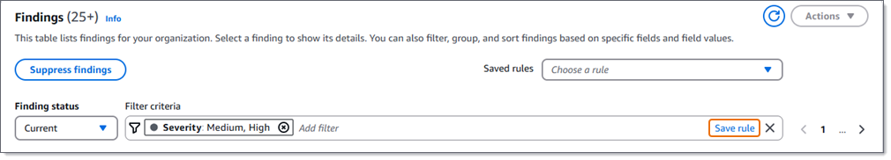

# Creating a filter rule for Macie

findings

A _filter rule_ is a set of filter criteria that you
create and save to use again when you review findings on the Amazon Macie console. Filter rules
can help you perform repeated, consistent analysis of findings that have specific
characteristics. For example, you might create a filter rule for analyzing all high-severity
sensitive data findings that report occurrences of sensitive data in particular Amazon Simple Storage Service
(Amazon S3) buckets. You can then apply that filter rule each time you want to identify and analyze
findings that have the specified characteristics.

When you create a filter rule, you specify filter criteria, a name, and, optionally, a
description of the rule. For the filter criteria, you use specific attributes of findings to
specify whether to include or exclude findings from a view. A _finding
attribute_ is a field that stores specific data for a finding, such as severity,
type, or the name of the resource that a finding applies to. Filter criteria consist of one or
more conditions. Each condition, also referred to as a _criterion_, consists of three parts:

- An attribute-based field, such as **Severity** or **Finding
  type**.
- An operator, such as _equals_ or _not equals_.
- One or more values. The type and number of values depends on the field and operator
  that you choose.
  After you create and save a filter rule, you apply its filter criteria by choosing the
  rule. Macie then uses the criteria to determine which findings to display. Macie also displays
  the criteria to help you determine which criteria you applied.

Note that filter rules are different from suppression rules. A _suppression
rule_ is a set of filter criteria that you create and save to automatically
archive findings that match the criteria of the rule. Although both types of rules store and
apply filter criteria, a filter rule doesn't perform any action on findings that match the
rule's criteria. Instead, a filter rule only determines which findings appear on the console
after you apply the rule. For information about suppression rules, see [Suppressing findings](findings-suppression.md "findings-suppression.md").

###### To create a filter rule for findings

You can create a filter rule by using the Amazon Macie console or the Amazon Macie API.

Console
Follow these steps to create a filter rule by using the Amazon Macie console.

###### To create a filter rule

1. Open the Amazon Macie console at [https://console.aws.amazon.com/macie/](https://console.aws.amazon.com/macie/ "https://console.aws.amazon.com/macie/").
2. In the navigation pane, choose **Findings**.

###### Tip

To use an existing filter rule as a starting point, choose the rule from the
**Saved rules** list.

You can also streamline creation of a rule by first pivoting and drilling down
on findings by a predefined logical group. If you do this, Macie automatically
creates and applies the appropriate filter conditions, which can be a helpful
starting point for creating a rule. To do this, choose **By
bucket**, **By type**, or **By job**
in the navigation pane (under **Findings**). Then choose an item
in the table. In the details panel, choose the link for the field to pivot on. 3. In the **Filter criteria** box, add conditions that define the
filter criteria for the rule.


To learn how to add filter conditions, see [Creating and applying filters to Macie
findings](findings-filter-procedure.md "findings-filter-procedure.md"). 4. When you finish defining filter criteria for the rule, choose **Save
rule** in the **Filter criteria** box.

 5. Under **Filter rule**, enter a name and, optionally, a
description of the rule. 6. Choose **Save**.

API
To create a filter rule programmatically, use the [CreateFindingsFilter](../APIReference/findingsfilters.md "../APIReference/findingsfilters.md")
operation of the Amazon Macie API and specify the appropriate values for the required
parameters:

- For the `action` parameter, specify `NOOP` to ensure that
  Macie doesn't suppress (automatically archive) findings that match the criteria of
  the rule.
- For the `criterion` parameter, specify a map of conditions that
  define the filter criteria for the rule.

In the map, each condition should specify a field, an operator, and one or more
values for the field. The type and number of values depends on the field and
operator that you choose. For information about the fields, operators, and types of
values that you can use in a condition, see: [Fields for filtering Macie findings](findings-filter-fields.md "findings-filter-fields.md"), [Using operators in conditions](findings-filter-basics.md#findings-filter-basics-operators "findings-filter-basics.md#findings-filter-basics-operators"), and [Specifying values for fields](findings-filter-basics.md#findings-filter-basics-value-types "findings-filter-basics.md#findings-filter-basics-value-types").

To create a filter rule by using the AWS Command Line Interface (AWS CLI), run the [create-findings-filter](../../../cli/latest/reference/macie2/create-findings-filter.md "../../../cli/latest/reference/macie2/create-findings-filter.md") command and specify the appropriate values for the
required parameters. The following examples create a filter rule that returns all
sensitive data findings that are in the current AWS Region and report occurrences of
personal information (and no other categories of sensitive data) in S3 objects.

This example is formatted for Linux, macOS, or Unix, and it uses the backslash (\) line-continuation character to improve readability.

```
`$` `aws macie2 create-findings-filter \
--action NOOP \
--name `my_filter_rule` \
--finding-criteria '{"criterion":{"`classificationDetails.result.sensitiveData.category`":{"`eqExactMatch`":["`PERSONAL_INFORMATION`"]}}}'`
```

This example is formatted for Microsoft Windows and it uses the caret (^) line-continuation character to improve readability.

```
`C:\>` `aws macie2 create-findings-filter ^
--action NOOP ^
--name `my_filter_rule` ^
--finding-criteria={\"criterion\":{\"`classificationDetails.result.sensitiveData.category`\":{\"`eqExactMatch`\":[\"`PERSONAL_INFORMATION`\"]}}}`
```

Where:

- `my_filter_rule` is the custom name for the
  rule.
- `criterion` is a map of filter conditions for the rule:
  - `classificationDetails.result.sensitiveData.category`
    is the JSON name of the **Sensitive data category**
    field.
  - `eqExactMatch` specifies the _equals exact match_ operator.
  - `PERSONAL_INFORMATION` is an enumerated value for
    the **Sensitive data category** field.

If the command runs successfully, you receive output similar to the
following.

```
`{
 "arn": "arn:aws:macie2:us-west-2:123456789012:findings-filter/9b2b4508-aa2f-4940-b347-d1451example",
 "id": "9b2b4508-aa2f-4940-b347-d1451example"
}`
```

Where `arn` is the Amazon Resource Name (ARN) of the filter rule that was
created, and `id` is the unique identifier for the rule.

For additional examples of filter criteria, see [Filtering findings programmatically with the
Amazon Macie API](findings-filter-procedure.md#findings-filter-procedure-api "findings-filter-procedure.md#findings-filter-procedure-api").
