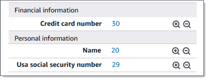
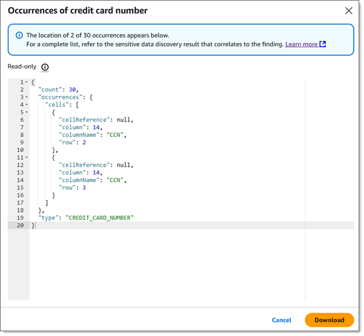

# Locating sensitive data with Macie findings

When you run sensitive data discovery jobs or Amazon Macie performs automated sensitive data discovery, Macie performs a deep
inspection of the latest version of each Amazon Simple Storage Service (Amazon S3) object that it analyzes. For each
job run or analysis cycle, Macie also uses a _depth-first
search_ algorithm to populate the resulting findings with details about the
location of specific occurrences of sensitive data that Macie finds in S3 objects. These
occurrences provide insight into the categories and types of sensitive data that an affected
S3 bucket and object might contain. The details can help you locate individual occurrences
of sensitive data in objects, and determine whether to perform a deeper investigation of
specific buckets and objects.

With sensitive data findings, you can determine the location of as many as 15 occurrences of
sensitive data that Macie found in an affected S3 object. This includes sensitive data that
Macie detected using [managed data
identifiers](managed-data-identifiers.md "managed-data-identifiers.md"), and data that matches the criteria of [custom data identifiers](custom-data-identifiers.md "custom-data-identifiers.md") that you configured a
job or Macie to use.

A sensitive data finding can provide details such as:

- The column and row number for a cell or field in a Microsoft Excel workbook, CSV
  file, or TSV file.
- The path to a field or array in a JSON or JSON Lines file.
- The line number for a line in a non-binary text file other than a CSV, JSON, JSON
  Lines, or TSV file—for example, an HTML, TXT, or XML file.
- The page number for a page in an Adobe
  Portable Document Format (PDF) file.
- The record index and the path to a field in a record in an Apache Avro object
  container or Apache Parquet file.
  You can access these details by using the Amazon Macie console or the Amazon Macie API. You can
  also access these details in findings that Macie publishes to other AWS services, both
  Amazon EventBridge and AWS Security Hub. To learn about the JSON structures that Macie uses to report these
  details, see [Schema for reporting the location of sensitive
  data](findings-locate-sd-schema.md "findings-locate-sd-schema.md"). To learn how to access the details in
  findings that Macie publishes to other AWS services, see [Monitoring and processing
  findings](findings-monitor.md "findings-monitor.md").

If an S3 object contains many occurrences of sensitive data, you can also use a finding to
navigate to its corresponding sensitive data discovery result. Unlike a sensitive data finding, a sensitive data discovery result provides
detailed location data for as many as 1,000 occurrences of each type of sensitive data that
Macie found in an object. If an S3 object is an archive file, such as a .tar or .zip file,
this includes occurrences of sensitive data in individual files that Macie extracted from
the archive. (Macie doesn’t include this information in sensitive data findings.) To learn
more about sensitive data discovery results, see [Storing and retaining
sensitive data discovery results](discovery-results-repository-s3.md "discovery-results-repository-s3.md"). Macie uses the same schema for
location data in sensitive data findings and sensitive data discovery results.

###### To locate sensitive data with findings

To locate occurrences of sensitive data reported by a finding, you can use the Amazon Macie
console or the Amazon Macie API. To do this programmatically, use the [GetFindings](../APIReference/findings-describe.md "../APIReference/findings-describe.md") operation. If a finding includes details about the location of
one or more occurrences of a specific type of sensitive data, `occurrences`
objects in the finding provide these details. For more information, see [Schema for reporting the location of sensitive
data](findings-locate-sd-schema.md "findings-locate-sd-schema.md").

To locate occurrences of sensitive data by using the console, follow these steps.

1. Open the Amazon Macie console at [https://console.aws.amazon.com/macie/](https://console.aws.amazon.com/macie/ "https://console.aws.amazon.com/macie/").
2. In the navigation pane, choose **Findings**.

###### Tip

You can quickly display all the findings from a particular sensitive data discovery job. To do this, choose
**Jobs** in the navigation pane, and then choose the name
of the job. At the top of the details panel, choose **Show
results**, and then choose **Show
findings**. 3. On the **Findings** page, choose the finding for the
sensitive data that you want to locate. The details panel displays information
for the finding. 4. In the details panel, scroll to the **Sensitive data**
section. This section provides information about the categories and types of
sensitive data that Macie found in the affected S3 object. It also indicates the
number of occurrences of each type of sensitive data that Macie found.

For example, the following image shows some details of a finding that reports 30
occurrences of credit card numbers, 20 occurrences of names, and 29 occurrences of
US Social Security numbers.

If the finding includes details about the location of one or more occurrences of a
specific type of sensitive data, the number of occurrences is a link. Choose the
link to show the details. Macie opens a new window and displays the details in
JSON format.

For example, the following image shows the location of two occurrences of
credit card numbers in an affected S3 object.

To save the details as a JSON file, choose **Download**, and
then and specify a name and location for the file. 5. To save all the finding's details as a JSON file, choose the finding's identifier
(**Finding ID**) at the top of the details panel. Macie opens a
new window and displays all the details in JSON format. Choose
**Download**, and then specify a name and location for the
file.
To access details about the location of as many as 1,000 occurrences of each type of
sensitive data in the affected object, refer to the corresponding sensitive data discovery result for the
finding. To do this, scroll to the beginning of the **Details** section
of the panel. Then choose the link in the **Detailed result location**
field. Macie opens the Amazon S3 console and displays the file or folder that contains the
corresponding discovery result.
