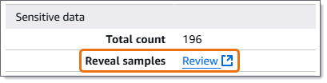
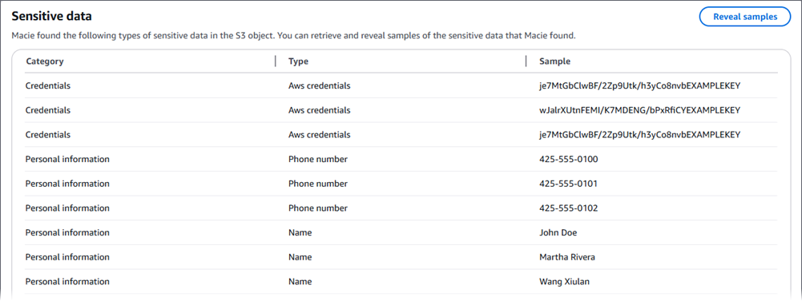

# Retrieving sensitive data samples for a Macie

finding

By using Amazon Macie, you can retrieve and reveal samples of sensitive data that Macie reports
in individual sensitive data findings. This includes sensitive data that Macie detects using
[managed data identifiers](managed-data-identifiers.md "managed-data-identifiers.md"), and data that
matches the criteria of [custom data identifiers](custom-data-identifiers.md "custom-data-identifiers.md").
The samples can help you verify the nature of the sensitive data that Macie found. They can also
help you tailor your investigation of an affected Amazon Simple Storage Service (Amazon S3) object and bucket. You can
retrieve and reveal sensitive data samples in all the AWS Regions where Macie is currently
available except the Asia Pacific (Osaka) and Israel (Tel Aviv) Regions.

If you retrieve and reveal sensitive data samples for a finding, Macie uses data in the
corresponding [sensitive data discovery
result](discovery-results-repository-s3.md "discovery-results-repository-s3.md") to locate the first 1–10 occurrences of sensitive data reported by the
finding. Macie then extracts the first 1–128 characters of each occurrence from the
affected S3 object. If a finding reports multiple types of sensitive data, Macie does this for
up to 100 types of sensitive data reported by the finding.

When Macie extracts sensitive data from an affected S3 object, Macie encrypts the data with
an AWS Key Management Service (AWS KMS) key that you specify, temporarily stores the encrypted data in a cache, and
returns the data in your results for the finding. Soon after extraction and encryption, Macie
permanently deletes the data from the cache unless additional retention is temporarily required
to resolve an operational issue.

If you choose to retrieve and reveal sensitive data samples for a finding again, Macie
repeats the process for locating, extracting, encrypting, storing, and ultimately deleting the
samples.

For a demonstration of how you can retrieve and reveal sensitive data samples by using the
Amazon Macie console, watch the following video:

###### Topics

- [Before you begin](#findings-retrieve-sd-proc-prereqs "#findings-retrieve-sd-proc-prereqs")
- [Determining whether samples
  are available for a finding](#findings-retrieve-sd-proc-criteria "#findings-retrieve-sd-proc-criteria")
- [Retrieving samples for a
  finding](#findings-retrieve-sd-proc-steps "#findings-retrieve-sd-proc-steps")

## Before you begin

Before you can retrieve and reveal sensitive data samples for findings, you need to [configure and enable settings for your Amazon Macie
account](findings-retrieve-sd-configure.md "findings-retrieve-sd-configure.md"). You also need to work with your AWS administrator to verify that you have
the permissions and resources that you need.

When you retrieve and reveal sensitive data samples for a finding, Macie performs a series
of tasks to locate, retrieve, encrypt, and reveal the samples. Macie doesn't use the [Macie service-linked role](service-linked-roles.md "service-linked-roles.md") for your account to perform
these tasks. Instead, you use your AWS Identity and Access Management (IAM) identity or allow Macie to assume an
IAM role in your account.

To retrieve and reveal sensitive data samples for a finding, you must have access to the
finding, the corresponding sensitive data discovery result, and the AWS KMS key that you
configured Macie to use to encrypt sensitive data samples. In addition, you or the IAM role
must be allowed to access the affected S3 bucket and the affected S3 object. You or the role
must also be allowed to use the AWS KMS key that was used to encrypt the affected object,
if applicable. If any IAM policies, resource policies, or other permissions settings deny
the requisite access, an error occurs and Macie doesn't return any samples for the
finding.

You must also be allowed to perform the following Macie actions:

- `macie2:GetMacieSession`
- `macie2:GetFindings`
- `macie2:ListFindings`
- `macie2:GetSensitiveDataOccurrences`

The first three actions allow you to access your Macie account and retrieve the details of
findings. The last action allows you to retrieve and reveal sensitive data samples for
findings.

To use the Amazon Macie console to retrieve and reveal sensitive data samples, you must also
be allowed to perform the following action:
`macie2:GetSensitiveDataOccurrencesAvailability`. This action allows you to
determine whether samples are available for individual findings. You don't need permission to
perform this action to retrieve and reveal samples programmatically. However, having this
permission can streamline your retrieval of samples.

If you're the delegated Macie administrator for an organization and you configured Macie to assume
an IAM role to retrieve sensitive data samples, you must also be allowed to perform the
following action: `macie2:GetMember`. This action allows you to retrieve
information about the association between your account and an affected account. It enables
Macie to verify that you're currently the Macie administrator for the affected account.

If you're not allowed to perform the requisite actions or access the requisite data and
resources, ask your AWS administrator for assistance.

## Determining whether sensitive data

samples are available for a finding

To retrieve and reveal sensitive data samples for a finding, the finding needs to meet
certain criteria. It has to include location data for specific occurrences of sensitive data.
In addition, it has to specify the location of a valid, corresponding sensitive data discovery
result. The sensitive data discovery result must be stored in the same AWS Region as the
finding. If you configured Amazon Macie to access affected S3 objects by assuming an AWS Identity and Access Management
(IAM) role, the sensitive data discovery result must also be stored in an S3 object that
Macie signed with a Hash-based Message Authentication Code (HMAC) AWS KMS key.

The affected S3 object also needs to meet certain criteria. The MIME type of the object
must be one of the following:

- _application/avro_, for an Apache Avro
  object container (.avro) file
- _application/gzip_, for a GNU Zip
  compressed archive (.gz or .gzip) file
- _application/json_, for a JSON or JSON
  Lines (.json or .jsonl) file
- _application/parquet_, for an Apache
  Parquet (.parquet) file
- _application/vnd.openxmlformats-officedocument.spreadsheetml.sheet_,
  for a Microsoft Excel workbook (.xlsx) file
- _application/zip_, for a ZIP
  compressed archive (.zip) file
- _text/csv_, for a CSV (.csv)
  file
- _text/plain_, for a non-binary text
  file other than a CSV, JSON, JSON Lines, or TSV file
- _text/tab-separated-values_, for a TSV
  (.tsv) file

In addition, the contents of the S3 object must be the same as when the finding was
created. Macie checks the object's entity tag (ETag) to determine whether it matches the ETag
specified by the finding. Also, the storage size of the object can't exceed the applicable
size quota for retrieving and revealing sensitive data samples. For a list of applicable
quotas, see [Quotas for Macie](macie-quotas.md "macie-quotas.md").

If a finding and the affected S3 object meet the preceding criteria, sensitive data
samples are available for the finding. You can optionally determine whether this is the case
for a particular finding before you try to retrieve and reveal samples for it.

###### To determine whether sensitive data samples are available for a finding

You can use the Amazon Macie console or the Amazon Macie API to determine whether sensitive
data samples are available for a finding.

Console
Follow these steps on the Amazon Macie console to determine whether sensitive data
samples are available for a finding.

###### To determine whether samples are available for a finding

1. Open the Amazon Macie console at [https://console.aws.amazon.com/macie/](https://console.aws.amazon.com/macie/ "https://console.aws.amazon.com/macie/").
2. In the navigation pane, choose **Findings**.
3. On the **Findings** page, choose the finding. The details panel
   displays information for the finding.
4. In the details panel, scroll to the **Sensitive data** section.
   Then refer to the **Reveal samples** field.

If sensitive data samples are available for the finding, a
**Review** link appears in the field, as shown in the following
image.



If sensitive data samples aren't available for the finding, the **Reveal
samples** field displays text indicating why:

    * **Account not in organization** – You're not allowed
     to access the affected S3 object by using Macie. The affected account isn't
     currently part of your organization. Or the account is part of your organization
     but Macie isn't currently enabled for the account in the current
     AWS Region.
    * **Invalid classification result** – There isn't a
     corresponding sensitive data discovery result for the finding. Or the
     corresponding sensitive data discovery result isn't available in the current
     AWS Region, is malformed or corrupted, or uses an unsupported storage format.
     Macie can't verify the location of the sensitive data to retrieve.
    * **Invalid result signature** – The corresponding
     sensitive data discovery result is stored in an S3 object that wasn't signed by
     Macie. Macie can't verify the integrity and authenticity of the sensitive data
     discovery result. Therefore, Macie can't verify the location of the sensitive
     data to retrieve.
    * **Member role too permissive** – The trust or
     permissions policy for the IAM role in the affected member account doesn't
     meet Macie requirements for restricting access to the role. Or the role's trust
     policy doesn't specify the correct external ID for your organization. Macie
     can’t assume the role to retrieve the sensitive data.
    * **Missing GetMember permission** – You're not
     allowed to retrieve information about the association between your account and
     the affected account. Macie can't determine whether you’re allowed to access the
     affected S3 object as the delegated Macie administrator for the affected account.
    * **Object exceeds size quota** – The storage size of
     the affected S3 object exceeds the size quota for retrieving and revealing
     samples of sensitive data from that type of file.
    * **Object unavailable** – The affected S3 object
     isn't available. The object was renamed, moved, or deleted, or its contents
     changed after Macie created the finding. Or the object is encrypted with an
     AWS KMS key that isn’t available. For example, the key is disabled, is
     scheduled for deletion, or was deleted.
    * **Result not signed** – The corresponding sensitive
     data discovery result is stored in an S3 object that hasn't been signed. Macie
     can't verify the integrity and authenticity of the sensitive data discovery
     result. Therefore, Macie can't verify the location of the sensitive data to
     retrieve.
    * **Role too permissive** – Your account is configured
     to retrieve occurrences of sensitive data by using an IAM role whose trust or
     permissions policy doesn't meet Macie requirements for restricting access to the
     role. Macie can’t assume the role to retrieve the sensitive data.
    * **Unsupported object type** – The affected S3 object
     uses a file or storage format that Macie doesn't support for retrieving and
     revealing samples of sensitive data. The MIME type of the affected S3 object
     isn't one of the values in the [preceding list](#findings-retrieve-sd-criteria-mimetype "#findings-retrieve-sd-criteria-mimetype").

If there's an issue with the sensitive data discovery result for the finding,
the information in the **Detailed result location** field of the
finding can help you investigate the issue. This field specifies the original path
to the result in Amazon S3. To investigate an issue with an IAM role, ensure that the
role's policies meet all requirements for Macie to assume the role. For these
details, see [Configuring
an IAM role to access affected S3 objects](findings-retrieve-sd-options.md#findings-retrieve-sd-options-s3access-role-configuration "findings-retrieve-sd-options.md#findings-retrieve-sd-options-s3access-role-configuration").

API
To programmatically determine whether sensitive data samples are available for a
finding, use the [GetSensitiveDataOccurrencesAvailability](../APIReference/findings-findingid-reveal-availability.md "../APIReference/findings-findingid-reveal-availability.md") operation of the Amazon Macie API. When
you submit your request, use the `findingId` parameter to specify the unique
identifier for the finding. To obtain this identifier, you can use the [ListFindings](../APIReference/findings.md "../APIReference/findings.md") operation.

If you're using the AWS Command Line Interface (AWS CLI), run the [get-sensitive-data-occurrences-availability](../../../cli/latest/reference/macie2/get-sensitive-data-occurrences-availability.md "../../../cli/latest/reference/macie2/get-sensitive-data-occurrences-availability.md") command and use the
`finding-id` parameter to specify the unique identifier for the finding. To
obtain this identifier, you can run the [list-findings](../../../cli/latest/reference/macie2/list-findings.md "../../../cli/latest/reference/macie2/list-findings.md")
command.

If your request succeeds and samples are available for the finding, you receive
output similar to the following:

```
`{
 "code": "AVAILABLE",
 "reasons": []
}`
```

If your request succeeds and samples aren't available for the finding, the value for
the `code` field is `UNAVAILABLE` and the `reasons`
array specifies why. For example:

```
`{
 "code": "UNAVAILABLE",
 "reasons": [
 "UNSUPPORTED_OBJECT_TYPE"
 ]
}`
```

If there's an issue with the sensitive data discovery result for the finding, the
information in the `classificationDetails.detailedResultsLocation` field of
the finding can help you investigate the issue. This field specifies the original path
to the result in Amazon S3. To investigate an issue with an IAM role, ensure that the
role's policies meet all requirements for Macie to assume the role. For these details,
see [Configuring
an IAM role to access affected S3 objects](findings-retrieve-sd-options.md#findings-retrieve-sd-options-s3access-role-configuration "findings-retrieve-sd-options.md#findings-retrieve-sd-options-s3access-role-configuration").

## Retrieving sensitive data samples for a

finding

To retrieve and reveal sensitive data samples for a finding, you can use the Amazon Macie
console or the Amazon Macie API.

Console
Follow these steps to retrieve and reveal sensitive data samples for a finding by
using the Amazon Macie console.

###### To retrieve and reveal sensitive data samples for a finding

1. Open the Amazon Macie console at [https://console.aws.amazon.com/macie/](https://console.aws.amazon.com/macie/ "https://console.aws.amazon.com/macie/").
2. In the navigation pane, choose **Findings**.
3. On the **Findings** page, choose the finding. The details panel
   displays information for the finding.
4. In the details panel, scroll to the **Sensitive data** section.
   Then, in the **Reveal samples** field, choose
   **Review**:


###### Note

If the **Review** link doesn't appear in the **Reveal
samples** field, sensitive data samples aren't available for the
finding. To determine why this is the case, see the [preceding topic](#findings-retrieve-sd-proc-criteria "#findings-retrieve-sd-proc-criteria").

After you choose **Review**, Macie displays a page that summarizes key details of the finding. The details
include the categories, types, and number of occurrences of sensitive data that
Macie found in the affected S3 object. 5. In the **Sensitive data** section of the page, choose
**Reveal samples**. Macie then retrieves and reveals samples of
the first 1–10 occurrences of sensitive data reported by the finding. Each
sample contains the first 1–128 characters of an occurrence of sensitive
data. It can take several minutes to retrieve and reveal the samples.

If the finding reports multiple types of sensitive data, Macie retrieves and
reveals samples for up to 100 types. For example, the following image shows samples
that span multiple categories and types of sensitive data—AWS credentials,
US phone numbers, and people's names.



The samples are organized first by
sensitive data category, and then by sensitive data type.

API
To retrieve and reveal sensitive data samples for a finding programmatically, use
the [GetSensitiveDataOccurrences](../APIReference/findings-findingid-reveal.md "../APIReference/findings-findingid-reveal.md") operation of the Amazon Macie API. When you submit
your request, use the `findingId` parameter to specify the unique identifier
for the finding. To obtain this identifier, you can use the [ListFindings](../APIReference/findings.md "../APIReference/findings.md")
operation.

To retrieve and reveal sensitive data samples by using the AWS Command Line Interface (AWS CLI), run
the [get-sensitive-data-occurrences](../../../cli/latest/reference/macie2/get-sensitive-data-occurrences.md "../../../cli/latest/reference/macie2/get-sensitive-data-occurrences.md") command and use the `finding-id`
parameter to specify the unique identifier for the finding. For example:

```
`C:\>` `aws macie2 get-sensitive-data-occurrences --finding-id "`1f1c2d74db5d8caa76859ec52example`"`
```

Where `1f1c2d74db5d8caa76859ec52example` is the unique
identifier for the finding. To obtain this identifier by using the AWS CLI, you can run
the [list-findings](../../../cli/latest/reference/macie2/list-findings.md "../../../cli/latest/reference/macie2/list-findings.md") command.

If your request succeeds, Macie begins processing your request and you receive output similar to the following:

```
`{
 "status": "PROCESSING"
}`
```

It can take several minutes to process your request. Within a few minutes, submit
your request again.

If Macie can locate, retrieve, and encrypt the sensitive data samples, Macie returns
the samples in a `sensitiveDataOccurrences` map. The map specifies
1–100 types of sensitive data reported by the finding and 1–10 samples for
each type. Each sample contains the first 1–128 characters of an occurrence of
sensitive data reported by the finding.

In the map, each key is the ID of the managed data identifier that detected the
sensitive data, or the name and unique identifier for the custom data identifier that
detected the sensitive data. The values are samples for the specified managed data
identifier or custom data identifier. For example, the following response provides three
samples of people's names and two samples of AWS secret access keys that were detected
by managed data identifiers (`NAME` and `AWS_CREDENTIALS`,
respectively).

```
`{
 "sensitiveDataOccurrences": {
 "NAME": [
 {
 "value": "Akua Mansa"
 },
 {
 "value": "John Doe"
 },
 {
 "value": "Martha Rivera"
 }
 ],
 "AWS_CREDENTIALS": [
 {
 "value": "wJalrXUtnFEMI/K7MDENG/bPxRfiCYEXAMPLEKEY"
 },
 {
 "value": "je7MtGbClwBF/2Zp9Utk/h3yCo8nvbEXAMPLEKEY"
 }
 ]
 },
 "status": "SUCCESS"
}`
```

If your request succeeds but sensitive data samples aren't available for the
finding, you receive an `UnprocessableEntityException` message that indicates
why samples aren't available. For example:

```
`{
 "message": "An error occurred (UnprocessableEntityException) when calling the GetSensitiveDataOccurrences operation: OBJECT_UNAVAILABLE"
}`
```

In the preceding example, Macie attempted to retrieve samples from the affected S3
object but the object isn't available anymore. The contents of the object changed after
Macie created the finding.

If your request succeeds but another type of error prevented Macie from retrieving
and revealing sensitive data samples for the finding, you receive output similar to the
following:

```
`{
 "error": "Macie can't retrieve the samples. You're not allowed to access the affected S3 object or the object is encrypted with a key that you're not allowed to use.",
 "status": "ERROR"
}`
```

The value for the `status` field is `ERROR` and the
`error` field describes the error that occurred. The information in the
[preceding topic](#findings-retrieve-sd-proc-criteria "#findings-retrieve-sd-proc-criteria") can help you
investigate the error.
