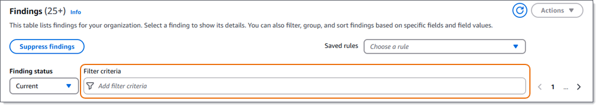

# Creating a suppression rule for Macie

findings

A _suppression rule_ is a set of attribute-based
filter criteria that defines cases where you want Amazon Macie to archive findings
automatically. Suppression rules are helpful in situations where you've reviewed a class
of findings and don't want to be notified of them again. When you create a suppression
rule, you specify filter criteria, a name, and, optionally, a description of the rule.
Macie then uses the rule's criteria to determine which findings to archive
automatically. By using suppression rules, you can streamline your analysis of
findings.

If you suppress findings with a suppression rule, Macie continues to generate findings
for subsequent occurrences of sensitive data and potential policy violations that match
the rule's criteria. However, Macie automatically changes the status of the findings to
_archived_. This means that the findings don't
appear by default on the Amazon Macie console, but they persist in Macie until they expire.
(Macie stores findings for 90 days.) This also means that Macie doesn't publish the
findings to Amazon EventBridge as events or to AWS Security Hub CSPM.

Note that suppression rules might work differently for your account, if your account
is part of an organization that centrally manages multiple Macie accounts. This depends
on the category of findings that you want to suppress, and whether you have a
Macie administrator or member account:

- **Policy findings** – Only a Macie administrator
  can suppress policy findings for the organization's accounts.

If you have a Macie administrator account and you create a suppression rule, Macie applies the rule
to policy findings for all the accounts in your organization unless you
configure the rule to exclude specific accounts. If you have a member account
and you want to suppress policy findings for your account, work with your
Macie administrator to suppress the findings.

- **Sensitive data findings** – A
  Macie administrator and individual members can suppress sensitive data findings that
  their sensitive data discovery jobs produce. A Macie administrator can also suppress
  findings that Macie generates while performing automated sensitive data discovery for the
  organization.

Only the account that creates a sensitive data discovery job can suppress or
otherwise access sensitive data findings that the job produces. Only the
Macie administrator account for an organization can suppress or otherwise access
findings that automated sensitive data discovery produces for accounts in the organization.
For more information about the tasks that administrators and members can perform, see
[Macie administrator and member account
relationships](accounts-mgmt-relationships.md "accounts-mgmt-relationships.md").

Also note that suppression rules are different from filter rules. A _filter rule_ is a set of filter criteria that you create and save to use
again when you review findings on the Amazon Macie console. Although both types of rules
store and apply filter criteria, a filter rule doesn't perform any action on findings
that match the rule's criteria. Instead, a filter rule only determines which findings
appear on the console after you apply the rule. For more information, see [Defining filter
rules](findings-filter-rule-procedures.md "findings-filter-rule-procedures.md"). Depending on your analysis
goals, you might determine that it's best to create a filter rule instead of a
suppression rule.

###### To create a suppression rule for findings

You can create a suppression rule by using the Amazon Macie console or the Amazon Macie
API. Before you create a suppression rule, it's important to note that you can't
restore (unarchive) findings that you suppress using a suppression rule. You can,
however, [review suppressed
findings](findings-suppression-view-findings.md "findings-suppression-view-findings.md") by using Macie.

Console
Follow these steps to create a suppression rule by using the Amazon Macie
console.

###### To create a suppression rule

1. Open the Amazon Macie console at [https://console.aws.amazon.com/macie/](https://console.aws.amazon.com/macie/ "https://console.aws.amazon.com/macie/").
2. In the navigation pane, choose
   **Findings**.

###### Tip

To use an existing suppression or filter rule as a starting
point, choose the rule from the **Saved rules**
list.

You can also streamline creation of a rule by first pivoting and drilling down on
findings by a predefined logical group. If you do this, Macie
automatically creates and applies the appropriate filter
conditions, which can be a helpful starting point for creating a
rule. To do this, choose **By bucket**,
**By type**, or **By job**
in the navigation pane (under **Findings**).
Then choose an item in the table. In the details panel, choose
the link for the field to pivot on. 3. In the **Filter criteria** box, add filter
conditions that specify attributes of the findings that you want the
rule to suppress.



To learn how to add filter conditions, see [Creating and applying filters to Macie
findings](findings-filter-procedure.md "findings-filter-procedure.md"). 4. When you finish adding filter conditions for the rule, choose
**Suppress findings**. 5. Under **Suppression rule**, enter a name and,
optionally, a description of the rule. 6. Choose **Save**.

API
To create a suppression rule programmatically, use the [CreateFindingsFilter](../APIReference/findingsfilters.md "../APIReference/findingsfilters.md") operation of the Amazon Macie API and specify
the appropriate values for the required parameters:

- For the `action` parameter, specify
  `ARCHIVE` to ensure that Macie suppresses findings
  that match the criteria of the rule.
- For the `criterion` parameter, specify a map of
  conditions that define the filter criteria for the rule.

In the map, each condition should specify a field, an operator,
and one or more values for the field. The type and number of values
depends on the field and operator that you choose. For information
about the fields, operators, and types of values that you can use in
a condition, see: [Fields for filtering Macie findings](findings-filter-fields.md "findings-filter-fields.md"), [Using operators in conditions](findings-filter-basics.md#findings-filter-basics-operators "findings-filter-basics.md#findings-filter-basics-operators"), and [Specifying values for fields](findings-filter-basics.md#findings-filter-basics-value-types "findings-filter-basics.md#findings-filter-basics-value-types").

To create a suppression rule by using the AWS Command Line Interface (AWS CLI), run the
[create-findings-filter](../../../cli/latest/reference/macie2/create-findings-filter.md "../../../cli/latest/reference/macie2/create-findings-filter.md") command and specify the appropriate
values for the required parameters. The following examples create a
suppression rule that returns all sensitive data findings that are in the
current AWS Region and report occurrences of mailing addresses (and no
other types of sensitive data) in S3 objects.

This example is formatted for Linux, macOS, or Unix, and it uses the backslash (\) line-continuation character to improve readability.

```
`$` `aws macie2 create-findings-filter \
--action ARCHIVE \
--name `my_suppression_rule` \
--finding-criteria '{"criterion":{"`classificationDetails.result.sensitiveData.detections.type`":{"`eqExactMatch`":["`ADDRESS`"]}}}'`
```

This example is formatted for Microsoft Windows and it uses the caret (^) line-continuation character to improve readability.

```
`C:\>` `aws macie2 create-findings-filter ^
--action ARCHIVE ^
--name `my_suppression_rule` ^
--finding-criteria={\"criterion\":{\"`classificationDetails.result.sensitiveData.detections.type`\":{\"`eqExactMatch`\":[\"`ADDRESS`\"]}}}`
```

Where:

- `my_suppression_rule` is the custom name
  for the rule.
- `criterion` is a map of filter conditions for the
  rule:
  - `classificationDetails.result.sensitiveData.detections.type`
    is the JSON name of the **Sensitive data detection
    type** field.
  - `eqExactMatch` specifies the
    _equals exact match_
    operator.
  - `ADDRESS` is an enumerated value
    for the **Sensitive data detection type**
    field.

If the command runs successfully, you receive output similar to the
following.

```
`{
 "arn": "arn:aws:macie2:us-west-2:123456789012:findings-filter/8a3c5608-aa2f-4940-b347-d1451example",
 "id": "8a3c5608-aa2f-4940-b347-d1451example"
}`
```

Where `arn` is the Amazon Resource Name (ARN) of the
suppression rule that was created, and `id` is the unique
identifier for the rule.

For additional examples of filter criteria, see [Filtering findings programmatically with the
Amazon Macie API](findings-filter-procedure.md#findings-filter-procedure-api "findings-filter-procedure.md#findings-filter-procedure-api").
