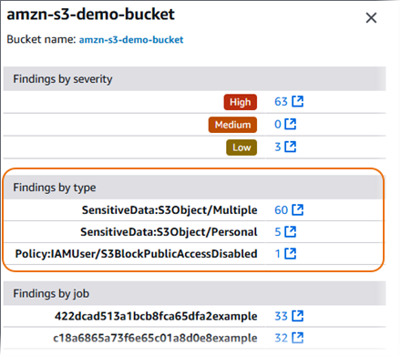
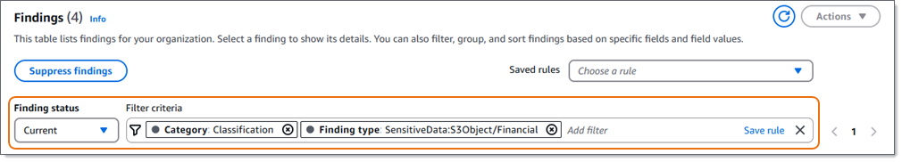

# Reviewing Macie findings by using the console

Amazon Macie monitors your AWS environment and generates policy findings when it detects
potential policy violations or issues with the security or privacy of your Amazon Simple Storage Service (Amazon S3)
general purpose buckets. Macie generates sensitive data findings when it detects sensitive data
in S3 objects. Macie stores your policy and sensitive data findings for 90 days.

Each finding specifies a [finding type](findings-types.md "findings-types.md") and [severity rating](findings-severity.md "findings-severity.md"). Additional details include information
about the affected resource and when and how Macie found the issue or sensitive data reported by
the finding. The severity and details of each finding vary depending on the type and nature of
the finding.

By using the Amazon Macie console, you can review and analyze findings, and access the details
of individual findings. You can also export one or more findings to a JSON file. To streamline
your analysis, the console offers several options that can help you build custom views of
findings.

Use predefined groupings

Use specific pages to review findings that are grouped by criteria such as affected S3
bucket, finding type, or sensitive data discovery job. With these pages, you can review
aggregated statistics for each group, such as the count of findings by severity. You can
also drill down to review the details of individual findings in a group, and you can apply
filters to refine your analysis.

For example, if you group all findings by S3 bucket and note that a particular bucket
has a policy violation, you can quickly determine whether there are also sensitive data
findings for the bucket. To do this, choose **By bucket** in the
navigation pane (under **Findings**), and then choose the bucket. In the
details panel that appears, the **Findings by type** section lists the
types of findings that apply to the bucket, as shown in the following image.

To investigate a specific type, choose the number for the type. Macie displays a table
of all the findings that match the selected type and apply to the S3 bucket. To refine the
results, filter the table.

Create and apply filters

Use specific finding attributes to include or exclude certain findings from a
**Findings** table. A _finding
attribute_ is a field that stores specific data for a finding, such as finding
type, severity, or the name of the affected S3 bucket. If you filter a table, you can more
easily identify findings that have specific characteristics. Then you can drill down to
review the details of those findings.

For example, to review all of your sensitive data findings, add filter criteria for
the **Category** field. To refine the results and include only a specific
type of sensitive data finding, add filter criteria for the **Finding
type** field. For example:

To then review the details of a particular finding, choose the finding. The details
panel displays information for the finding.

You can also sort findings in ascending or descending order by certain fields. To do this,
choose the column heading for the field. To change the sort order, choose the column heading
again.

###### To review findings by using the console

1.  Open the Amazon Macie console at [https://console.aws.amazon.com/macie/](https://console.aws.amazon.com/macie/ "https://console.aws.amazon.com/macie/").
2.  In the navigation pane, choose **Findings**. The
    **Findings** page displays findings that Macie created or updated for
    your account in the current AWS Region during the past 90 days. By default, this doesn't
    include findings that were suppressed by a [suppression
    rule](findings-suppression.md "findings-suppression.md").
3.  To pivot on and review findings by a predefined logical group, choose **By
    bucket**, **By type**, or **By job** in the
    navigation pane (under **Findings**). Then choose an item in the table. In
    the details panel, choose the link for the field to pivot on.
4.  To filter the findings by specific criteria, use the filter options above the
    table:

        * To display findings that were suppressed by a suppression rule, use the
         **Finding status** menu. Choose **All** to display
         both suppressed and unsuppressed findings, or choose **Archived** to
         display only suppressed findings. To then hide suppressed findings again, choose
         **Current**.
        * To display only those findings that have a specific attribute, use the
         **Filter criteria** box. Place your cursor in the box and add a
         filter condition for the attribute. To further refine the results, add conditions for
         additional attributes. To then remove a condition, choose the remove condition icon
         (
        
        ) for the condition to remove.

    For more information about filtering findings, see [Creating and applying filters to Macie
    findings](findings-filter-procedure.md "findings-filter-procedure.md").

5.  To sort the findings by a specific field, choose the column heading for the field. To
    change the sort order, choose the column heading again.
6.  To review the details of a specific finding, choose the finding. The details panel
    displays information for the finding.

###### Tips

In the details panel, you can pivot and drill down on certain fields. To show findings
that have the same value for a field, choose

in the field. Choose

to show findings that have other values for the field.

For a sensitive data finding, you can also use the details panel to investigate
sensitive data that Macie found in the affected S3 object:

    * To locate occurrences of a specific type of sensitive data, choose the numeric
     link in the field for that type of data. Macie displays information (in JSON format)
     about where Macie found the data. For more information, see [Locating sensitive data](findings-locate-sd.md "findings-locate-sd.md").
    * To retrieve samples of the sensitive data that Macie found, choose
     **Review** in the **Reveal samples** field. For
     more information, see [Retrieving sensitive data
     samples](findings-retrieve-sd.md "findings-retrieve-sd.md").
    * To navigate to the corresponding sensitive data discovery result, choose the link
     in the **Detailed result location** field. Macie opens the Amazon S3
     console and displays the file or folder that contains the discovery result. For more
     information, see [Storing and retaining
     sensitive data discovery results](discovery-results-repository-s3.md "discovery-results-repository-s3.md").

7. To download and save the details of one or more findings as a JSON file, select the
   checkbox for each finding to download and save. Then choose **Export
   (JSON)** on the **Actions** menu. In the window that appears,
   choose **Download**. For detailed descriptions of the JSON fields that a
   finding can include, see [Findings](../APIReference/findings-describe.md "../APIReference/findings-describe.md") in the _Amazon Macie API Reference_.
   In certain cases, a finding might not include all the details of an affected S3 bucket. This
   can occur if you store more than 10,000 buckets in Amazon S3. Macie maintains complete inventory data
   for only 10,000 buckets for an account—the 10,000 buckets that were most recently created
   or changed. To review additional details for an affected bucket, you can use data in the finding
   to determine the bucket's name, the account ID for the AWS account that owns the bucket, and
   the AWS Region that stores the bucket. You can then use Amazon S3 to review all the bucket's
   details.
