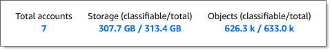
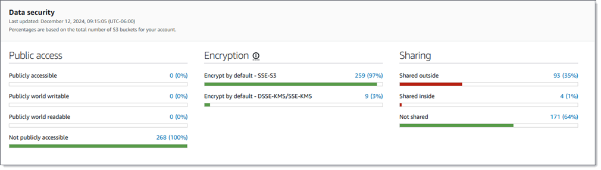
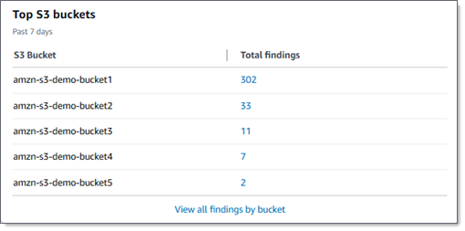
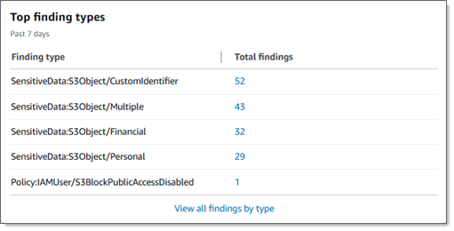
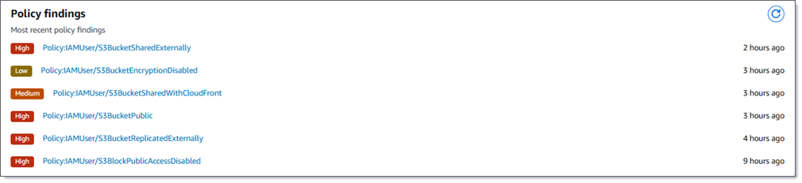

# Assessing your Amazon S3 security posture with Macie

To assess the overall security posture of your Amazon Simple Storage Service (Amazon S3) data and determine where to
take action, you can use the **Summary** dashboard on the Amazon Macie
console.

The **Summary** dashboard provides a snapshot of aggregated statistics for
your Amazon S3 data in the current AWS Region. The statistics include data for key security
metrics such as the number of general purpose buckets that are publicly accessible or shared
with other AWS accounts. The dashboard also displays groups of aggregated findings data
for your account—for example, the types of findings that had the highest number of
occurrences during the preceding seven days. If you're the Macie administrator for an organization,
the dashboard provides aggregated statistics and data for all the accounts in your
organization. You can optionally filter the data by account.

To perform deeper analysis, you can drill down and review the supporting data for
individual items on the dashboard. You can also [review and analyze your S3 bucket inventory](monitoring-s3-inventory.md "monitoring-s3-inventory.md") by using the Amazon Macie console, or
query and analyze inventory data programmatically by using the [DescribeBuckets](../APIReference/datasources-s3.md "../APIReference/datasources-s3.md") operation of
the Amazon Macie API.

###### Topics

- [Displaying the
  dashboard](#monitoring-s3-dashboard-view "#monitoring-s3-dashboard-view")
- [Understanding
  dashboard components](#monitoring-s3-dashboard-components-main "#monitoring-s3-dashboard-components-main")
- [Understanding data
  security statistics on the dashboard](#monitoring-s3-dashboard-statistics-s3 "#monitoring-s3-dashboard-statistics-s3")

## Displaying the Summary dashboard

On the Amazon Macie console, the **Summary** dashboard provides a
snapshot of aggregated statistics and findings data for your Amazon S3 data in the current
AWS Region. If you prefer to query the statistics programmatically, you can use the
[GetBucketStatistics](../APIReference/datasources-s3-statistics.md "../APIReference/datasources-s3-statistics.md") operation of the Amazon Macie API.

###### To display the Summary dashboard

1. Open the Amazon Macie console at [https://console.aws.amazon.com/macie/](https://console.aws.amazon.com/macie/ "https://console.aws.amazon.com/macie/").
2. In the navigation pane, choose **Summary**. Macie displays
   the **Summary** dashboard.
3. To determine when Macie most recently retrieved bucket or object metadata from
   Amazon S3 for your account, refer to the **Last updated** field at
   the top of the dashboard. For more information, see [Data
   refreshes](monitoring-s3-how-it-works.md#monitoring-s3-how-it-works-data-refresh "monitoring-s3-how-it-works.md#monitoring-s3-how-it-works-data-refresh").
4. To drill down and review the supporting data for an item on the dashboard,
   choose the item.

If you're the Macie administrator for an organization, the dashboard displays aggregated statistics
and data for your account and member accounts in your organization. To filter the
dashboard and display data only for a particular account, enter the account's ID in the
**Account** box above the dashboard.

## Understanding components of

the Summary dashboard

On the **Summary** dashboard, statistics and data are organized into
several sections. At the top of the dashboard, you'll find aggregated statistics that
indicate how much data you store in Amazon S3, and how much of that data Amazon Macie can
analyze to detect sensitive data. You can also refer to the **Last
updated** field to determine when Macie most recently retrieved bucket or
object metadata from Amazon S3 for your account. Additional sections provide statistics and
recent findings data that can help you assess the security, privacy, and sensitivity of
your Amazon S3 data in the current AWS Region.

Statistics and data are organized into the following sections:

[Storage and sensitive data
discovery](#monitoring-s3-dashboard-storage-statistics "#monitoring-s3-dashboard-storage-statistics") | [Automated discovery and coverage issues](#monitoring-s3-dashboard-asdd-statistics "#monitoring-s3-dashboard-asdd-statistics") | [Data security](#monitoring-s3-dashboard-security-statistics "#monitoring-s3-dashboard-security-statistics") | [Top S3 buckets](#monitoring-s3-dashboard-top-buckets-statistics "#monitoring-s3-dashboard-top-buckets-statistics") |
[Top finding
types](#monitoring-s3-dashboard-top-findings-statistics "#monitoring-s3-dashboard-top-findings-statistics") | [Policy findings](#monitoring-s3-dashboard-policy-finding-statistics "#monitoring-s3-dashboard-policy-finding-statistics")

As you review each section, optionally choose an item to drill down and review the
supporting data. Also note that the dashboard doesn't include data for S3 directory
buckets, only general purpose buckets. Macie doesn't monitor or analyze directory
buckets.

Storage and sensitive data discovery

At the top of the dashboard, statistics indicate how much data you store in Amazon S3, and how
much of that data Macie can analyze to detect sensitive data. The following
image shows an example of these statistics for an organization with seven
accounts.

Individual statistics in this section are:

- **Total accounts** – This field appears if you're the
  Macie administrator for an organization or you have a standalone Macie
  account. It indicates the total number of AWS accounts that own
  buckets in your bucket inventory. If you're a Macie administrator, this is
  the total number of Macie accounts that you manage for your
  organization. If you have a standalone Macie account, this value is
  _1_.

**Total S3 buckets** – This field appears if you have a member
account in an organization. It indicates the total number of general
purpose buckets in your inventory, including buckets that don't
store any objects.

- **Storage** – These statistics provide information about the
  storage size of objects in your bucket inventory:

      + **Classifiable** – The total
       storage size of all the objects that Macie can analyze in
       the buckets.
      + **Total** – The total storage size
       of all the objects in the buckets, including objects that
       Macie can’t analyze.

  If any of the objects are compressed files, these values don’t
  reflect the actual size of those files after they’re decompressed.
  If versioning is enabled for any of the buckets, these values are
  based on the storage size of the latest version of each object in
  those buckets.

- **Objects** – These statistics provide information about the
  number of objects in your bucket inventory:
  - **Classifiable** – The total
    number of objects that Macie can analyze in the
    buckets.
  - **Total** – The total number of
    objects in the buckets, including objects that Macie can’t
    analyze.

In the preceding statistics, data and objects are _classifiable_ if they use a supported Amazon S3 storage class and
they have a file name extension for a supported file or storage format. You
can detect sensitive data in the objects by using Macie. For more
information, see [Supported storage classes and
formats](discovery-supported-storage.md "discovery-supported-storage.md").

Note that **Storage** and **Objects** statistics don't
include data about objects in buckets that Macie isn't allowed to access.
For example, objects in buckets that have restrictive bucket policies. To
identify buckets where this is the case, you can [review your bucket
inventory](monitoring-s3-inventory-review.md "monitoring-s3-inventory-review.md") by using the **S3 buckets** table. If
the warning icon (

) appears next to a bucket's name, Macie
isn't allowed to access the bucket.

**Automated discovery**
**and**
**coverage issues**

If automated sensitive data discovery is enabled, these sections appear on the dashboard. They capture the status
and results of automated sensitive data discovery activities that Macie has performed thus far for
your Amazon S3 data. The following image shows an example of the statistics that
these sections provide.

For details about these statistics, see [Reviewing data sensitivity statistics on
the Summary dashboard](discovery-asdd-results-s3-dashboard.md "discovery-asdd-results-s3-dashboard.md").

**Data
security**

This section provides statistics that indicate potential security and privacy risks for
your Amazon S3 data. The following image shows an example of the statistics in
this section.

For details about these statistics, see [Understanding data security
statistics on the Summary dashboard](#monitoring-s3-dashboard-statistics-s3 "#monitoring-s3-dashboard-statistics-s3").

**Top S3
buckets**

This section lists the S3 buckets that generated the most findings of any type during the
preceding seven days, for as many as five buckets. It also indicates the
number of findings that Macie created for each bucket. The following image
shows an example of the data that this section provides.

To display and optionally drill down on all the findings for a bucket for
the preceding seven days, choose the value in the **Total
findings** field. To display all current findings for all of
your buckets, grouped by bucket, choose **View all findings by
bucket**.

This section is empty if Macie didn’t create any findings during the
preceding seven days. Or all the findings that were created during the
preceding seven days were suppressed by a [suppression rule](findings-suppression.md "findings-suppression.md").

**Top
finding types**

This section lists the [types of findings](findings-types.md "findings-types.md") that had
the highest number of occurrences during the preceding seven days, for as
many as five types of findings. It also indicates the number of findings
that Macie created for each type. The following image shows an example of
the data that this section provides.

To display and optionally drill down on all findings of a particular type
for the preceding seven days, choose the value in the **Total
findings** field. To display all current findings, grouped by
finding type, choose **View all findings by type**.

This section is empty if Macie didn’t create any findings during the
preceding seven days. Or all the findings that were created during the
preceding seven days were suppressed by a [suppression rule](findings-suppression.md "findings-suppression.md").

**Policy findings**

This section lists the [policy findings](findings-types.md#findings-policy-types "findings-types.md#findings-policy-types") that
Macie created or updated most recently, for as many as ten findings. The
following image shows an example of the data that this section
provides.

To display the details of a particular finding, choose the finding.

This section is empty if Macie didn’t create or update any policy findings
during the preceding seven days. Or all the policy findings that were
created or updated during the preceding seven days were suppressed by a
[suppression rule](findings-suppression.md "findings-suppression.md").

## Understanding data security

statistics on the Summary dashboard

The **Data security** section of the **Summary** dashboard
provides statistics that can help you identify and investigate potential security and
privacy risks for your Amazon S3 data in the current AWS Region. For example, you can use
this data to identify general purpose buckets that are publicly accessible or shared
with other AWS accounts.

If automated sensitive data discovery is disabled, [storage and sensitive data discovery statistics](#monitoring-s3-dashboard-storage-statistics "#monitoring-s3-dashboard-storage-statistics") at the top of this section
indicate how much data you store in Amazon S3, and how much of that data Amazon Macie can
analyze to detect sensitive data. Additional statistics are organized into three areas,
as shown in the following image.

As you review each area, optionally choose an item to drill down and review the
supporting data. Also note that the statistics don't include data for S3 directory
buckets, only general purpose buckets. Macie doesn't monitor or analyze directory
buckets.

Individual statistics in each area are as follows.

**Public access**

These statistics indicate how many S3 buckets are or aren't publicly
accessible:

- **Publicly accessible** – The number and
  percentage of buckets that allow the general public to have read or
  write access to the bucket.
- **Publicly world writable** – The number
  and percentage of buckets that allow the general public to have
  write access to the bucket.
- **Publicly world readable** – The number
  and percentage of buckets that allow the general public to have read
  access to the bucket.
- **Not publicly accessible** – The number
  and percentage of buckets that don’t allow the general public to
  have read or write access to the bucket.

To calculate each percentage, Macie divides the number of applicable
buckets by the total number of buckets in your bucket inventory.

To determine the values in this area, Macie analyzes a combination of account- and
bucket-level settings for each bucket: the block public access settings for
the account; the block public access settings for the bucket; the bucket
policy for the bucket; and, the access control list (ACL) for the bucket.
For information about these settings, see [Access
control](../../../AmazonS3/latest/userguide/access-management.md "../../../AmazonS3/latest/userguide/access-management.md") and [Blocking public access to your Amazon S3 storage](../../../AmazonS3/latest/userguide/access-control-block-public-access.md "../../../AmazonS3/latest/userguide/access-control-block-public-access.md") in the _Amazon Simple Storage Service User Guide_.

In certain cases, the **Public access** area also displays values for
**Unknown**. If these values appear, Macie wasn’t able
to evaluate the public access settings for the specified number and
percentage of buckets. For example, a temporary issue or the buckets'
permissions settings prevented Macie from retrieving the requisite data. Or
Macie wasn't able to fully determine whether one or more policy statements
allow an external entity to access the buckets. This can also be the case
for buckets that exceed the quota for preventative control monitoring. Macie
evaluates and monitors the security and privacy of no more than 10,000
buckets for an account—the 10,000 buckets that were most recently
created or changed.

**Encryption**

These statistics indicate how many S3 buckets are configured to apply
certain types of server-side encryption to objects that are added to the
buckets:

- **Encrypt by default – SSE-S3** –
  The number and percentage of buckets whose default encryption
  settings are configured to encrypt new objects with an Amazon S3 managed
  key. For these buckets, new objects are encrypted automatically
  using SSE-S3 encryption.
- **Encrypt by default – DSSE-KMS/SSE-KMS**
  – The number and percentage of buckets whose default
  encryption settings are configured to encrypt new objects with an
  AWS KMS key, either an AWS managed key or a customer managed key. For
  these buckets, new objects are encrypted automatically using
  DSSE-KMS or SSE-KMS encryption.

To calculate each percentage, Macie divides the number of applicable
buckets by the total number of buckets in your bucket inventory.

To determine the values in this area, Macie analyzes the default encryption settings for
each bucket. Starting January 5, 2023, Amazon S3 automatically applies server-side encryption with Amazon S3
managed keys (SSE-S3) as the base level of encryption for objects that are added to buckets. You can optionally configure a
bucket's default encryption settings to instead use server-side encryption with an AWS KMS key (SSE-KMS) or dual-layer server-side
encryption with an AWS KMS key (DSSE-KMS). For information about default encryption
settings and options, see [Setting default
server-side encryption behavior for S3 buckets](../../../AmazonS3/latest/userguide/bucket-encryption.md "../../../AmazonS3/latest/userguide/bucket-encryption.md") in the _Amazon Simple Storage Service User Guide_.

In certain cases, the **Encryption** area also displays values for
**Unknown**. If these values appear, Macie wasn’t able
to evaluate the default encryption settings for the specified number and
percentage of buckets. For example, a temporary issue or the buckets'
permissions settings prevented Macie from retrieving the requisite data. Or
the buckets exceed the quota for preventative control monitoring. Macie
evaluates and monitors the security and privacy of no more than 10,000
buckets for an account—the 10,000 buckets that were most recently
created or changed.

**Sharing**

These statistics indicate how many S3 buckets are or aren't shared with
other AWS accounts, Amazon CloudFront origin access identities (OAIs), or CloudFront
origin access controls (OACs):

- **Shared outside** – The number and
  percentage of buckets that are shared with one or more of the
  following or any combination of the following: a CloudFront OAI, a CloudFront
  OAC, or an account that isn’t in the same organization.
- **Shared inside** – The number and
  percentage of buckets that are shared with one or more accounts in
  the same organization. These buckets aren't shared with CloudFront OAIs or
  OACs.
- **Not shared** – The number and percentage
  of buckets that aren’t shared with other accounts, CloudFront OAIs, or
  CloudFront OACs.

To calculate each percentage, Macie divides the number of applicable
buckets by the total number of buckets in your bucket inventory.

To determine whether buckets are shared with other AWS accounts, Macie analyzes the
bucket policy and ACL for each bucket. In addition, an _organization_ is defined as a set of Macie
accounts that are centrally managed as a group of related accounts through
AWS Organizations or by Macie invitation. For information about Amazon S3 options for
sharing buckets, see [Access
control](../../../AmazonS3/latest/userguide/access-management.md "../../../AmazonS3/latest/userguide/access-management.md") in the _Amazon Simple Storage Service User
Guide_.

###### Note

In certain cases, Macie might incorrectly report that a bucket is
shared with an AWS account that isn't in the same organization. This
can occur if Macie isn’t able to fully evaluate the relationship between
the `Principal` element in a bucket’s policy and certain
[AWS global condition context keys](../../../IAM/latest/UserGuide/reference_policies_condition-keys.md "../../../IAM/latest/UserGuide/reference_policies_condition-keys.md") or [Amazon S3 condition keys](../../../service-authorization/latest/reference/list_amazons3.md#amazons3-policy-keys "../../../service-authorization/latest/reference/list_amazons3.md#amazons3-policy-keys") in the `Condition` element
of the policy. This can be the case for the following condition keys:
`aws:PrincipalAccount`, `aws:PrincipalArn`,
`aws:PrincipalOrgID`, `aws:PrincipalOrgPaths`,
`aws:PrincipalTag`, `aws:PrincipalType`,
`aws:SourceAccount`, `aws:SourceArn`,
`aws:SourceIp`, `aws:SourceOrgID`,
`aws:SourceOrgPaths`, `aws:SourceVpc`,
`aws:SourceVpce`, `aws:userid`,
`s3:DataAccessPointAccount`, and
`s3:DataAccessPointArn`.

To determine whether this is the case for individual buckets, choose
the **Shared outside** statistic on the dashboard. In
the table that appears, note the name of each bucket. Then use Amazon S3 to
review each bucket’s policy and determine whether the shared access
settings are intended and safe.

To determine whether buckets are shared with CloudFront OAIs or OACs, Macie
analyzes the bucket policy for each bucket. A CloudFront OAI or OAC allows users
to access a bucket's objects through one or more specified CloudFront
distributions. For information about CloudFront OAIs and OACs, see [Restricting access to an Amazon S3 origin](../../../AmazonCloudFront/latest/DeveloperGuide/private-content-restricting-access-to-s3.md "../../../AmazonCloudFront/latest/DeveloperGuide/private-content-restricting-access-to-s3.md") in the _Amazon CloudFront Developer Guide_.

In certain cases, the **Sharing** area also displays values for
**Unknown**. If these values appear, Macie wasn’t able
to determine whether the specified number and percentage of buckets are
shared with other accounts, CloudFront OAIs, or CloudFront OACs. For example, a
temporary issue or the buckets' permissions settings prevented Macie from
retrieving the requisite data. Or Macie wasn't able to fully evaluate the
buckets' policies or ACLs. This can also be the case for buckets that exceed
the quota for preventative control monitoring. Macie evaluates and monitors
the security and privacy of no more than 10,000 buckets for an
account—the 10,000 buckets that were most recently created or
changed.
