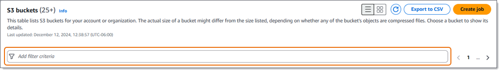
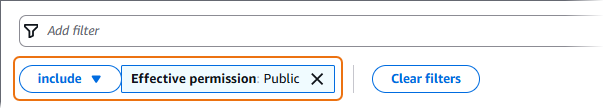

# Filtering your S3 bucket inventory in

Macie

To identify and focus on buckets that have specific characteristics, you can filter your
S3 bucket inventory on the Amazon Macie console and in queries that you submit programmatically
using the Amazon Macie API. When you create a filter, you use specific bucket attributes to
define criteria for including or excluding buckets from a view or from query results. A
_bucket attribute_ is a field that stores specific
metadata for a bucket.

In Macie, a filter consists of one or more conditions. Each condition, also referred to as
a _criterion_, consists of three parts:

- An attribute-based field, such as **Bucket name**, **Tag
  key**, or **Defined in job**.
- An operator, such as _equals_ or _not equals_.
- One or more values. The type and number of values depends on the field and
  operator that you choose.
  How you define and apply filter conditions depends on whether you use the Amazon Macie
  console or the Amazon Macie API.

###### Topics

- [Filtering your
  inventory on the console](#monitoring-s3-inventory-filter-console "#monitoring-s3-inventory-filter-console")
- [Filtering your
  inventory programmatically](#monitoring-s3-inventory-filter-api "#monitoring-s3-inventory-filter-api")

## Filtering your inventory on the

Amazon Macie console

If you use the Amazon Macie console to filter your S3 bucket inventory, Macie provides
options to help you choose fields, operators, and values for individual conditions. You
access these options by using the filter box on the **S3 buckets**
page, as shown in the following image.



When you place your cursor in the filter box, Macie displays a list of fields that you
can use in filter conditions. The fields are organized by logical category. For example,
the **Common fields** category includes fields that store general
information about an S3 bucket. **Public access** categories include
fields that store data about the various types of public access settings that can apply
to a bucket. The fields are sorted alphabetically within each category.

To add a condition, start by choosing a field from the list. To find a field, browse
the complete list, or enter part of the field's name to narrow the list of
fields.

Depending on the field that you choose, Macie displays different options. The options
reflect the type and nature of the field that you choose. For example, if you choose the
**Shared access** field, Macie displays a list of values to choose
from. If you choose the **Bucket name** field, Macie displays a text
box in which you can enter the name of an S3 bucket. Whichever field you choose, Macie
guides you through the steps to add a condition that includes the required settings for
the field.

After you add a condition, Macie applies the criteria for the condition and displays
the condition in a filter token below the filter box, as shown in the following
image.



In this example, the condition is configured to include all buckets that are publicly
accessible, and to exclude all other buckets. It returns buckets where the value for the
**Effective permission** field _equals_
**Public**.

As you add more conditions, Macie applies their criteria and displays them below the
filter box. If you add multiple conditions, Macie uses AND logic to join the conditions
and evaluate the filter criteria. This means that an S3 bucket matches the filter
criteria only if it matches all the conditions in the filter. You can refer to the area
below the filter box at any time to determine which criteria you've applied.

###### To filter your inventory by using the console

1. Open the Amazon Macie console at [https://console.aws.amazon.com/macie/](https://console.aws.amazon.com/macie/ "https://console.aws.amazon.com/macie/").
2. In the navigation pane, choose **S3 buckets**. The
   **S3 buckets** page displays your bucket inventory.

If automated sensitive data discovery is enabled, the default view doesn't display data for buckets
that are currently excluded from automated discovery. If you're the Macie administrator for an
organization, it also doesn't display data for accounts that automated discovery is currently
disabled for. To display this data, choose **X** in the
**Is monitored by automated discovery** filter token below
the filter box. 3. At the top of the page, optionally choose refresh (

) to retrieve
the latest bucket metadata from Amazon S3. 4. Place your cursor in the filter box, and then choose the field to use for the
condition. 5. Choose or enter the appropriate type of value for the field, keeping the
following tips in mind.

Dates, times, and time ranges

For dates and times, use the **From** and
**To** boxes to define an inclusive time
range:

    * To define a fixed time range, use the
     **From** and **To**
     boxes to specify the first date and time and the last date
     and time in the range, respectively.
    * To define a relative time range that starts at a certain
     date and time and ends at the current time, enter the start
     date and time in the **From** boxes, and
     delete any text in **To** boxes.
    * To define a relative time range that ends at a certain
     date and time, enter the end date and time in the
     **To** boxes, and delete any text in
     the **From** boxes.

Note that time values use 24-hour notation. If you use the date
picker to choose dates, you can refine the values by entering text
directly in the **From** and
**To** boxes.

Numbers and numeric ranges

For numeric values, use the **From** and
**To** boxes to enter integers that define an
inclusive numeric range:

    * To define a fixed numeric range, use the
     **From** and **To**
     boxes to specify the lowest and highest numbers in the
     range, respectively.
    * To define a fixed numeric range that's limited to one
     specific value, enter the value in both the
     **From** and **To**
     boxes. For example, to include only those S3 buckets that
     store exactly 15 objects, enter `15` in
     the **From** and **To**
     boxes.
    * To define a relative numeric range that starts at a
     certain number, enter the number in the
     **From** box, and don’t enter any text
     in the **To** box.
    * To define a relative numeric range that ends at a certain
     number, enter the number in the **To** box,
     and don’t enter any text in the **From**
     box.

Text (string) values

For this type of value, enter a complete, valid value for the
field. Values are case sensitive.

Note that you can’t use a partial value or wildcard characters in
this type of value. The only exception is the **Bucket
name** field. For that field, you can specify a prefix
instead of a complete bucket name. For example, to find all S3
buckets whose names begin with _my-S3_, enter `my-S3` as the
filter value for **Bucket name** field. If you
enter any other value, such as `My-s3` or
`my*`, Macie won’t return the
buckets. 6. When you finish adding a value for the field, choose
**Apply**. Macie applies the filter criteria and displays
the condition in a filter token below the filter box. 7. Repeat steps 4 through 6 for each additional condition that you want to
add. 8. To remove a condition, choose the **X** in the filter token
for the condition. 9. To change a condition, remove the condition by choosing the
**X** in the filter token for the condition. Then repeat
steps 4 through 6 to add a condition with the correct settings.

## Filtering your inventory

programmatically with the Amazon Macie API

To filter your S3 bucket inventory programmatically, specify filter criteria in
queries that you submit using the [DescribeBuckets](../APIReference/datasources-s3.md "../APIReference/datasources-s3.md")
operation of the Amazon Macie API. This operation returns an array of objects. Each object
contains statistical data and other information about a bucket that matches the filter
criteria.

To specify filter criteria in a query, include a map of filter conditions in your
request. For each condition, specify a field, an operator, and one or more values for
the field. The type and number of values depends on the field and operator that you
choose. For information about the fields, operators, and types of values that you can
use in a condition, see [Amazon S3 Data Sources](../APIReference/datasources-s3.md "../APIReference/datasources-s3.md") in the
_Amazon Macie API Reference_.

The following examples show you how to specify filter criteria in queries that you
submit using the [AWS Command Line Interface (AWS CLI)](../../../cli/latest/userguide/cli-chap-welcome.md "../../../cli/latest/userguide/cli-chap-welcome.md"). You can
also do this by using a current version of another AWS command line tool or an AWS
SDK, or by sending HTTPS requests directly to Macie. For information about AWS tools and SDKs,
see [Tools to Build on AWS](https://aws.amazon.com/developer/tools/ "https://aws.amazon.com/developer/tools/").

###### Examples

- [Find
  buckets by bucket name](#monitoring-s3-inventory-filter-api-example1 "#monitoring-s3-inventory-filter-api-example1")
- [Find
  buckets that are publicly accessible](#monitoring-s3-inventory-filter-api-example2 "#monitoring-s3-inventory-filter-api-example2")
- [Find
  buckets that store unencrypted objects](#monitoring-s3-inventory-filter-api-example3 "#monitoring-s3-inventory-filter-api-example3")
- [Find
  buckets that replicate data to external accounts](#monitoring-s3-inventory-filter-api-example5 "#monitoring-s3-inventory-filter-api-example5")
- [Find
  buckets that aren’t monitored by a sensitive data discovery job](#monitoring-s3-inventory-filter-api-example4 "#monitoring-s3-inventory-filter-api-example4")
- [Find
  buckets that aren’t monitored by automated sensitive data discovery](#monitoring-s3-inventory-filter-api-example-asdd "#monitoring-s3-inventory-filter-api-example-asdd")
- [Find
  buckets based on multiple criteria](#monitoring-s3-inventory-filter-api-example6 "#monitoring-s3-inventory-filter-api-example6")

The examples use the [describe-buckets](../../../cli/latest/reference/macie2/describe-buckets.md "../../../cli/latest/reference/macie2/describe-buckets.md")
command. If the command runs successfully, Macie returns a `buckets` array.
The array contains an object for each bucket that’s in the current AWS Region and
matches the filter criteria. For an example of this output, expand the following
section.

In this example, the `buckets` array provides details about two
buckets that match the filter criteria specified in a query.

```
`{
 "buckets": [
 {
 "accountId": "123456789012",
 "allowsUnencryptedObjectUploads": "FALSE",
 "automatedDiscoveryMonitoringStatus": "MONITORED",
 "bucketArn": "arn:aws:s3:::amzn-s3-demo-bucket1",
 "bucketCreatedAt": "2020-05-18T19:54:00+00:00",
 "bucketName": "amzn-s3-demo-bucket1",
 "classifiableObjectCount": 13,
 "classifiableSizeInBytes": 1592088,
 "jobDetails": {
 "isDefinedInJob": "TRUE",
 "isMonitoredByJob": "TRUE",
 "lastJobId": "08c81dc4a2f3377fae45c9ddaexample",
 "lastJobRunTime": "2024-05-26T14:55:30.270000+00:00"
 },
 "lastAutomatedDiscoveryTime": "2024-06-07T19:11:25.364000+00:00",
 "lastUpdated": "2024-06-12T07:33:06.337000+00:00",
 "objectCount": 13,
 "objectCountByEncryptionType": {
 "customerManaged": 0,
 "kmsManaged": 2,
 "s3Managed": 7,
 "unencrypted": 4,
 "unknown": 0
 },
 "publicAccess": {
 "effectivePermission": "NOT_PUBLIC",
 "permissionConfiguration": {
 "accountLevelPermissions": {
 "blockPublicAccess": {
 "blockPublicAcls": true,
 "blockPublicPolicy": true,
 "ignorePublicAcls": true,
 "restrictPublicBuckets": true
 }
 },
 "bucketLevelPermissions": {
 "accessControlList": {
 "allowsPublicReadAccess": false,
 "allowsPublicWriteAccess": false
 },
 "blockPublicAccess": {
 "blockPublicAcls": true,
 "blockPublicPolicy": true,
 "ignorePublicAcls": true,
 "restrictPublicBuckets": true
 },
 "bucketPolicy": {
 "allowsPublicReadAccess": false,
 "allowsPublicWriteAccess": false
 }
 }
 }
 },
 "region": "us-east-1",
 "replicationDetails": {
 "replicated": false,
 "replicatedExternally": false,
 "replicationAccounts": []
 },
 "sensitivityScore": 78,
 "serverSideEncryption": {
 "kmsMasterKeyId": null,
 "type": "NONE"
 },
 "sharedAccess": "NOT_SHARED",
 "sizeInBytes": 4549746,
 "sizeInBytesCompressed": 0,
 "tags": [
 {
 "key": "Division",
 "value": "HR"
 },
 {
 "key": "Team",
 "value": "Recruiting"
 }
 ],
 "unclassifiableObjectCount": {
 "fileType": 0,
 "storageClass": 0,
 "total": 0
 },
 "unclassifiableObjectSizeInBytes": {
 "fileType": 0,
 "storageClass": 0,
 "total": 0
 },
 "versioning": true
 },
 {
 "accountId": "123456789012",
 "allowsUnencryptedObjectUploads": "TRUE",
 "automatedDiscoveryMonitoringStatus": "MONITORED",
 "bucketArn": "arn:aws:s3:::amzn-s3-demo-bucket2",
 "bucketCreatedAt": "2020-11-25T18:24:38+00:00",
 "bucketName": "amzn-s3-demo-bucket2",
 "classifiableObjectCount": 8,
 "classifiableSizeInBytes": 133810,
 "jobDetails": {
 "isDefinedInJob": "TRUE",
 "isMonitoredByJob": "FALSE",
 "lastJobId": "188d4f6044d621771ef7d65f2example",
 "lastJobRunTime": "2024-04-09T19:37:11.511000+00:00"
 },
 "lastAutomatedDiscoveryTime": "2024-06-07T19:11:25.364000+00:00",
 "lastUpdated": "2024-06-12T07:33:06.337000+00:00",
 "objectCount": 8,
 "objectCountByEncryptionType": {
 "customerManaged": 0,
 "kmsManaged": 0,
 "s3Managed": 8,
 "unencrypted": 0,
 "unknown": 0
 },
 "publicAccess": {
 "effectivePermission": "NOT_PUBLIC",
 "permissionConfiguration": {
 "accountLevelPermissions": {
 "blockPublicAccess": {
 "blockPublicAcls": true,
 "blockPublicPolicy": true,
 "ignorePublicAcls": true,
 "restrictPublicBuckets": true
 }
 },
 "bucketLevelPermissions": {
 "accessControlList": {
 "allowsPublicReadAccess": false,
 "allowsPublicWriteAccess": false
 },
 "blockPublicAccess": {
 "blockPublicAcls": true,
 "blockPublicPolicy": true,
 "ignorePublicAcls": true,
 "restrictPublicBuckets": true
 },
 "bucketPolicy": {
 "allowsPublicReadAccess": false,
 "allowsPublicWriteAccess": false
 }
 }
 }
 },
 "region": "us-east-1",
 "replicationDetails": {
 "replicated": false,
 "replicatedExternally": false,
 "replicationAccounts": []
 },
 "sensitivityScore": 95,
 "serverSideEncryption": {
 "kmsMasterKeyId": null,
 "type": "AES256"
 },
 "sharedAccess": "EXTERNAL",
 "sizeInBytes": 175978,
 "sizeInBytesCompressed": 0,
 "tags": [
 {
 "key": "Division",
 "value": "HR"
 },
 {
 "key": "Team",
 "value": "Recruiting"
 }
 ],
 "unclassifiableObjectCount": {
 "fileType": 3,
 "storageClass": 0,
 "total": 3
 },
 "unclassifiableObjectSizeInBytes": {
 "fileType": 2999826,
 "storageClass": 0,
 "total": 2999826
 },
 "versioning": true
 }
 ]
}`
```

If no buckets match the filter criteria, Macie returns an empty `buckets`
array.

```
`{
 "buckets": []
}`
```

### Example: Find buckets

by bucket name

This example queries metadata for buckets that are in the current AWS Region and
have names beginning with _my-S3_.

For Linux, macOS, or Unix:

```
`$` `aws macie2 describe-buckets --criteria '{"`bucketName`":{"`prefix`":"`my-S3`"}}'`
```

For Microsoft Windows:

```
`C:\>` `aws macie2 describe-buckets --criteria={\"`bucketName`\":{\"`prefix`\":\"`my-S3`\"}}`
```

Where:

- `bucketName` specifies the JSON name of the
  **Bucket name** field.
- `prefix` specifies the _prefix_ operator.
- `my-S3` is the value for the **Bucket
  name** field.

### Example: Find buckets

that are publicly accessible

This example queries metadata for buckets that are in the current AWS Region
and, based on a combination of permissions settings, are publicly accessible.

For Linux, macOS, or Unix:

```
`$` `aws macie2 describe-buckets --criteria '{"`publicAccess.effectivePermission`":{"`eq`":["`PUBLIC`"]}}'`
```

For Microsoft Windows:

```
`C:\>` `aws macie2 describe-buckets --criteria={\"`publicAccess.effectivePermission`\":{\"`eq`\":[\"`PUBLIC`\"]}}`
```

Where:

- `publicAccess.effectivePermission` specifies the
  JSON name of the **Effective permission** field.
- `eq` specifies the _equals_ operator.
- `PUBLIC` is an enumerated value for the
  **Effective permission** field.

### Example: Find buckets

that store unencrypted objects

This example queries metadata for buckets that are in the current AWS Region and
store unencrypted objects.

For Linux, macOS, or Unix:

```
`$` `aws macie2 describe-buckets --criteria '{"`objectCountByEncryptionType.unencrypted`":{"`gte`":`1`}}'`
```

For Microsoft Windows:

```
`C:\>` `aws macie2 describe-buckets --criteria={\"`objectCountByEncryptionType.unencrypted`\":{\"`gte`\":`1`}}`
```

Where:

- `objectCountByEncryptionType.unencrypted`
  specifies the JSON name of the **No encryption**
  field.
- `gte` specifies the _greater than or equal to_ operator.
- `1` is the lowest value in an inclusive, relative
  numeric range for the **No encryption** field.

### Example: Find buckets

that replicate data to external accounts

This example queries metadata for buckets that are in the current AWS Region and
are configured to replicate objects to buckets for an AWS account that isn’t part
of your organization.

For Linux, macOS, or Unix:

```
`$` `aws macie2 describe-buckets --criteria '{"`replicationDetails.replicatedExternally`":{"`eq`":["`true`"]}}'`
```

For Microsoft Windows:

```
`C:\>` `aws macie2 describe-buckets --criteria={\"`replicationDetails.replicatedExternally`\":{\"`eq`\":[\"`true`\"]}}`
```

Where:

- `replicationDetails.replicatedExternally`
  specifies the JSON name of the **Replicated externally**
  field.
- `eq` specifies the _equals_ operator.
- `true` specifies a Boolean value for the
  **Replicated externally** field.

### Example: Find buckets

that aren’t monitored by a sensitive data discovery job

This example queries metadata for buckets that are in the current AWS Region and
aren’t associated with any periodic sensitive data discovery jobs.

For Linux, macOS, or Unix:

```
`$` `aws macie2 describe-buckets --criteria '{"`jobDetails.isMonitoredByJob`":{"`eq`":["`FALSE`"]}}'`
```

For Microsoft Windows:

```
`C:\>` `aws macie2 describe-buckets --criteria={\"`jobDetails.isMonitoredByJob`\":{\"`eq`\":[\"`FALSE`\"]}}`
```

Where:

- `jobDetails.isMonitoredByJob` specifies the JSON
  name of the **Actively monitored by job** field.
- `eq` specifies the _equals_ operator.
- `FALSE` is an enumerated value for the
  **Actively monitored by job** field.

### Example: Find

buckets that aren’t monitored by automated sensitive data discovery

This example queries metadata for buckets that are in the current AWS Region and
are excluded from automated sensitive data discovery.

For Linux, macOS, or Unix:

```
`$` `aws macie2 describe-buckets --criteria '{"`automatedDiscoveryMonitoringStatus`":{"`eq`":["`NOT_MONITORED`"]}}'`
```

For Microsoft Windows:

```
`C:\>` `aws macie2 describe-buckets --criteria={\"`automatedDiscoveryMonitoringStatus`\":{\"`eq`\":[\"`NOT_MONITORED`\"]}}`
```

Where:

- `automatedDiscoveryMonitoringStatus` specifies
  the JSON name of the **Is monitored by automated discovery**
  field.
- `eq` specifies the _equals_ operator.
- `NOT_MONITORED` is an enumerated value for the
  **Is monitored by automated discovery** field.

### Example: Find buckets

based on multiple criteria

This example queries metadata for buckets that are in the current AWS Region and
match the following criteria: are publicly accessible based on a combination of
permission settings; store unencrypted objects; and, aren’t associated with any
periodic sensitive data discovery jobs.

For Linux, macOS, or Unix, using the backslash (\) line-continuation character to improve readability:

```
`$` `aws macie2 describe-buckets \
--criteria '{"`publicAccess.effectivePermission`":{"`eq`":["`PUBLIC`"]},"`objectCountByEncryptionType.unencrypted`":{"`gte`":`1`},"`jobDetails.isMonitoredByJob`":{"`eq`":["`FALSE`"]}}'`
```

For Microsoft Windows, using the caret (^) line-continuation character to improve readability:

```
`C:\>` `aws macie2 describe-buckets ^
--criteria={\"`publicAccess.effectivePermission`\":{\"`eq`\":[\"`PUBLIC`\"]},\"`objectCountByEncryptionType.unencrypted`\":{\"`gte`\":`1`},\"`jobDetails.isMonitoredByJob`\":{\"`eq`\":[\"`FALSE`\"]}}`
```

Where:

- `publicAccess.effectivePermission` specifies the
  JSON name of the **Effective permission** field,
  and:
  - `eq` specifies the _equals_ operator.
  - `PUBLIC` is an enumerated value for the
    **Effective permission** field.

- `objectCountByEncryptionType.unencrypted`
  specifies the JSON name of the **No encryption** field,
  and:
  - `gte` specifies the _greater than or equal to_
    operator.
  - `1` is the lowest value in an inclusive,
    relative numeric range for the **No encryption**
    field.

- `jobDetails.isMonitoredByJob` specifies the JSON
  name of the **Actively monitored by job** field,
  and:
  - `eq` specifies the _equals_ operator.
  - `FALSE` is an enumerated value for the
    **Actively monitored by job** field.
