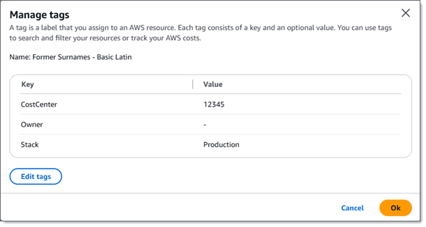

# Reviewing and editing tags for Macie

resources

As your environment or requirements change over time, you can evaluate existing tags
for your Amazon Macie resources and change the tags as necessary. A *tag* is a label that you define and assign to one or more AWS
resources, including certain types of Macie resources. Each tag consists of a required
_tag key_ and an optional _tag value_. A _tag key_ is a general
label that acts as a category for a more specific tag value. A _tag value_ acts as a descriptor for a tag key.

Tags can help you identify, categorize, and manage resources in different ways, such
as by purpose, owner, environment, or other criteria. For example, you can use tags to:
apply policies, allocate costs, distinguish between versions of resources, or identify
resources that support certain compliance requirements or workflows.

You can assign tags to the following types of Macie resources:

- Allow lists
- Custom data identifiers
- Filter rules and suppression rules for findings
- Sensitive data discovery jobs
  If you're the Macie administrator for an organization, you can also assign tags to member
  accounts in your organization. A resource can have as many as 50 tags.

###### Topics

- [Reviewing tags for
  resources](#tags-retrieve "#tags-retrieve")
- [Editing tags for resources](#tags-update "#tags-update")

## Reviewing tags for Macie resources

You can review the tags for an Amazon Macie resource by using Macie or AWS Resource Groups.
AWS Resource Groups is a service that's designed to help you group and manage AWS resources
as a single unit instead of individually. If you use Macie, you can review the tags
for one resource at a time. With AWS Resource Groups, you can review tags in bulk for multiple
existing resources spanning multiple AWS services, including Macie.

###### To review the tags for a Macie resource

To review the tags for an individual Macie resource, you can use the Amazon Macie
console or the Amazon Macie API. To review tags for multiple Macie resources at the
same time, use the Tag Editor on the AWS Resource Groups console or the tagging operations
of the AWS Resource Groups Tagging API. For more information, see the [Tagging
AWS Resources User Guide](../../../tag-editor/latest/userguide/tagging.md "../../../tag-editor/latest/userguide/tagging.md").

Console
Follow these steps to review a resource's tags by using the Amazon Macie
console.

###### To review the tags for a resource

1.  Open the Amazon Macie console at [https://console.aws.amazon.com/macie/](https://console.aws.amazon.com/macie/ "https://console.aws.amazon.com/macie/").
2.  Depending on the type of resource whose tags you want to
    review, do one of the following:

        * For an allow list, choose **Allow lists** in
         the navigation pane. In the table, select the checkbox for the list. Then choose
         **Manage tags** on the
         **Actions** menu.
        * For a custom data identifier, choose **Custom data identifiers** in
         the navigation pane. In the table, select the checkbox for the custom data identifier. Then choose
         **Manage tags** on the
         **Actions** menu.
        * For a filter or suppression rule, choose **Findings** in the
         navigation pane. In the **Saved rules** list, choose the edit icon
         (
        
        ) next to the rule. Then choose
         **Manage tags**.
        * For a member account in your organization, choose **Accounts** in
         the navigation pane. In the table, select the checkbox for the account. Then choose
         **Manage tags** on the
         **Actions** menu.
        * For a sensitive data discovery job, choose **Jobs** in the
         navigation pane. In the table, select the checkbox for the job. Then choose **Manage
         tags** on the **Actions** menu.

    The **Manage tags** window lists all the tags
    that are currently assigned to the resource. For example, the
    following image shows the tags that are assigned to a custom
    data identifier.



In this example, three tags are assigned to the custom data identifier: the
**CostCenter** tag key with
**12345** as an associated tag value; the
**Owner** tag key with no associated tag
value (–); and, the **Stack** tag key
with **Production** as an associated tag
value. 3. When you finish reviewing the tags, choose
**Cancel** to close the window.

API
To retrieve and review the tags for an existing resource
programmatically, you can use the appropriate `Get` or
`Describe` operation for the type of resource whose tags
you want to review. For example, if you use the [GetCustomDataIdentifier](../APIReference/custom-data-identifiers-id.md "../APIReference/custom-data-identifiers-id.md") operation or you run the [get-custom-data-identifier](../../../cli/latest/reference/macie2/get-custom-data-identifier.md "../../../cli/latest/reference/macie2/get-custom-data-identifier.md") command from the AWS Command Line Interface
(AWS CLI), the response includes a `tags` object. The object
lists all the tags (both tag keys and tag values) that are currently
assigned to the resource.

You can also use the [ListTagsForResource](../APIReference/tags-resourcearn.md "../APIReference/tags-resourcearn.md") operation of the Amazon Macie API. In your
request, use the `resourceArn` parameter to specify the
Amazon Resource Name (ARN) of the resource. If you're using the AWS CLI,
run the [list-tags-for-resource](../../../cli/latest/reference/macie2/list-tags-for-resource.md "../../../cli/latest/reference/macie2/list-tags-for-resource.md") command and use the
`resource-arn` parameter to specify the ARN of the
resource. For example:

```
`C:\>` `aws macie2 list-tags-for-resource --resource-arn `arn:aws:macie2:us-east-1:123456789012:classification-job/3ce05dbb7ec5505def334104bexample``
```

In the preceding example,
`arn:aws:macie2:us-east-1:123456789012:classification-job/3ce05dbb7ec5505def334104bexample`
is the ARN of an existing sensitive data discovery job.

If the operation succeeds, Macie returns a `tags` object
that lists all the tags (both tag keys and tag values) that are
currently assigned to the resource. For example:

```
`{
 "tags": {
 "Stack": "Production",
 "CostCenter": "12345",
 "Owner": ""
 }
}`
```

Where `Stack`, `CostCenter`, and
`Owner` are the tag keys that are assigned to the
resource. `Production` is the tag value that's associated
with the `Stack` tag key. `12345` is the tag value
that's associated with the `CostCenter` tag key. The
`Owner` tag key doesn't have an associated tag
value.

To retrieve a list of all the Macie resources that have tags and all
the tags that are assigned to each of those resources, use the [GetResources](../../../resourcegroupstagging/latest/APIReference/API_GetResources.md "../../../resourcegroupstagging/latest/APIReference/API_GetResources.md") operation of the AWS Resource Groups Tagging API. In
your request, set the value for the `ResourceTypeFilters`
parameter to `macie2`. To do this by using the AWS CLI, run the
[get-resources](../../../cli/latest/reference/resourcegroupstaggingapi/get-resources.md "../../../cli/latest/reference/resourcegroupstaggingapi/get-resources.md") command and set the value for the
`resource-type-filters` parameter to `macie2`.
For example:

```
`C:\>` `aws resourcegroupstaggingapi get-resources --resource-type-filters "macie2"`
```

If the operation succeeds, Resource Groups returns a
`ResourceTagMappingList` array that contains the ARNs of
all the Macie resources that have tags, and the tag keys and values that
are assigned to each of those resources.

## Editing tags for Macie resources

To edit the tags (tag keys or tag values) for an Amazon Macie resource, you can use
Macie or AWS Resource Groups. If you use Macie, you can edit the tags for one resource at a
time. If you use AWS Resource Groups, you can edit tags in bulk for multiple existing
resources spanning multiple AWS services, including Macie.

###### To edit the tags for a Macie resource

To edit the tags for an individual Macie resource, you can use the Amazon Macie
console or the Amazon Macie API. To edit tags for multiple Macie resources at the
same time, use the [Tag Editor](../../../tag-editor/latest/userguide/tagging.md "../../../tag-editor/latest/userguide/tagging.md") on the
AWS Resource Groups console or the tagging operations of the [AWS Resource Groups
Tagging API](../../../resourcegroupstagging/latest/APIReference/overview.md "../../../resourcegroupstagging/latest/APIReference/overview.md").

###### Important

Editing the tags for a resource can affect access to the resource. Before you
edit a tag key or value for a resource, review any AWS Identity and Access Management (IAM) policies
that might use the tag to control access to resources. For more information, see
[Controlling access to AWS resources using tags](../../../IAM/latest/UserGuide/access_tags.md "../../../IAM/latest/UserGuide/access_tags.md") in the _IAM User Guide_.

Console
Follow these steps to edit a resource's tags by using the Amazon Macie
console.

###### To edit the tags for a resource

1.  Open the Amazon Macie console at [https://console.aws.amazon.com/macie/](https://console.aws.amazon.com/macie/ "https://console.aws.amazon.com/macie/").
2.  Depending on the type of resource whose tags you want to edit,
    do one of the following:

        * For an allow list, choose **Allow lists** in
         the navigation pane. In the table, select the checkbox for the list. Then choose
         **Manage tags** on the
         **Actions** menu.
        * For a custom data identifier, choose **Custom data identifiers** in
         the navigation pane. In the table, select the checkbox for the custom data identifier. Then choose
         **Manage tags** on the
         **Actions** menu.
        * For a filter or suppression rule, choose **Findings** in the
         navigation pane. In the **Saved rules** list, choose the edit icon
         (
        
        ) next to the rule. Then choose
         **Manage tags**.
        * For a member account in your organization, choose **Accounts** in
         the navigation pane. In the table, select the checkbox for the account. Then choose
         **Manage tags** on the
         **Actions** menu.
        * For a sensitive data discovery job, choose **Jobs** in the
         navigation pane. In the table, select the checkbox for the job. Then choose **Manage
         tags** on the **Actions** menu.

    The **Manage tags** window lists all the tags
    that are currently assigned to the resource.

3.  In the **Manage tags** window, choose
    **Edit tags**.
4.  Do any of the following:

        * To add a tag value to a tag key, enter the value in
         the **Value** box next to the tag
         key.
        * To change an existing tag key, choose
         **Remove** next to the tag. Then
         choose **Add tag**. In the
         **Key** box that appears, enter the
         new tag key. Optionally enter an associated tag value in
         the **Value** box.
        * To change an existing tag value, choose
         **X** in the
         **Value** box that contains the
         value. Then enter the new tag value in the
         **Value** box.
        * To remove an existing tag value, choose
         **X** in the
         **Value** box that contains the
         value.
        * To remove an existing tag (both the tag key and tag
         value), choose **Remove** next to the
         tag.

    A resource can have as many as 50 tags. A tag key can contain
    as many as 128 characters. A tag value can contain as many as
    256 characters. The characters can be letters, numbers, spaces,
    or the following symbols: \_ . : / = + - @

5.  When you finish editing the tags, choose
    **Save**.

API
When you edit a tag for a resource programmatically, you overwrite the
existing tag with new values. Therefore, the best way to edit a tag
depends on whether you want to edit a tag key, a tag value, or both. To
edit a tag key, [remove the current
tag](tags-remove.md "tags-remove.md") and [add a new tag](tags-add.md "tags-add.md").

To edit or remove only the tag value that's associated with a tag key,
overwrite the existing value by using the [TagResource](../APIReference/tags-resourcearn.md "../APIReference/tags-resourcearn.md") operation of the Amazon Macie API. If you're using
the AWS Command Line Interface (AWS CLI), you can do this by running the [tag-resource](../../../cli/latest/reference/macie2/tag-resource.md "../../../cli/latest/reference/macie2/tag-resource.md") command. In your request, specify the Amazon
Resource Name (ARN) of the resource whose tag value you want to edit or
remove.

To edit a tag value for a tag key, use the `tags` parameter
to specify the tag key whose tag value you want to change, and specify
the new tag value for the key. For example, the following command
changes the tag value from `Production` to
`Staging` for the `Stack` tag key that's
assigned to the specified sensitive data discovery job.
This example is formatted for Microsoft Windows and it uses the caret (^) line-continuation character to improve readability.

```
`C:\>` `aws macie2 tag-resource ^
--resource-arn `arn:aws:macie2:us-east-1:123456789012:classification-job/3ce05dbb7ec5505def334104bexample` ^
--tags={\"`Stack`\":\"`Staging`\"}`
```

Where:

- `resource-arn` specifies the job's ARN.
- `Stack` is the tag key
  that's associated with the tag value to change.
- `Staging` is the new tag
  value for the specified tag key
  (`Stack`).

To remove a tag value from a tag key, don’t specify a value for the
`value` argument in the `tags` parameter. For
example:

```
`C:\>` `aws macie2 tag-resource ^
--resource-arn `arn:aws:macie2:us-east-1:123456789012:classification-job/3ce05dbb7ec5505def334104bexample` ^
--tags={\"`Stack`\":\"\"}`
```

If the operation succeeds, Macie returns an empty HTTP 204 response.
Otherwise, Macie returns an HTTP 4*xx*
or 500 response that indicates why the operation failed.
