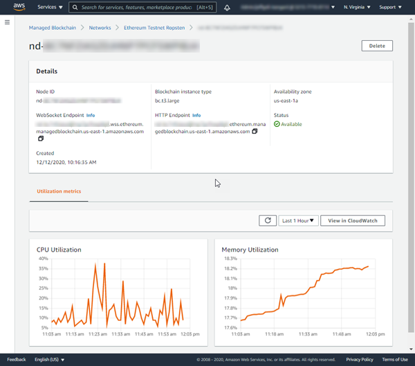

# Working with Ethereum nodes using AMB Access

You can use AMB Access Ethereum to create nodes and join them to Ethereum public networks. A node is a
computer that connects to a blockchain network. A blockchain network consists of multiple parties
(or peers) that are connected to each other in a decentralized way. When you use AMB Access Ethereum, you pay for the
nodes, the storage that you use, and the requests that are made between the nodes and the network.

## Creating a node

When you create an Ethereum node, you select the network that the node joins and the
configuration details such as the instance type and the Ethereum node type. When you create an Ethereum
node in Amazon Managed Blockchain (AMB), a full Geth node on the selected Ethereum network is created. The IAM principal
(user or group) that you use must have permissions to create nodes and view node information. For
more information, see [Performing all available actions for AMB Access Ethereum](security_iam_id-based-policy-examples.md#security_iam_id-based-policy-example "security_iam_id-based-policy-examples.md#security_iam_id-based-policy-example").

To create an Ethereum node, you must consider and select the following characteristics:

- **Blockchain network** – Amazon Managed Blockchain (AMB) supports the following public Ethereum networks:

**Mainnet** – The proof-of-stake network of the primary public Ethereum blockchain. Transactions on Mainnet have actual value (that is, they incur real costs) and are recorded on the distributed ledger. This network supports the JSON-RPC and Consensus API operations.

- **Blockchain instance type** – This determines the computational
  and memory capacity allocated to this node for the blockchain workload. If you anticipate a
  more demanding workload for each node, you can choose more CPU and RAM. For example, your nodes
  might need to process a higher rate of transactions. Different instance types are subject to
  different pricing.

###### Note

For optimal performance and minimal degradation, we recommend the `bc.t3.xlarge` (or larger) instance size.

- **Ethereum node type** – The only node type that is currently
  supported is **Full node (Geth)**. The node uses the Geth execution client and
  the Lighthouse consensus client. For more information about node types, see [Node
  Types](https://ethereum.org/en/developers/docs/nodes-and-clients/#node-types "https://ethereum.org/en/developers/docs/nodes-and-clients/#node-types") in the Ethereum developer documentation. For more information on
  _Execution clients_ such as Geth, see [Execution
  clients](https://ethereum.org/en/developers/docs/nodes-and-clients/#execution-clients "https://ethereum.org/en/developers/docs/nodes-and-clients/#execution-clients") in the Ethereum developer documentation. For more information on
  _Consensus clients_ such as Lighthouse, see [Consensus
  clients](https://ethereum.org/en/developers/docs/nodes-and-clients/#consensus-clients "https://ethereum.org/en/developers/docs/nodes-and-clients/#consensus-clients") in the Ethereum developer documentation.
- **Availability Zone** – You can select the Availability Zone to
  launch the Ethereum node in. You can distribute nodes across different Availability Zones. This
  way, you can design your blockchain application for resiliency. For more information, see
  [Regions and Availability
  Zones](../../../AWSEC2/latest/UserGuide/using-regions-availability-zones.md "../../../AWSEC2/latest/UserGuide/using-regions-availability-zones.md") in the _Amazon EC2 User Guide_.

1. Open the AMB Access console at [https://console.aws.amazon.com/managedblockchain/](https://console.aws.amazon.com/managedblockchain/ "https://console.aws.amazon.com/managedblockchain/").
2. Choose **Networks** from the **Access** header in the left navigation.
3. Choose the **Dedicated networks** tab and select
   **Ethereum Mainnet** as your network to the details page.
4. Choose **Create node**.
5. In the **Create node** page, choose the **Blockchain instance type** suitable for your application. If your
   nodes need to process a higher rate of transactions more efficiently, choose an instance type
   with more CPU and RAM.
6. Choose the **Ethereum node type**, choose **Full node (Geth)**.
7. Choose the **Availability zone** such as **us-east-1**.
8. Optional, choose **Add new tag** in the **Tags** section.
9. Choose **Create node**.

###### Note

Amazon Managed Blockchain (AMB) Access Ethereum provisions and configures the node for you. The length of this process is not instantaneous depends on
many variables.
The following example shows how to use the `create-node` command. Replace the
value of `--network-id`, `InstanceType`, and
`AvailabilityZone` as appropriate.

```
aws managedblockchain create-node \
  --node-configuration '{"InstanceType":"`bc.t3.xlarge`","AvailabilityZone":"`us-east-1a`"}' \
  --network-id `n-ethereum-mainnet`
```

Ethereum public networks have the following network IDs:

- `n-ethereum-mainnet`
  The command returns the node ID, as shown in the following snippet.

```
{
    "NodeId": "`nd-RG3GM4U7HFFHHHGJHHU7UNPCLU`"
}
```

After you create the node, the **Node** details page in the AWS Management Console displays
the endpoints that you can use to make Ethereum API calls from code on a client. There are separate endpoints for
HTTP connections and WebSocket connections. For more information about sending API calls to
an Ethereum node in Amazon Managed Blockchain (AMB) to interact with smart contracts, see [Using Ethereum APIs with Amazon Managed Blockchain (AMB)](ethereum-api.md "ethereum-api.md").

## Viewing node details

After you create a node, you can view administrative properties for each node that your
AWS account owns. For example, you can view the endpoints to use for Ethereum API calls on HTTP
and WebSocket (JSON-RPC API only) connections, the node status, and important performance
metrics for the node. The IAM principal (user or group) that you use must have permissions to
list and get node information. For more information, see [Identity-based policy examples](security_iam_id-based-policy-examples.md "security_iam_id-based-policy-examples.md").

Information such as the AMB Access instance type, Availability Zone, and creation date, is
available for the node. The following properties are also available:

- **Status**
  - **Creating**

  AMB Access is provisioning and configuring the AMB Access instance for the node. The amount of
  time that it takes to create a node depends on many factors. Nodes on testnets typically take
  a few minutes to create. Nodes on mainnet might take an hour or longer to create.
  - **Available**

  The node is running and available on the network.
  - **Unhealthy**

  AMB Access detected a problem and is automatically replacing the blockchain instance that
  the node runs on. Nodes in an unhealthy state typically return to an available state in
  approximately five minutes.
  - **Failed**

  The node has an issue that caused AMB Access to add it to the deny list on the network. This
  usually indicates that the node reached its memory or storage capacity. As a first step, we
  recommend that you delete the instance and provision an instance type with more
  capability.
  - **Create Failed**

  The node couldn't be created with the AMB Access instance type and the Availability Zone
  specified. We recommend trying another availability zone, a different instance type, or
  both.
  - **Deleting**

  The node is being deleted.
  - **Deleted**

  The node is now deleted. For possible reasons, see the previous item.

- **Endpoints**

Endpoints are used to make Ethereum API calls to the node. When AMB Access creates the node, it
assigns unique endpoints. Nodes support connections over HTTP and WebSockets (JSON-RPC API
only). You use a different endpoint for each connection. For more information, see [Using Ethereum APIs with Amazon Managed Blockchain (AMB)](ethereum-api.md "ethereum-api.md").

1. Open the AMB Access console at [https://console.aws.amazon.com/managedblockchain/](https://console.aws.amazon.com/managedblockchain/ "https://console.aws.amazon.com/managedblockchain/").
2. If the console doesn't open to the **Networks** list, choose **Networks** from the navigation pane.
3. Choose the **Name** of the Ethereum network that the node belongs to from the list.
4. On the network details page, under **Nodes**, choose the **Node ID**.
5. The following example shows how the node details page displays key properties and metrics for
   the node.


The following example shows how to use the `get-node` command to view Ethereum
node information. Replace the value of `--network-id` and `--node-id` as
appropriate.

```
aws managedblockchain get-node \
  --network-id `n-ethereum-mainnet` \
  --node-id `nd-RG3GM4U7HFFHHHGJHHU7UNPCLU`
```

The command returns the following output that includes the node's
`HttpEndpoint`, `WebSocketEndpoint`, and other key properties.

```
{
    "Node": {
        "NetworkId": "`n-ethereum-mainnet`",
        "Id": "`nd-RG3GM4U7HFFHHHGJHHU7UNPCLU`",
        "InstanceType": "`bc.t3.xlarge`",
        "AvailabilityZone": "`us-east-1a`",
        "FrameworkAttributes": {
            "Ethereum": {
                "HttpEndpoint": "`nd-rg3gm4u7hffhhhgjhhu7unpclu.ethereum.managedblockchain.us-east-1.amazonaws.com`",
                "WebSocketEndpoint": "`nd-rg3gm4u7hffhhhgjhhu7unpclu.wss.ethereum.managedblockchain.us-east-1.amazonaws.com`"
            }
        },
        "Status": "`CREATING`",
        "CreationDate": "`2021-06-25T20:10:18.555000+00:00`",
        "Tags": {},
        "Arn": "`arn:aws:managedblockchain:us-east-1:111122223333:nodes/nd-RG3GM4U7HFFHHHGJHHU7UNPCLU`"
    }
}
```

## Deleting a node

When you delete an Ethereum node from AMB Access, all resources that are stored on that node are
immediately deleted. The IAM principal (user or group) that you use must have permissions to
delete nodes. For more information, see [Performing all available actions for AMB Access Ethereum](security_iam_id-based-policy-examples.md#security_iam_id-based-policy-example "security_iam_id-based-policy-examples.md#security_iam_id-based-policy-example").

1. Open the AMB Access console at [https://console.aws.amazon.com/managedblockchain/](https://console.aws.amazon.com/managedblockchain/ "https://console.aws.amazon.com/managedblockchain/").
2. If the console doesn't open to the **Networks** list, choose **Networks** from the navigation pane.
3. Choose the **Name** of the Ethereum network that the node belongs to from the
   list.
4. On the network details page, under **Nodes**, select the **Node
   ID**, and then choose **Delete**.
   Use the `delete-node` command to delete an Ethereum node. Replace the value of
   `--network-id` and `--node-id` as appropriate.

```
aws managedblockchain delete-node \
  --network-id `n-ethereum-mainnet` \
  --node-id `nd-RG3GM4U7HFFHHHGJHHU7UNPCLU`
```
