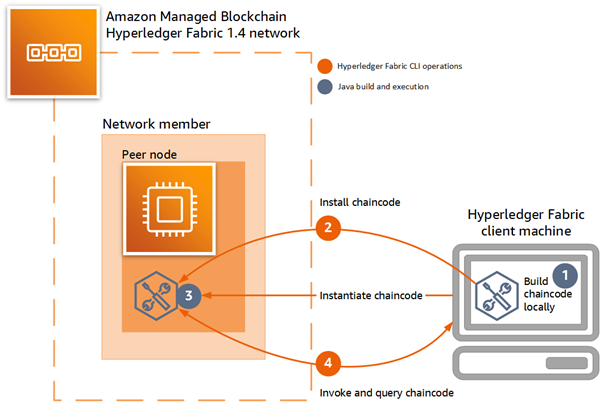

# Develop Hyperledger Fabric Chaincode Using Java on Amazon Managed Blockchain (AMB)

Hyperledger Fabric 2.2 networks on Amazon Managed Blockchain (AMB) are based on the following
components:

- [JDK 8](https://www.oracle.com/java/technologies/downloads/#java8 "https://www.oracle.com/java/technologies/downloads/#java8") or [higher](https://www.oracle.com/java/technologies/downloads/ "https://www.oracle.com/java/technologies/downloads/")
- [Hyperledger Fabric v2.2.4](https://github.com/hyperledger/fabric/tree/v2.2.4 "https://github.com/hyperledger/fabric/tree/v2.2.4")
- [Hyperledger Fabric CA v1.4.7](https://github.com/hyperledger/fabric-ca/tree/v1.4.7 "https://github.com/hyperledger/fabric-ca/tree/v1.4.7")
- [fabric-chaincode-java](https://github.com/hyperledger/fabric-chaincode-java/tree/release-2.2 "https://github.com/hyperledger/fabric-chaincode-java/tree/release-2.2")

## AMB Access Dependency on Javaenv Docker Image

AMB Access uses the `fabric-chaincode-java` package to build the `hyperledger/fabric-javaenv` Docker image. This image is the base layer of the Java chaincode container. It has built-in support to build the Java chaincode using Gradle or Maven at the following versions:

- gradle@5.6.2
- maven@3.8.1

You can verify this by examining the [Docker file in the fabric-chaincode-java package](https://github.com/hyperledger/fabric-chaincode-java/blob/release-2.2/fabric-chaincode-docker/Dockerfile "https://github.com/hyperledger/fabric-chaincode-java/blob/release-2.2/fabric-chaincode-docker/Dockerfile").

The default settings support Gradle or Maven for building Java chaincode. Once the `javaenv` Docker image is deployed, it is used to provision all new peer nodes and
install Java chaincode in those peer nodes. You cannot modify these settings or update versions on the `javaenv` Docker image because AMB Access manages these.

## Installing and Running Java Chaincode

The following is a high-level summary of the steps to install and run Java Chaincode using AMB Access with Hyperledger Fabric 2.2

1. **Marshall dependencies locally** – This step uses Gradle and the Gradle shadow plugin to download dependencies to the client machine and package them for installation to the peer node.
2. **Install the chaincode** – This step packages the Java chaincode project and copies it to the Hyperledger Fabric peer node.
3. **Invoke and query the chaincode** –
   After, you can send query transactions or invoke transactions to modify the ledger.



## Building Java Chaincode with AMB Access: Step-by-step

In a traditional installation of Hyperledger
Fabric chaincode built with Java, Gradle automatically resolves dependencies by loading
them locally in addition to downloading them from remote repositories. AMB Access does not
allow downloaded dependencies to help ensure the security and reliability of the
network. For this reason, to run Java chaincode, or any chaincode, in a Hyperledger Fabric network on AMB Access,
you manually download dependencies to the client machine and add them into the chaincode
project.

The steps in this section demonstrate how to use Gradle to build and deploy a [sample Java chaincode](https://github.com/hyperledger/fabric-samples/tree/release-2.2/chaincode/abstore/java "https://github.com/hyperledger/fabric-samples/tree/release-2.2/chaincode/abstore/java") project with fabric-shim@2.2.1 to a Hyperledger Fabric network on AMB Access. The [Gradle Shadow plugin](https://github.com/johnrengelman/shadow "https://github.com/johnrengelman/shadow") is needed to combine all jar files into a single jar file.

### Prerequisites and Assumptions

The steps below require that you have the following:

- A Hyperledger Fabric client machine with access to the internet and access to a member's peer node, ordering service, and CA on an AMB Access network running Hyperledger Fabric v2.2 or later. For more information, see the following:
  - [Create a Hyperledger Fabric Blockchain Network on Amazon Managed Blockchain (AMB)](create-network.md "create-network.md")
  - [Create an Interface VPC Endpoint for Amazon Managed Blockchain (AMB) Hyperledger Fabric](managed-blockchain-endpoints.md "managed-blockchain-endpoints.md")
  - [Work with Hyperledger Fabric Peer Nodes on AMB Access](managed-blockchain-hyperledger-peer-nodes.md "managed-blockchain-hyperledger-peer-nodes.md")
  - [Step 4: Create an Amazon EC2 Instance and Set Up the Hyperledger Fabric Client](get-started-create-client.md "get-started-create-client.md"). Optionally, modify [step 4.4](get-started-create-client.md#get-started-client-configure-peer-cli "get-started-create-client.md#get-started-client-configure-peer-cli") when launching the Docker container to establish CLI variables demonstrated in the install steps below.

- You must be a Hyperledger Fabric admin to install chaincode. For more information, see [Register and Enroll a
  Hyperledger Fabric Admin](managed-blockchain-hyperledger-create-admin.md "managed-blockchain-hyperledger-create-admin.md").

### Step 1: Download the Gradle Shadow plugin and add it to the chaincode project

Because AMB Access peer nodes don't have internet access, the [Gradle Shadow plugin](https://github.com/johnrengelman/shadow "https://github.com/johnrengelman/shadow") needs
to be downloaded manually to the client and added to the project. The plugin is
downloaded from the [Gradle plugin repository](https://plugins.gradle.org/m2/com/github/jengelman/gradle/plugins/shadow/5.1.0/ "https://plugins.gradle.org/m2/com/github/jengelman/gradle/plugins/shadow/5.1.0/").

1. Create a sub-directory in the Java chaincode working directory on the Hyperledger Fabric
   client machine where you want to download the plugin, and then switch to
   that directory. The example below uses a directory named
   `plugin`.

```
mkdir plugin
cd plugin
```

2. Download the plugin.

```
wget https://plugins.gradle.org/m2/com/github/jengelman/gradle/plugins/shadow/5.1.0/shadow-5.1.0.jar
```

3. Verify that the plugin was downloaded as expected.

```
ls
`shadow-5.1.0.jar`
```

4. After downloading the shadow plugin jar file, use an editor to modify the
   `build.gradle` file so that it references the local directory and plugin.

Make sure to remove the `id 'com.github.johnrengelman.shadow' version '5.1.0'`
entry from the `plugins` section.

The following example shows an excerpt from an edited `build.gradle` file,
with `relevant sections emphasized`:

```
`buildscript {
 dependencies {
 classpath fileTree(dir: 'plugin', include:['*.jar'])
 }
}`

plugins {
    id 'java'
}

group 'org.hyperledger.fabric-chaincode-java'
version '1.0-SNAPSHOT'

sourceCompatibility = 1.8


repositories {
    mavenLocal()
    mavenCentral()
}

dependencies {
    implementation 'org.hyperledger.fabric-chaincode-java:fabric-chaincode-shim:2.+'
}

`apply plugin: 'com.github.johnrengelman.shadow'`

shadowJar {
    baseName = 'chaincode'
    version = null
    classifier = null

    manifest {
        attributes 'Main-Class': 'org.hyperledger.fabric_samples.ABstore'
    }
}
```

### Step 2: Add

fabric-chaincode-shim and the getDeps task to the chaincode project

Update `build.gradle` to add [fabric-chaincode-shim](https://github.com/hyperledger/fabric-chaincode-java/tree/master/fabric-chaincode-shim "https://github.com/hyperledger/fabric-chaincode-java/tree/master/fabric-chaincode-shim") as a dependency in the `dependencies`
section. In addition, reference the task `getDeps` to download
dependencies to the `libs` sub-directory on the client machine. The
following example shows an excerpt from a `build.gradle` file with
`relevant sections emphasized`.

```
buildscript {
    dependencies {
        classpath fileTree(dir: 'plugin', include:['*.jar'])
    }
}

plugins {
    id 'java'
}

group 'org.hyperledger.fabric-chaincode-java'
version '1.0-SNAPSHOT'

sourceCompatibility = 1.8

repositories {
    mavenLocal()
    mavenCentral()
    maven {
        url "https://hyperledger.jfrog.io/hyperledger/fabric-maven"
    }
    maven {
        url 'https://jitpack.io'
    }
}

dependencies {
    `compile group: 'org.hyperledger.fabric-chaincode-java', name: 'fabric-chaincode-shim', version: '2.2.1'`
    testCompile group: 'junit', name: 'junit', version: '4.12'
}

apply plugin: 'com.github.johnrengelman.shadow'

shadowJar {
    baseName = 'chaincode'
    version = null
    classifier = null

    manifest {
        attributes 'Main-Class': 'org.hyperledger.fabric_samples.ABstore'
    }
}

`task getDeps(type: Copy) {
 from sourceSets.main.compileClasspath
 into 'libs/'
}`
```

### Step 3: Download dependencies and build the project locally

Run `gradle build` and `gradle getDeps` as shown in the following
examples to build the chaincode locally and download dependencies. When the
`gradle getDeps` task runs, Gradle creates the `lib`
sub-directory on the client machine and downloads dependencies to it.

1. Download chaincode project dependencies locally.

```
gradle getDeps
```

The command creates output similar to the following example.

```
Deprecated Gradle features were used in this build, making it incompatible with Gradle 7.0.
Use '--warning-mode all' to show the individual deprecation warnings.
See https://docs.gradle.org/6.5/userguide/command_line_interface.html#sec:command_line_warnings

BUILD SUCCESSFUL in 1s
1 actionable task: 1 executed

```

2. Verify that dependencies were downloaded to the libs sub-directory.

```
ls libs/
`bcpkix-jdk15on-1.62.jar error_prone_annotations-2.3.4.jar grpc-protobuf-lite-1.31.1.jar jsr305-3.0.2.jar
bcprov-jdk15on-1.62.jar fabric-chaincode-protos-2.2.1.jar grpc-stub-1.31.1.jar listenablefuture-9999.0-empty-to-avoid-conflict-with-guava.jar
checker-compat-qual-2.5.5.jar fabric-chaincode-shim-2.2.1.jar gson-2.8.6.jar org.everit.json.schema-1.12.1.jar
classgraph-4.8.47.jar failureaccess-1.0.1.jar guava-29.0-android.jar protobuf-java-3.12.0.jar
commons-cli-1.4.jar grpc-api-1.31.1.jar handy-uri-templates-2.1.8.jar protobuf-java-util-3.11.1.jar
commons-collections-3.2.2.jar grpc-context-1.31.1.jar j2objc-annotations-1.3.jar proto-google-common-protos-1.17.0.jar
commons-digester-1.8.1.jar grpc-core-1.31.1.jar javax.annotation-api-1.3.2.jar re2j-1.3.jar
commons-logging-1.2.jar grpc-netty-shaded-1.31.1.jar joda-time-2.10.2.jar
commons-validator-1.6.jar grpc-protobuf-1.31.1.jar json-20190722.jar`
```

3. Build the project using Gradle.

```
gradle build
```

The command creates output similar to the following example.

```
> Task :compileJava
Note: /home/ec2-user/fabric-samples/chaincode/abstore/java/src/main/java/org/hyperledger/fabric-samples/ABstore.java uses or overrides a deprecated API.
Note: Recompile with -Xlint:deprecation for details.

BUILD SUCCESSFUL in 5s
```

### Step 4: Add dependencies downloaded in the previous step to the project

Use a text editor to update the `build.gradle` file again so that it reference the dependencies in the `libs` sub-directory. This adds the dependencies that you downloaded in the previous step to the project.

The following example shows an excerpt from a `build.gradle` file with
`relevant sections emphasized`.

```
buildscript {
    dependencies {
        classpath fileTree(dir: 'plugin', include:['*.jar'])
    }
}

plugins {
    id 'java'
}

group 'org.hyperledger.fabric-chaincode-java'
version '1.0-SNAPSHOT'

sourceCompatibility = 1.8

repositories {
    mavenLocal()
    mavenCentral()
}

dependencies {
    `compile fileTree(dir:'libs',includes:['*.jar'])`
    testCompile group: 'junit', name: 'junit', version: '4.12'
}

apply plugin: 'com.github.johnrengelman.shadow'

shadowJar {
    baseName = 'chaincode'
    version = null
    classifier = null

    manifest {
        attributes 'Main-Class': 'org.hyperledger.fabric_samples.ABstore'
    }
}

task getDeps(type: Copy) {
  from sourceSets.main.compileClasspath
  into 'libs/'
}
```

### Step 5: Use the Hyperledger Fabric CLI to install the chaincode on the peer node

Use the Hyperledger Fabric CLI to package the Java chaincode project and copy it to the peer node. The `-l java` option is required for the `package` command to specify that the chaincode is Java-based. The path to the Java chaincode working directory is an absolute path, which is different from chaincode written in golang.

1. Before running the following chaincode commands, establish variables for the Hyperledger Fabric CLI Docker container as shown in the following example. Alternatively, you can configure a Docker compose file to establish these variables. For more information, see [Step 4.4: Configure and Run Docker Compose to Start the Hyperledger Fabric CLI](get-started-create-client.md#get-started-client-configure-peer-cli "get-started-create-client.md#get-started-client-configure-peer-cli") in the getting started tutorial. Replace the values with those appropriate for your network. Set `CORE_PEER_ADDRESS` to the endpoint of the peer node for which you want to install the chaincode, set `CORE_PEER_LOCALMSPID` to the ID of the member that owns the peer node, and set `CORE_PEER_MSPCONFIGPATH` as shown, which is the location of the membership service provider directory on the peer node.

```
docker exec -e "CORE_PEER_TLS_ENABLED=true" \
-e "CORE_PEER_TLS_ROOTCERT_FILE=/opt/home/managedblockchain-tls-chain.pem
" \
-e "CORE_PEER_ADDRESS=nd-6EAJ5VA43JGGNPXOUZP7Y47E4Y.m-K46ICRRXJRCGRNNS4ES4XUUS5A.n-MWY63ZJZU5HGNCMBQER7IN6OIU.managedblockchain.`us-east-1`.amazonaws.com:`30003`" \
-e "CORE_PEER_LOCALMSPID=m-K46ICRRXJRCGRNNS4ES4XUUS5A" \
-e "CORE_PEER_MSPCONFIGPATH=/opt/home/admin-msp"
```

2.  Running the Hyperledger Fabric CLI `package` command on the client packages the chaincode and writes the package to a file. The following example demonstrates a `package` command using the following flags:

        * The `-p` flag specifies the location of the chaincode on the client machine. When installing Java chaincode, this must be an absolute path.
        * The `-l` flag specifies that the chaincode language is `java`.
        * The `--label` flag specifies the package label, which is a human-readable description of the package.

    For more information about options, see [peer lifecycle chaincode package](https://hyperledger-fabric.readthedocs.io/en/release-2.2/commands/peerlifecycle.html#peer-lifecycle-chaincode-package "https://hyperledger-fabric.readthedocs.io/en/release-2.2/commands/peerlifecycle.html#peer-lifecycle-chaincode-package") in Hyperledger Fabric documentation.

```
cli peer lifecycle chaincode package `./abstorejava.tar.gz` \
-p /opt/home/`fabric-samples/chaincode/abstore/java/` \
-l java \
--label `MyLabel`
```

3. The following example installs the chaincode package on the peer node.

```
cli peer lifecycle chaincode install `abstorejava.tar.gz`
```

4. The following example queries the installed chaincodes on the peer node.

```
cli peer lifecycle chaincode queryinstalled
```

5.  Running the Hyperledger Fabric CLI `approveformyorg` command on the client approves the chaincode definition for your organization. The following example demonstrates an `approveformyorg` command.

        * The `-o` flag specifies the ordering service endpoint for the member.
        * The `--tls` flag specifies that communication with the ordering service uses TLS.
        * The `--cafile` flag specifies the location of the certificate for the ordering
         service that you copied when you set up the Hyperledger Fabric
         admin. For more information, see [step 5.1](get-started-enroll-admin.md#get-started-enroll-member-create-cert "get-started-enroll-admin.md#get-started-enroll-member-create-cert")
         in the
         [Getting Started](managed-blockchain-get-started-tutorial.md "managed-blockchain-get-started-tutorial.md") tutorial.
        * The `-C` flag specifies the channel on which to approve the chaincode.
        * The `-n` and `-v` options establish the name and version of the chaincode.
        * The `--sequence` flag specifies the sequence number of the chaincode definition for the channel.
        * The `--package-id` flag specifies the identifier of the chaincode install package. This value is returned by the `queryinstalled` command in the previous step.

    For more information about options, see [peer lifecycle chaincode approveformyorg](https://hyperledger-fabric.readthedocs.io/en/release-2.2/commands/peerlifecycle.html#peer-lifecycle-chaincode-approveformyorg "https://hyperledger-fabric.readthedocs.io/en/release-2.2/commands/peerlifecycle.html#peer-lifecycle-chaincode-approveformyorg") in Hyperledger Fabric documentation.

```
cli peer lifecycle chaincode approveformyorg \
-o orderer.n-MWY63ZJZU5HGNCMBQER7IN6OIU.managedblockchain.`MyRegion`.amazonaws.com:`30001` \
--tls --cafile /opt/home/managedblockchain-tls-chain.pem \
-C `MyHLFChannelID` -n `MyJavaChaincodeName` -v `MyCCVerNumber` --sequence `MySeqNumber` --package-id `MyPackageID`
```

6. The following example checks whether the chaincode definition is ready to be committed on the channel.

```
cli peer lifecycle chaincode checkcommitreadiness \
-o orderer.n-MWY63ZJZU5HGNCMBQER7IN6OIU.managedblockchain.`MyRegion`.amazonaws.com:`30001` \
--tls --cafile /opt/home/managedblockchain-tls-chain.pem \
-C `MyHLFChannelID` -n `MyJavaChaincodeName` -v `MyCCVerNumber` --sequence `MySeqNumber`
```

7. The following example commits the chaincode definition on the channel.

```
cli peer lifecycle chaincode commit \
-o orderer.n-MWY63ZJZU5HGNCMBQER7IN6OIU.managedblockchain.`MyRegion`.amazonaws.com:`30001` \
--tls --cafile /opt/home/managedblockchain-tls-chain.pem \
-C `MyHLFChannelID` -n `MyJavaChaincodeName` -v `MyCCVerNumber` --sequence `MySeqNumber`
```

8. The following example queries the committed chaincode definitions by channel on the peer node.

```
cli peer lifecycle chaincode querycommitted \
-C `MyHLFChannelID`
```

### Step 6: Invoke the sample chaincode to perform a transaction

Precede the following example command with the variable overrides for the CLI container as shown in the previous example.

The following example invokes the sample chaincode.
The parameters are the same as the previous example, except for the JSON constructor. This constructor invokes the [the sample chaincode](https://github.com/hyperledger/fabric-samples/blob/release-2.2/chaincode/abstore/java/src/main/java/org/hyperledger/fabric-samples/ABstore.java "https://github.com/hyperledger/fabric-samples/blob/release-2.2/chaincode/abstore/java/src/main/java/org/hyperledger/fabric-samples/ABstore.java") to transfer a value of 10 from `a` to `b`.

```
cli peer chaincode invoke \
-o orderer.n-MWY63ZJZU5HGNCMBQER7IN6OIU.managedblockchain.`MyRegion`.amazonaws.com:`30001` \
--cafile /opt/home/managedblockchain-tls-chain.pem --tls \
-C one-org-channel-java \
-c '{"Args":["invoke","a", "b", "10"]}' -n javacc
```

The command should print output similar to the following.

```
2020-06-26 23:49:43.895 UTC [chaincodeCmd] chaincodeInvokeOrQuery -> INFO 003 Chaincode invoke successful. result: status:200 message:"invoke finished successfully" payload:"a: 90 b: 210
```

### Step 7: Invoke the sample chaincode to query

Precede the following command with the variable overrides for the CLI container as shown in the previous example.

The following example queries the ledger for the value attributed to `a`. The query should print `90` as output.

```
cli peer chaincode query \
-o orderer.n-MWY63ZJZU5HGNCMBQER7IN6OIU.managedblockchain.`MyRegion`.amazonaws.com:`30001` \
--cafile /opt/home/managedblockchain-tls-chain.pem --tls \
-C one-org-channel-java \
-c '{"Args":["query","a"]}' -n javacc
```
