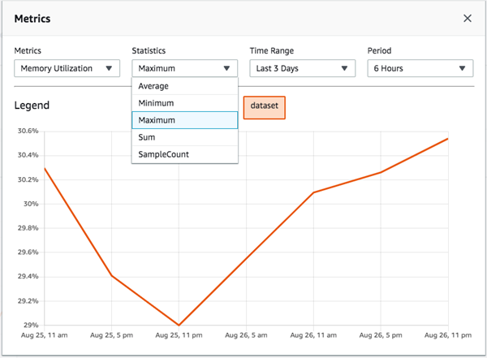

# Use Hyperledger Fabric Peer Node Metrics on Amazon Managed Blockchain (AMB)

You can use peer node metrics to track the activity and health of Hyperledger Fabric peer nodes on Amazon Managed Blockchain (AMB) that belong to your member. You can use the AMB Access console to view the metrics for a peer node. AMB Access also reports metrics to Amazon CloudWatch. You can use CloudWatch to set up dashboards, receive alarms, and view log files for peer node metrics. For more information, see [Using Amazon CloudWatch Metrics](../../../AmazonCloudWatch/latest/monitoring/working_with_metrics.md "../../../AmazonCloudWatch/latest/monitoring/working_with_metrics.md") in the _Amazon CloudWatch User Guide_.

In addition to using peer node metrics, you optionally can enable CloudWatch Logs for peer nodes and for instances of chaincode running on a peer node to view **Peer node logs** and **Chaincode logs**. These logs are useful for troubleshooting and analysis of chaincode activity. For more information, see [Monitoring AMB Access Hyperledger Fabric Using CloudWatch Logs](monitoring-cloudwatch-logs.md "monitoring-cloudwatch-logs.md").

AMB Access collects the following metrics for each peer node in the `aws/managedblockchain` namespace. Available metrics in AMB Access correspond to [Hyperledger Fabric metrics](https://hyperledger-fabric.readthedocs.io/en/release-2.2/metrics_reference.html "https://hyperledger-fabric.readthedocs.io/en/release-2.2/metrics_reference.html").

| Metric name                        | Description                                                                                                                  |
| ---------------------------------- | ---------------------------------------------------------------------------------------------------------------------------- |
| **Fabric metrics**                 |
| ChaincodeExecuteTimeouts           | The number of chaincode executions (`Init` or `Invoke`) that have timed out. Units: Count                                 |
| EndorserProposalDuration           | For each proposal, the time to complete the proposal. Units: Seconds                                                      |
| EndorserProposalValidationFailures | The number of proposals that have failed initial validation. Units: Count                                                 |
| EndorserProposalsReceived          | The number of proposals received. Units: Count                                                                            |
| EndorserSuccessfulProposals        | The number of successful proposals. Units: Count                                                                          |
| Transactions                       | The number of transactions that a peer node receives per minute. Units: Count                                             |
| **Utilization metrics**            |
| CPUUtilization                     | The percentage of total CPU capacity used on the peer node's AMB Access instance at any given instant. Units: Percent     |
| MemoryUtilization                  | The percentage of total available memory used on the peer node's AMB Access instance at any given instant. Units: Percent |

## Viewing Peer Node Metrics

You can use the Amazon Managed Blockchain (AMB) console to view graphs for peer node metrics. Metrics are available on the peer node details page.

###### To view metrics using the AMB Access console

1. Open the AMB Access console at [https://console.aws.amazon.com/managedblockchain/](https://console.aws.amazon.com/managedblockchain/ "https://console.aws.amazon.com/managedblockchain/").
2. Under **Network**, choose the **Name** of the network.
3. Choose **Members**. Under **Members owned by you**, choose the **Name** of the member to which the node belongs.
4. Under **Peer Nodes**, choose the **Node ID** you want to view.

Under **Metrics**, tabs for **Channel Metrics** and **Utilization Metrics** are available. 5. For **Channel Metrics**, choose the channels you want to view or compare from the list. 6. Choose a chart and then use **Statistics**, **Time Range**, and **Period** to customize the chart.

