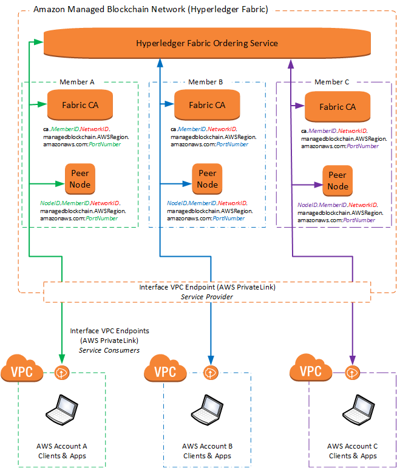

# Key Concepts: Amazon Managed Blockchain (AMB) Networks, Members, and Peer

Nodes

A blockchain network is a peer-to-peer network running a decentralized blockchain framework. A Hyperledger Fabric network on Amazon Managed Blockchain (AMB) includes one or more _members_. Members are unique identities in the network. For example, a member might be an organization in a consortium of banks. A single AWS account might have multiple members. Each member runs one or more Hyperledger Fabric _peer nodes_. The peer nodes run chaincode, endorse transactions, and store a local copy of ledger.

Amazon Managed Blockchain (AMB) creates and manages these components for each member in a network. AMB Access also creates components that all network members share, such as the Hyperledger Fabric ordering service and the general networking configuration.

###### Note

What we call _members_ in a Hyperledger Fabric network on AMB Access is very similar to what Hyperledger Fabric calls _organizations_.

## AMB Access Hyperledger Fabric Networks and Editions

When creating a Hyperledger Fabric network, the creator chooses the framework version and the _edition_ of Amazon Managed Blockchain (AMB) to use. The edition determines the capacity and capabilities of the network as a whole.

The creator also must create the first network member. Additional members are added through a proposal and voting process. There is no charge for the network itself, but each member pays an hourly rate (billed per second) for their network membership. Charges vary depending on the edition of the network. Each member also pays for peer nodes, peer node storage, and the amount of data that the member writes to the network. For more information about available editions and their attributes, see [Amazon Managed Blockchain (AMB) Pricing](https://aws.amazon.com/managed-blockchain/pricing/ "https://aws.amazon.com/managed-blockchain/pricing/"). For more information about the number of networks that each AWS account can create and join, see [Amazon Managed Blockchain (AMB) Limits](../../../general/latest/gr/aws_service_limits.md#limits_managedblockchain "../../../general/latest/gr/aws_service_limits.md#limits_managedblockchain") in the _AWS General Reference_.

A Hyperledger Fabric network on AMB Access remains active as long as there are members. The network is deleted only when the last member deletes itself from the network. No member or AWS account, even the creator's AWS account, can delete the network until they are the last member and delete themselves.

The following diagram shows the basic components of a Hyperledger Fabric blockchain running on AMB Access.



## Inviting and Removing Members

An AWS account initially creates a Hyperledger Fabric network on AMB Access, but
the network is not owned by that AWS account or any other AWS account. The network is decentralized, so changes to the network are made by consensus.

To make changes to the network, members make _proposals_ that all other members in the network vote on. For another AWS account to join the network, for example, an existing member creates a proposal to invite the account. Other members then vote Yes or No on the proposal. If the proposal is approved, an invitation is sent to the AWS account. The account then accepts the invitation and creates a member to join the network. A similar proposal process is required to remove a member in a different AWS account. A principal in an AWS account with sufficient permissions can remove a member that the account owns at any time by deleting that member directly, without submitting a proposal.

The network creator also defines a _voting policy_ for the network during creation. The voting policy determines the basic rules for all proposal voting on the network. The voting policy includes the percentage of votes required to pass the proposal, and the duration before the vote expires.

## Peer Nodes

When a member joins the network, one of the first things they must do is create at least one
_peer node_ in the membership.

Blockchain networks contain a distributed, cryptographically secure ledger that maintains
the history of transactions in the network that is immutable—it can't be changed after-the
fact. Each peer node also holds the global
state of the network for the channels in which they participate. The global state is updated with each new
transaction. When a new peer node in a channel comes online, it fetches the global state and ledger from other peers. Even if there are no other peer nodes on a network, as long as a member exists, ledger data can be restored to a new peer node.

Peer nodes also interact to create and endorse the transactions that are proposed on the
network to update the ledger. The members define the rules in the endorsement process based on
their business logic. In this way, every member can conduct transactions as allowed by the
business logic and independently verify the transaction history without a centralized
authority.

###### Note

Limit transactions to less than 4 MB. Transactions greater than 4 MB result in an error.

To configure Hyperledger Fabric applications on peer nodes and to interact with other network resources, members use a client configured with open-source Hyperledger Fabric tools such as a CLI or SDK. The applications and tools that you choose and your client setup depend on your preferred development environment. For example, in the [Getting Started](managed-blockchain-get-started-tutorial.md "managed-blockchain-get-started-tutorial.md") tutorial, you configure an Amazon EC2 instance in a VPC with open-source Hyperledger Fabric CLI tools.

## Identifying AMB Access Resources and Connecting from a Client

Because a Hyperledger Fabric blockchain network is decentralized, members must interact with each other's
peer nodes and network-wide resources to make transactions, endorse transactions, verify members,
and so on. When a network is created, AMB Access gives the network a unique ID. Similarly, when an
AWS account creates a member on the network and peer nodes, AMB Access gives unique IDs to those
resources.

Each network resource has a unique, addressable endpoint that AMB Access creates from these IDs.
Other members of the network, Hyperledger Fabric chaincode, and other tools use these endpoints to
identify and interact with resources on the network.

Resource endpoints for a Hyperledger Fabric network on AMB Access are in the following format:

```
`ResourceID`.`MemberID`.`NetworkID`.managedblockchain.`AWSRegion`.amazonaws.com:`PortNumber`
```

For example, to refer to a peer node with ID nd-6EAJ5VA43JGGNPXOUZP7Y47E4Y, owned by a member with ID
m-K46ICRRXJRCGRNNS4ES4XUUS5A, in a Hyperledger Fabric network with ID n-MWY63ZJZU5HGNCMBQER7IN6OIU, you use the following
peer node endpoint:

```
nd-6EAJ5VA43JGGNPXOUZP7Y47E4Y.m-K46ICRRXJRCGRNNS4ES4XUUS5A.n-MWY63ZJZU5HGNCMBQER7IN6OIU.managedblockchain.`us-east-1`.amazonaws.com:`30003`
```

The port that you use with an endpoint depends on the
Hyperledger Fabric service that you are calling and your unique network setup. `AWSRegion` is the Region you are using. For a list of supported Regions, see [Amazon Managed Blockchain (AMB) Endpoints and Quotas](../../../general/latest/gr/managedblockchain.md "../../../general/latest/gr/managedblockchain.md") in the _Amazon Web Services General Reference_.

Within the Hyperledger Fabric network, access and authorization for each resource is governed by processes defined in the chaincode and network configurations such as Hyperledger Fabric channels. Outside the confines of the network—that is, from member's client applications and tools—AMB Access uses AWS PrivateLink to ensure that only network members can access required resources. In this way, each member has a private connection from a client in their VPC to the Hyperledger Fabric network on AMB Access. The interface VPC endpoint uses private DNS, so you must have a VPC in your account that is enabled for Private DNS. For more information, see [Create an Interface VPC Endpoint for Amazon Managed Blockchain (AMB) Hyperledger Fabric](managed-blockchain-endpoints.md "managed-blockchain-endpoints.md").
