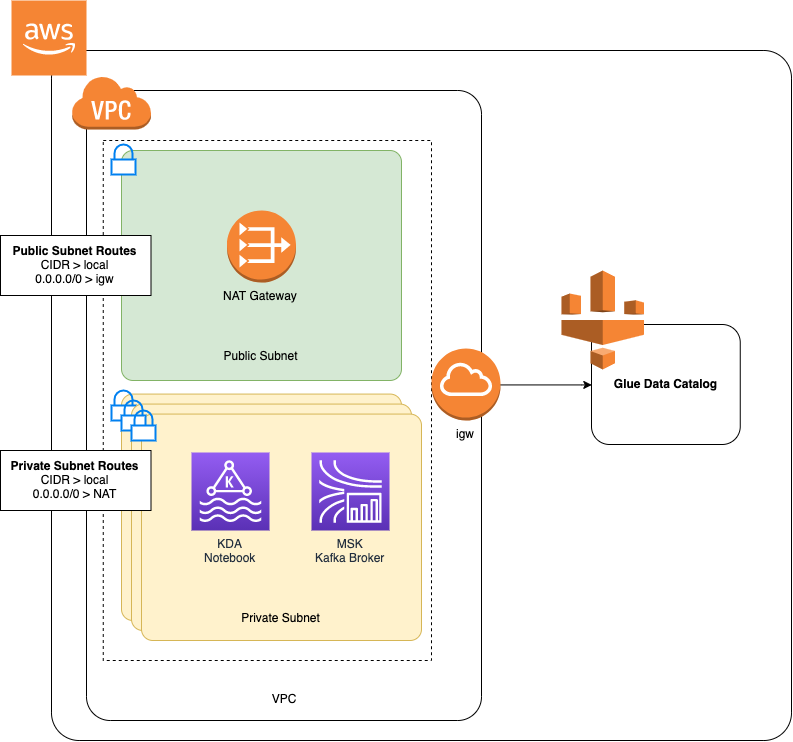

Amazon Managed Service for Apache Flink (Amazon MSF) was previously known as Amazon Kinesis Data Analytics for Apache Flink.

# Create a Studio notebook with Amazon MSK

This tutorial describes how to create a Studio notebook that uses an Amazon MSK cluster as a source.

###### This tutorial contains the following sections:

- [Set up an Amazon MSK cluster](#example-notebook-msk-setup "#example-notebook-msk-setup")
- [Add a NAT gateway to your VPC](#example-notebook-msk-nat "#example-notebook-msk-nat")
- [Create an AWS Glue connection and table](#example-notebook-msk-glue "#example-notebook-msk-glue")
- [Create a Studio notebook with Amazon MSK](#example-notebook-msk-create "#example-notebook-msk-create")
- [Send data to your Amazon MSK cluster](#example-notebook-msk-send "#example-notebook-msk-send")
- [Test your Studio notebook](#example-notebook-msk-test "#example-notebook-msk-test")

## Set up an Amazon MSK cluster

For this tutorial, you need an Amazon MSK cluster that allows plaintext access. If you don't have an Amazon MSK cluster set up already, follow the
[Getting Started Using Amazon MSK](../../../msk/latest/developerguide/getting-started.md "../../../msk/latest/developerguide/getting-started.md") tutorial to create
an Amazon VPC, an Amazon MSK cluster, a topic, and an Amazon EC2 client instance.

When following the tutorial, do the following:

- In
  [Step 3: Create an Amazon MSK Cluster](../../../msk/latest/developerguide/create-cluster.md "../../../msk/latest/developerguide/create-cluster.md"), on
  step 4, change the `ClientBroker` value from `TLS` to `PLAINTEXT`.

## Add a NAT gateway to your VPC

If you created an Amazon MSK cluster by following the [Getting Started Using Amazon
MSK](../../../msk/latest/developerguide/getting-started.md "../../../msk/latest/developerguide/getting-started.md") tutorial, or if your existing Amazon VPC does not already have a NAT gateway
for its private subnets, you must add a NAT Gateway to your Amazon VPC. The following diagram
shows the architecture.



To create a NAT gateway for your Amazon VPC, do the following:

1. Open the Amazon VPC console at
   [https://console.aws.amazon.com/vpc/](https://console.aws.amazon.com/vpc/ "https://console.aws.amazon.com/vpc/").
2. Choose **NAT Gateways** from the left navigation bar.
3. On the **NAT Gateways** page, choose **Create NAT Gateway**.
4. On the **Create NAT Gateway** page, provide the following values:

|                              |                                                                                                                                                                   |
| ---------------------------- | ----------------------------------------------------------------------------------------------------------------------------------------------------------------- |
| **Name<br>• _optional_**     | `ZeppelinGateway`                                                                                                                                                 |
| **Subnet**                   | **AWSKafkaTutorialSubnet1**                                                                                                                                       |
| **Elastic IP allocation ID** | Choose an available Elastic IP. If there are no Elastic IPs available, choose **Allocate Elastic IP**,<br>and then choose the Elasic IP that the console creates. |

Choose **Create NAT Gateway**. 5. On the left navigation bar, choose **Route Tables**. 6. Choose **Create Route Table**. 7. On the **Create route table** page, provide the following information:

    * **Name tag**: `ZeppelinRouteTable`
    * **VPC**: Choose your VPC (e.g. **AWSKafkaTutorialVPC**).

Choose **Create**. 8. In the list of route tables, choose **ZeppelinRouteTable**.
Choose the **Routes** tab, and choose **Edit routes**. 9. In the **Edit Routes** page, choose **Add route**. 10. In the For **Destination**, enter `0.0.0.0/0`. For
**Target**, choose **NAT Gateway**, **ZeppelinGateway**.
Choose **Save Routes**. Choose **Close**. 11. On the Route Tables page, with **ZeppelinRouteTable** selected,
choose the **Subnet associations** tab. Choose
**Edit subnet associations**. 12. In the **Edit subnet associations** page, choose
**AWSKafkaTutorialSubnet2** and **AWSKafkaTutorialSubnet3**. Choose
**Save**.

## Create an AWS Glue connection and table

Your Studio notebook uses an [AWS Glue](../../../glue/latest/dg/what-is-glue.md "../../../glue/latest/dg/what-is-glue.md") database for metadata about
your Amazon MSK data source. In this section, you create an AWS Glue connection that describes
how to access your Amazon MSK cluster, and an AWS Glue table that describes how to present the
data in your data source to clients such as your Studio notebook.

###### Create a Connection

1.  Sign in to the AWS Management Console and open the AWS Glue console at
    [https://console.aws.amazon.com/glue/](https://console.aws.amazon.com/glue/ "https://console.aws.amazon.com/glue/").
2.  If you don't already have a AWS Glue database, choose **Databases** from the left navigation bar. Choose
    **Add Database**. In the **Add database** window, enter `default` for
    **Database name**. Choose **Create**.
3.  Choose **Connections** from the left navigation bar. Choose **Add Connection**.
4.  In the **Add Connection** window, provide the following values:

        * For **Connection name**, enter `ZeppelinConnection`.
        * For **Connection type**, choose **Kafka**.
        * For **Kafka bootstrap server URLs**, provide the bootstrap broker string for your cluster. You can
         get the bootstrap brokers from either the MSK console, or by entering the following CLI command:


        ```
        aws kafka get-bootstrap-brokers --region us-east-1 --cluster-arn `ClusterArn`
        ```
        * Uncheck the **Require SSL connection** checkbox.

    Choose **Next**.

5.  In the **VPC** page, provide the following values:

        * For **VPC**, choose the name of your VPC (e.g.
          **AWSKafkaTutorialVPC**.)
        * For **Subnet**, choose **AWSKafkaTutorialSubnet2**.
        * For **Security groups**, choose all available groups.

    Choose **Next**.

6.  In the **Connection properties** / **Connection access** page, choose **Finish**.

###### Create a Table

###### Note

You can either manually create the table as described in the following steps, or you can
use the create table connector code for Managed Service for Apache Flink in your notebook within Apache
Zeppelin to create your table via a DDL statement. You can then check in AWS Glue to
make sure the table was correctly created.

1. In the left navigation bar, choose **Tables**. In the **Tables** page, choose
   **Add tables**, **Add table manually**.
2. In the **Set up your table's properties** page, enter `stock` for the
   **Table name**. Make sure you select the database you created previously. Choose **Next**.
3. In the **Add a data store** page, choose **Kafka**. For the **Topic name**,
   enter your topic name (e.g. **AWSKafkaTutorialTopic**). For **Connection**, choose **ZeppelinConnection**.
4. In the **Classification** page, choose **JSON**. Choose **Next**.
5. In the **Define a Schema** page, choose Add Column to add a column. Add columns with the following properties:

| Column name | Data type |
| ----------- | --------- |
| `ticker`    | `string`  |
| `price`     | `double`  |

Choose **Next**. 6. On the next page, verify your settings, and choose **Finish**. 7. Choose your newly created table from the list of tables. 8. Choose **Edit table** and add the following
properties:

    * key: `managed-flink.proctime`, value:
     `proctime`
    * key: `flink.properties.group.id`, value:
     `test-consumer-group`
    * key: `flink.properties.auto.offset.reset`, value:
     `latest`
    * key: `classification`, value: `json`

Without these key/value pairs, the Flink notebook runs into an error. 9. Choose **Apply**.

## Create a Studio notebook with Amazon MSK

Now that you have created the resources your application uses, you create your Studio notebook.

###### You can

create your application using either the AWS Management Console or the AWS CLI.

- [Create a Studio notebook using the AWS Management Console](#example-notebook-create-msk-console "#example-notebook-create-msk-console")
- [Create a Studio notebook using the AWS CLI](#example-notebook-msk-create-api "#example-notebook-msk-create-api")

###### Note

You can also create a Studio notebook from the Amazon MSK console by choosing an existing cluster, then choosing **Process data in real time**.

### Create a Studio notebook using the AWS Management Console

1. Open the Managed Service for Apache Flink console at
   [https://console.aws.amazon.com/managed-flink/home?region=us-east-1#/applications/dashboard](https://console.aws.amazon.com/managed-flink/home?region=us-east-1#/applications/dashboard "https://console.aws.amazon.com/managed-flink/home?region=us-east-1#/applications/dashboard").
2. In the **Managed Service for Apache Flink applications** page, choose the
   **Studio** tab. Choose **Create Studio notebook**.

###### Note

To create a Studio notebook from the Amazon MSK or Kinesis Data Streams consoles, select your input
Amazon MSK cluster or Kinesis data stream, then choose **Process data in real time**. 3. In the **Create Studio notebook** page, provide the following information:

    * Enter `MyNotebook` for
     **Studio notebook Name**.
    * Choose **default** for **AWS Glue database**.

Choose **Create Studio notebook**. 4. In the **MyNotebook** page, choose the **Configuration** tab. In the
**Networking** section, choose **Edit**. 5. In the **Edit networking for MyNotebook** page, choose
**VPC configuration based on Amazon MSK cluster**. Choose your Amazon MSK cluster
for **Amazon MSK Cluster**. Choose **Save changes**. 6. In the **MyNotebook** page, choose **Run**. Wait for the
**Status** to show **Running**.

### Create a Studio notebook using the AWS CLI

To create your Studio notebook by using the AWS CLI, do the following:

1. Verify that you have the following information. You need these values to create your application.
   - Your account ID.
   - The subnet IDs and security group ID for the Amazon VPC that contains your Amazon MSK cluster.

2. Create a file called `create.json` with the following contents.
   Replace the placeholder values with your information.

```
{
    "ApplicationName": "MyNotebook",
    "RuntimeEnvironment": "ZEPPELIN-FLINK-3_0",
    "ApplicationMode": "INTERACTIVE",
    "ServiceExecutionRole": "arn:aws:iam::`AccountID`:role/ZeppelinRole",
    "ApplicationConfiguration": {
        "ApplicationSnapshotConfiguration": {
            "SnapshotsEnabled": false
        },
        "VpcConfigurations": [
            {
                "SubnetIds": [
                    "`SubnetID 1`",
                    "`SubnetID 2`",
                    "`SubnetID 3`"
                ],
                "SecurityGroupIds": [
                    "`VPC Security Group ID`"
                ]
            }
        ],
        "ZeppelinApplicationConfiguration": {
            "CatalogConfiguration": {
                "GlueDataCatalogConfiguration": {
                    "DatabaseARN": "arn:aws:glue:us-east-1:`AccountID`:database/default"
                }
            }
        }
    }
}

```

3. Run the following command to create your application:

```
aws kinesisanalyticsv2 create-application --cli-input-json file://create.json

```

4. When the command completes, you should see output similar to the following, showing the
   details for your new Studio notebook:

```
{
    "ApplicationDetail": {
        "ApplicationARN": "arn:aws:kinesisanalyticsus-east-1:012345678901:application/MyNotebook",
        "ApplicationName": "MyNotebook",
        "RuntimeEnvironment": "ZEPPELIN-FLINK-3_0",
        "ApplicationMode": "INTERACTIVE",
        "ServiceExecutionRole": "arn:aws:iam::012345678901:role/ZeppelinRole",
...

```

5. Run the following command to start your application. Replace the sample value with your account ID.

```
aws kinesisanalyticsv2 start-application --application-arn arn:aws:kinesisanalyticsus-east-1:`012345678901`:application/MyNotebook\

```

## Send data to your Amazon MSK cluster

In this section, you run a Python script in your Amazon EC2 client to send data to your Amazon MSK
data source.

1. Connect to your Amazon EC2 client.
2. Run the following commands to install Python version 3, Pip, and the Kafka for Python package, and confirm the actions:

```
sudo yum install python37
curl -O https://bootstrap.pypa.io/get-pip.py
python3 get-pip.py --user
pip install kafka-python
```

3. Configure the AWS CLI on your client machine by entering the following command:

```
aws configure
```

Provide your account credentials, and `us-east-1` for the
`region`. 4. Create a file called `stock.py` with the following contents.
Replace the sample value with your Amazon MSK cluster's Bootstrap Brokers string, and
update the topic name if your topic is not **AWSKafkaTutorialTopic**:

```
from kafka import KafkaProducer
import json
import random
from datetime import datetime

BROKERS = "`<<Bootstrap Broker List>>`"
producer = KafkaProducer(
    bootstrap_servers=BROKERS,
    value_serializer=lambda v: json.dumps(v).encode('utf-8'),
    retry_backoff_ms=500,
    request_timeout_ms=20000,
    security_protocol='PLAINTEXT')


def getStock():
    data = {}
    now = datetime.now()
    str_now = now.strftime("%Y-%m-%d %H:%M:%S")
    data['event_time'] = str_now
    data['ticker'] = random.choice(['AAPL', 'AMZN', 'MSFT', 'INTC', 'TBV'])
    price = random.random() * 100
    data['price'] = round(price, 2)
    return data


while True:
    data =getStock()
    # print(data)
    try:
        future = producer.send("AWSKafkaTutorialTopic", value=data)
        producer.flush()
        record_metadata = future.get(timeout=10)
        print("sent event to Kafka! topic {} partition {} offset {}".format(record_metadata.topic, record_metadata.partition, record_metadata.offset))
    except Exception as e:
        print(e.with_traceback())
```

5. Run the script with the following command:

```
$ python3 stock.py
```

6. Leave the script running while you complete the following section.

## Test your Studio notebook

In this section, you use your Studio notebook to query data from your Amazon MSK cluster.

1. Open the Managed Service for Apache Flink console at
   [https://console.aws.amazon.com/managed-flink/home?region=us-east-1#/applications/dashboard](https://console.aws.amazon.com/managed-flink/home?region=us-east-1#/applications/dashboard "https://console.aws.amazon.com/managed-flink/home?region=us-east-1#/applications/dashboard").
2. On the **Managed Service for Apache Flink applications** page, choose the **Studio notebook**
   tab. Choose **MyNotebook**.
3. In the **MyNotebook** page, choose **Open in Apache Zeppelin**.

The Apache Zeppelin interface opens in a new tab. 4. In the **Welcome to Zeppelin!** page, choose **Zeppelin new note**. 5. In the **Zeppelin Note** page, enter the following query into a new note:

```
%flink.ssql(type=update)
select * from stock
```

Choose the run icon.

The application displays data from the Amazon MSK cluster.

To open the Apache Flink Dashboard for your application to view operational aspects, choose **FLINK JOB**.
For more information about the Flink Dashboard, see [Apache Flink Dashboard](how-dashboard.md "how-dashboard.md")
in the [Managed Service for Apache Flink Developer Guide](../../../index.md "../../../index.md").

For more examples of Flink Streaming SQL queries, see
[Queries](https://nightlies.apache.org/flink/flink-docs-release-1.15/dev/table/sql/queries.html "https://nightlies.apache.org/flink/flink-docs-release-1.15/dev/table/sql/queries.html")
in the [Apache Flink documentation](https://nightlies.apache.org/flink/flink-docs-release-1.15/ "https://nightlies.apache.org/flink/flink-docs-release-1.15/").
