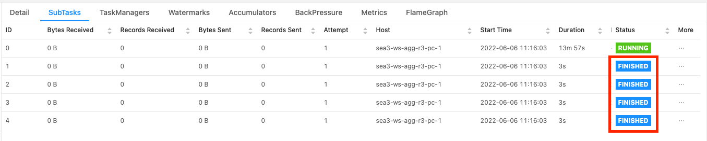
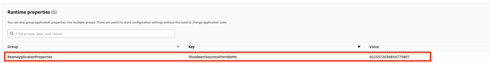

Amazon Managed Service for Apache Flink (Amazon MSF) was previously known as Amazon Kinesis Data Analytics for Apache Flink.

# Checkpoint failure for Apache Beam application

If your Beam application is configured with [shutdownSourcesAfterIdleMs](https://beam.apache.org/documentation/runners/flink/#:~:text=shutdownSourcesAfterIdleMs "https://beam.apache.org/documentation/runners/flink/#:~:text=shutdownSourcesAfterIdleMs") set to 0ms, checkpoints can fail to trigger because tasks are in "FINISHED" state. This section describes symptoms and resolution for this condition.

## Symptom

Go to your Managed Service for Apache Flink application CloudWatch logs and check if the following log message has been logged. The following log message indicates that checkpoint failed to trigger as some tasks has been finished.

```

                {
                "locationInformation": "org.apache.flink.runtime.checkpoint.CheckpointCoordinator.onTriggerFailure(CheckpointCoordinator.java:888)",
                "logger": "org.apache.flink.runtime.checkpoint.CheckpointCoordinator",
                "message": "Failed to trigger checkpoint for job `your job ID` since some tasks of job `your job ID` has been finished, abort the checkpoint Failure reason: Not all required tasks are currently running.",
                "threadName": "Checkpoint Timer",
                "applicationARN": `your application ARN`,
                "applicationVersionId": "5",
                "messageSchemaVersion": "1",
                "messageType": "INFO"
                }

```

This can also be found on Flink dashboard where some tasks have entered "FINISHED" state, and checkpointing is not possible anymore.



## Cause

shutdownSourcesAfterIdleMs is a Beam config variable that shuts down sources which have been idle for the configured time of milliseconds. Once a source has been shut down, checkpointing is not possible anymore. This could lead to [checkpoint failure](https://issues.apache.org/jira/browse/FLINK-2491 "https://issues.apache.org/jira/browse/FLINK-2491").

One of the causes for tasks entering "FINISHED" state is when shutdownSourcesAfterIdleMs is set to 0ms, which means that tasks that are idle will be shutdown immediately.

## Solution

To prevent tasks from entering "FINISHED" state immediately, set shutdownSourcesAfterIdleMs to Long.MAX_VALUE. This can be done in two ways:

- Option 1: If your beam configuration is set in your Managed Service for Apache Flink application configuration page, then you can add a new key value pair to set shutdpwnSourcesAfteridleMs as follows:



- Option 2: If your beam configuration is set in your JAR file, then you can set shutdownSourcesAfterIdleMs as follows:

```

                        FlinkPipelineOptions options = PipelineOptionsFactory.create().as(FlinkPipelineOptions.class); // Initialize Beam Options object

                        options.setShutdownSourcesAfterIdleMs(Long.MAX_VALUE); // set shutdownSourcesAfterIdleMs to Long.MAX_VALUE
                        options.setRunner(FlinkRunner.class);

                        Pipeline p = Pipeline.create(options); // attach specified options to Beam pipeline

```
