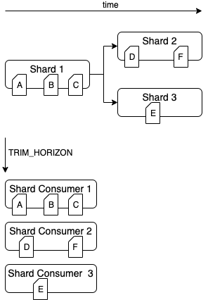

Amazon Managed Service for Apache Flink (Amazon MSF) was previously known as Amazon Kinesis Data Analytics for Apache Flink.

# Amazon Kinesis

data streams source processing out of order during re-sharding

The current FlinkKinesisConsumer implementation doesn’t provide strong ordering guarantees between Kinesis shards. This may lead to out-of-order processing during re-sharding of Kinesis Stream, in particular for Flink applications that experience processing lag. Under some circumstances, for example windows operators based on event times, events might get discarded because of the resulting lateness.

This is a [known problem](https://issues.apache.org/jira/browse/FLINK-6349 "https://issues.apache.org/jira/browse/FLINK-6349") in Open Source Flink.

Until connector fix is made available, ensure your Flink applications are not falling behind Kinesis Data Streams during re-partitioning. By ensuring that the processing delay is tolerated by your Flink apps, you
can minimize the impact of out-of-order processing and risk of data loss.
