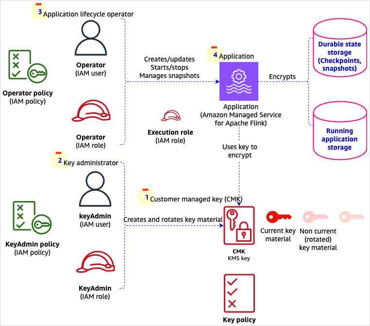

Amazon Managed Service for Apache Flink (Amazon MSF) was previously known as Amazon Kinesis Data Analytics for Apache Flink.

# Using customer managed keys in Amazon MSF

You need to consider the following factors when establishing, managing, and operating Amazon MSF applications subject to a CMK policy.

###### Customer managed key

This is the [key policy](../../../kms/latest/developerguide/key-policies.md "../../../kms/latest/developerguide/key-policies.md") and [key material](../../../kms/latest/developerguide/concepts.md#key-material "../../../kms/latest/developerguide/concepts.md#key-material"). You'll need to create a key which is used to encrypt your application state in running application storage and durable application storage.

###### Application lifecycle operator (API caller)

This is the `Operator` IAM user or role. The Operator can be a human or an automation, such as a CI/CD pipeline that will create, deploy, and run the Amazon MSF application. The application lifecycle Operator can either be an IAM role or user.

###### Note

It's possible that the key administrator and operator are the same person. In this case, we recommend that you always use separate roles or users.

###### Application

This is the Amazon MSF application you create. The application execution (IAM) role requires no changes to use CMK. For more information about IAM in Amazon MSF, see [Identity and Access Management for Amazon Managed Service for Apache Flink](security-iam.md "security-iam.md").

###### Dependencies between policies

There are interdependencies between the key policy assigned to the CMK, and the IAM policy defining the permissions of the application lifecycle operator. You might want to create them in the following order:

- Create the Operator IAM user or role without IAM policy defining permissions for CMK. The Operator creates the application with AOK.
- Create the key administrator with permissions to manage KMS keys. The key administrator creates the CMK. The key policy references to the Operator and administrator role ARNs, and to the application ARN. For more information, see [Create a KMS key policy](manage-cmk-api.md#create-cmk-kms-key-policy "manage-cmk-api.md#create-cmk-kms-key-policy").
- Create an IAM policy for the Operator allowing to manage CMK for the application. For more information, see [Application lifecycle operator (API caller) permissions](manage-cmk-api.md#create-cmk-kms-api-caller-permissions "manage-cmk-api.md#create-cmk-kms-api-caller-permissions") . Attach the new IAM policy to the Operator. The Operator updates the application enabling CMK. For more information, see [Update an existing application to use CMK](manage-cmk-api.md#update-existing-app-use-cmk-api "manage-cmk-api.md#update-existing-app-use-cmk-api").
  If the application doesn’t exist, create the application without CMK.

The following illustration shows how CMK is implemented in Amazon MSF.

1. **Customer managed key (CMK)**: Comprises key policy and key material.
2. **Key administrator**: The `KeyAdmin` IAM user or role.
3. **Application lifecycle operator (API caller)**: The operator IAM user or role.
4. **Application**: Has an execution (IAM) role attached.
