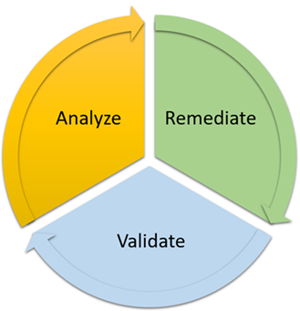

# Step 1. Account discovery in Accelerate

AMS works with you during account discovery to assess the current state of your account, and identify technical blockers for onboarding your account. AMS doesn't provide operational services during the account discovery stage. AMS uses the `AWSServiceRoleForSupport` service-linked role to identify technical blockers, and then works with you to remediate them, before moving to the Account-Level onboarding stage.

## Account discovery process in Accelerate

To help you with the analysis and discovery of your account, AMS performs operational checks to identify technical blockers through read-only API calls. After your account is onboarded to AMS, these checks are performed on an on-demand basis to maintain the account posture. AMS works with you to remediate any findings associated with these checks when required. AMS uses the following operational checks and read-only API actions as part of Account Discovery:

| Operational Check                    | Purpose                                                                                                                                    | AWS API Calls Used                                                                                                                                                                                                                                                                               |
| ------------------------------------ | ------------------------------------------------------------------------------------------------------------------------------------------ | ------------------------------------------------------------------------------------------------------------------------------------------------------------------------------------------------------------------------------------------------------------------------------------------------ | -------------------------------------------------------------------------------------------------------------------------------------------------------------------------------------------------------------------------------------------------------------------------------------------------------------------------------------------------------------------------------------------------------------------------------------------------------------------------------------------------------------------------------------------------------------------------------------------------------------------------------------------------- |
| AWS Control Tower Version Evaluation | Identifies the AWS Control Tower version to make sure that it's the minimum supported version for onboarding your AWS account.             |  • `ControlTower:GetLandingZone`  • `ControlTower:ListEnabledControls`  • `ControlTower:ListLandingZones`                                                                                                                                                                               |
| AWS CloudTrail Evaluation            | Identifies AWS CloudTrail trails and their configurations for onboarding your AWS account to minimize CloudTrail trail costs.              |  • `CloudTrail:GetTrail`  • `CloudTrail:ListTrails`  • `S3:GetBucketOwnershipControls`  • `S3:GetBucketPolicy`  • `KMS:GetKeyPolicy`  • `CloudTrail:GetEventSelectors`  • `S3:GetBucketLogging`  • `S3: GetBucketLifecycleConfiguration`  • `S3: GetBucketEncryption` |
| AWS CloudFormation Hook Evaluation   | Identifies CloudFormation hooks in your onboarding AWS account that block AMS service deployment in your AWS account.                      |  • `CloudFormation:ListTypes`                                                                                                                                                                                                                                                                 |
| Amazon EC2 Instance Evaluation       | Identifies EC2 instances in your AWS account that are not running AWS Systems Manager Agent (SSM Agent) and that are not supported by AMS. |  • `EC2:DescribeInstances`  • `EC2:DescribeImages`  • `SSM:DescribeInstanceInformation`                                                                                                                                                                                                 | AMS Accelerate follows industry best practices to meet and maintain compliance eligibility. AMS Accelerate Discovery access to your account is recorded in AWS CloudTrail through the [AWSServiceRoleForSupport service-linked role](../../../awssupport/latest/user/using-service-linked-roles-sup.md "../../../awssupport/latest/user/using-service-linked-roles-sup.md"). This helps with monitoring and auditing requirements. For information about AWS CloudTrail, see the [AWS CloudTrail User Guide](../../../awscloudtrail/latest/userguide/cloudtrail-user-guide.md "../../../awscloudtrail/latest/userguide/cloudtrail-user-guide.md"). |
