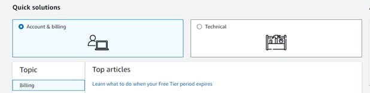

# Billing questions for AMS Accelerate

To submit a billing-related question, complete the following steps:

1. Open the [AWS Support Center](https://console.aws.amazon.com/support/home#/ "https://console.aws.amazon.com/support/home#/") at https://console.aws.amazon.com/support/home#/.
2. Choose **Account & billing**.

 3. Choose **Create case**.

 4. Choose **Account and billing**, and then follow the prompts to submit your case.

