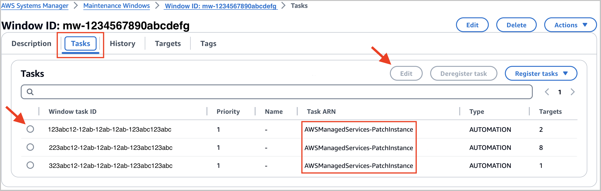

# Patch with hooks

You can configure AMS patching to run operating-system (OS) level commands before and after patching, using AMS patch hooks. Use AMS patch hooks to run
SSM Command documents to stop a service before patching and then start the service after patching, or to run commands to confirm that your application is healthy after patching.

To use AMS patch hooks, you need to do the following:

1. Create SSM Command documents to use as patch hooks.
2. Create an AMS patch maintenance window, or use an existing AMS patch maintenance window. For details, see
   [AMS patch maintenance window](acc-p-maint-window.md "acc-p-maint-window.md").
3. Configure an AMS patch maintenance window to use your SSM Command documents for AMS patch hooks.

## AMS patch hooks RACI

The responsible, accountable, consulted, and informed, or RACI, matrix assigns the primary responsibility to either the customer or AMS for a variety of activities.
The following table provides an overview of the responsibilities of customer and AMS for activities in an application that uses AMS patch hooks.

- R stands for the responsible party that does the work to achieve the task
- A stands for the accountable party
- C stands for consulted; the party whose opinions are sought, typically as subject matter experts; and with whom there is bilateral communication
- I stands for informed; the party that is informed on progress, often only on completion of the task or deliverable

| Activity                                                        | Customer | AMS |
| --------------------------------------------------------------- | -------- | --- | ----------------------------------------------------------------------------------------------------------------------------------------------------------------------------------------------------------------------------------------------------------------------------------------------------------------------------------------------------------------------------------------------------------------------------------------------------------------------------------------------------------------------------------------------------------------------------------------------------------------------------------------------------------------------------------------------------------------------------------------------------------------------------------------------------------------------------------------------------------------------------------------------------------------------------------------------------------------------------------------------------------------------------------------------------------------------------------------------------------------------------------------------------------------------------------------------------------------------------------------------------------------------------------------------------------------------------------------------------------------------------------------------------------------------------------------------------------------------------------------------------------------------------------------------------------------------------------------------------------------------------------------------------------------------------------------------------------------------------------------------------------------------------------------------------------------------------------------------------------------------------------------------------------------------------------------------------------------------------------------------------------------------------------------------------------------------------------------------------------------------------------------------------------------------------------------------------------------------------------------------------------------------------------------------------------------------------------------------------------------------------------------------------------------------------------------------------------------------------------------------------------------------------------------------------------------------------------------------------------------------------------------------------------------------------------------------------------------------------------------------------------------------------------------------------------------------------------------------------------------------------------------------------------------------------------------------------------------------------------------------------------------------------------------------------------------------------------------------------------------------------------------------------------------------------------------------------------------------------------------------------------------------------------------------------------------------------------------------------------------------------------------------------------------------------------------------------------------------------------------------------------------------------------------------------------------------------------------------------------------------------------------------------------------------------------------------------------------------------------------------------------------------------------------------------------------------------------------------------------------------------------------------------------------------------------------------------------------------------------------------------------------------- |
| Create pre/post patch SSM Command document and document content | R        | C   |
| Configure patch hook parameters for AMS patching                | R        | C   |
| Execute pre/post patch SSM Command document                     | I        | R   |
| Triage and respond to patch hook failures                       | I        | R   |
| Notify customer of patch hook failure                           | I        | R   |
| Rollback to a pre-patch state if requested by customer          | C        | R   | ## Create SSM documents for patch hooks AMS patch hooks use Amazon EC2 Systems Manager (SSM) documents during patching. Create an SSM Command document, or share an existing SSM Command document, with the account where patching occurs. For information about SSM documents, including limitations, see [Sharing SSM documents](../../../systems-manager/latest/userguide/documents-ssm-sharing.md "../../../systems-manager/latest/userguide/documents-ssm-sharing.md"). To create an SSM Command document, follow these steps: 1. Create an [SSM document with **Document Type** = "Command"](../../../systems-manager/latest/userguide/create-ssm-console.md "../../../systems-manager/latest/userguide/create-ssm-console.md"). 2. Enter your command(s) in the **Content** section. For more information, see [Creating SSM document content](../../../systems-manager/latest/userguide/documents-creating-content.md "../../../systems-manager/latest/userguide/documents-creating-content.md"). ###### Note SSM documents for AMS patch hooks can also be created with AWS CLI or AWS CloudFormation. If you need assistance creating SSM documents for your AMS patch hooks, contact your Cloud Architect. ## Configure AMS patch maintenance window to use your SSM Command documents as AMS patch hooks An AMS patch maintenance window is a Systems Manager maintenance window that executes your configured AMS patch automation. To edit an AMS patch maintenance window to use patch hooks, follow these steps: 1. On the [https://console.aws.amazon.com/systems-manager/](https://console.aws.amazon.com/systems-manager/ "https://console.aws.amazon.com/systems-manager/"), under **Change Management Tools** in the left navigation pane, select **Maintenance Windows**. A page listing existing maintenance windows opens. 2. Select a Window ID that starts with **mw-**. The details page for that maintenance window opens. 3. Select the **Tasks** tab and the Window Task ID with the Task ARN of **AMS-PatchInstance** and click **Edit**.  4. Scroll down to the **Parameters** section and update the following parameters. AMS patch hook parameters:  • **PrePatchHook**: The name of the SSM document with type "Command" that you want to run before patching. Leave this blank or type "AWS-Noop" (case-sensitive) if you aren’t running a command before patching.  • **PostPatchHook**: The name of the SSM document with type "Command" that you want to run after patching. Leave this blank or type "AWS-Noop" (case-sensitive) if you aren’t running a command after patching.  • **ExecutePatchBasedOnPreHookStatus**: Run patching based on the success or failure of the PrePatchHook run, choose one: + **OnPreHookSuccess**: Only run AMS patch automation when the PrePatchHook is successful. + **Always**: Run AMS patch automation when the PrePatchHook is successful and when it fails. + **OnPreHookFailure** - Run AMS patch automation only when the PrePatchHook fails. + **Never**: Do not run AMS patch automation. This may be useful when testing your PrePatchHook.  • **ExecutePostHookBasedOnPatchStatus**: Run the post-patch hook based on success or failure of the AMS patch automation, choose one: + **OnPatchSuccess**: Only run the PostPatchHook when AMS patch automation runs successfully. + **Always**: Run the PostPatchHook when AMS patch automation is successful and when it fails. + **OnPatchFailure** - Run the PostPatchHook only when AMS patch automation fails. ###### Note If any of these variables are missing their text box, remedy this by scrolling up to the **Automation document** section on the same page and selecting a different document and then re-selecting the original document. This refreshes input parameters so you can edit them. |
