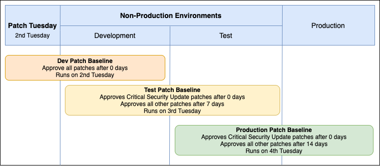

# Understand patch management in AMS Accelerate

###### Important

Accelerate Patch reporting periodically deploys an AWS Glue resource-based policy. Be advised that AMS updates to the patching system overwrite existing AWS Glue resource-based policies.

###### Important

You can specify alternative patch repositories for managed nodes. While AMS
implements your requested patch configurations, you are responsible for selecting and
validating the security of your chosen repositories. You must also accept any risks from
using these repositories, such as supply chain risks.

The following are best practices for the security of your patch management process:

- Use only trusted, verified repository sources
- Default to standard OS vendor repositories when possible
- Regularly audit custom repository configurations
  You can use the AMS Accelerate patching system, Patch Add-On, to patch your instances with security-related
  and other types of updates. Accelerate Patch Add-On is a feature that provides tag-based patching for AMS instances. It leverages AWS Systems Manager (SSM) functionality so
  you can tag instances and have those instances patched using a baseline and a window that you configure. The AMS Accelerate Patch Add-On is an onboarding option,
  if you did not obtain it during onboarding your Accelerate account, contact your cloud service delivery manager (CSDM) to get it.

AMS Accelerate patch management uses the Systems Manager patch baseline functionality to control the definition of the patches
that are applied on an instance. The patch baseline contains the list of patches that are pre-approved;
for example, all security patches. The compliance of the instance is measured against the patch baseline associated to it.
AMS Accelerate, by default, installs all patches available to keep the instance up to date.

###### Note

AMS Accelerate applies only operating system (OS) patches. For example, for Windows, only
Windows updates are applied, not Microsoft updates.

For information on reports, see [AMS host management reports](ams-host-man.md "ams-host-man.md").

AMS Accelerate provides a range of operational services to help you achieve operational excellence on AWS.
To gain a quick understanding of how AMS helps your teams achieve overall operational excellence in AWS Cloud with some of our key operational
capabilities including 24x7 helpdesk, proactive monitoring, security, patching, logging and backup, see
[AMS Reference Architecture Diagrams](https://d1.awsstatic.com/architecture-diagrams/ArchitectureDiagrams/AWS-managed-services-for-operational-excellence-ra.pdf "https://d1.awsstatic.com/architecture-diagrams/ArchitectureDiagrams/AWS-managed-services-for-operational-excellence-ra.pdf").

###### Topics

- [Patching recommendations](#acc-patching-recos "#acc-patching-recos")
- [Create a patch maintenance window in AMS](acc-p-maint-window.md "acc-p-maint-window.md")
- [Patch with hooks](acc-p-hooks.md "acc-p-hooks.md")
- [AMS Accelerate patch baseline](acc-patch-baseline.md "acc-patch-baseline.md")
- [Creating an IAM role for on-demand patching of AMS Accelerate](acc-p-user-access.md "acc-p-user-access.md")
- [Understand patch notifications and patch failures in AMS Accelerate](acc-patch-mon-remediate.md "acc-patch-mon-remediate.md")

## Patching recommendations

If you are involved in application or infrastructure operations, you understand the
importance of an operating system (OS) patching solution that is flexible and scalable enough to
meet the varied requirements from your application teams. In a typical organization, some
application teams use an architecture that involves immutable instances whereas others deploy
their applications on mutable instances.

For more information on AWS Prescriptive Guidance for patching, see
[Automated patching for mutable instances in the hybrid cloud using AWS Systems Manager](../../../prescriptive-guidance/latest/patch-management-hybrid-cloud/welcome.md "../../../prescriptive-guidance/latest/patch-management-hybrid-cloud/welcome.md").

###### Note

Accelerate Patch Add-On is a feature that provides tag-based patching for AMS instances. It leverages AWS Systems Manager (SSM) functionality so
you can tag instances and have those instances patched using a baseline and a window that you configure.
The AMS Accelerate Patch Add-On is an onboarding option, if you did not obtain it
during onboarding your Accelerate account, contact your cloud service delivery manager (CSDM) to get it.

### Patch responsibility recommendations

The patching process for persistent instances should involve the following teams and actions:

- **The application (DevOps) teams** define the
  patch groups for their servers based on application environment, OS type, or other
  criteria. They also define the maintenance windows specific to each patch group. This
  information should be stored on tags attached to the instances. Recommended tag names
  are 'Patch Group' and 'Maintenance Window'. During each patch cycle, the application teams
  prepare for patching, test the application after patching, and troubleshoot any issues with
  their applications and OS during patching.
- **The security operations team** defines the
  patch baselines for various OS types that are used by the application teams, and make the
  patches available through Systems Manager Patch Manager.
- **The automated patching solution** runs on a
  regular basis and deploys the patches defined in the patch baselines, based on the user-defined patch groups and maintenance windows.
- **The governance and compliance teams** define patching guidelines and exception processes & mechanisms.

For more information, see [Patching solution design for mutable EC2 instances](../../../prescriptive-guidance/latest/patch-management-hybrid-cloud/design-standard.md "../../../prescriptive-guidance/latest/patch-management-hybrid-cloud/design-standard.md").

### Guidance for application teams

- Review and become familiar with creating and managing maintenance windows; see
  [AWS Systems Manager Maintenance Windows](../../../systems-manager/latest/userguide/systems-manager-maintenance.md "../../../systems-manager/latest/userguide/systems-manager-maintenance.md") and
  [Create an SSM Maintenance window for patching](acc-patching.md#acc-p-maint-window "acc-patching.md#acc-p-maint-window")
  to learn more. Understanding the general structure and use of maintenance windows helps you understand what information to provide if you are not the
  person creating them.
- For High Availability (HA) setups, plan to have one maintenance window per availability
  zone and per environment (Dev/Test/Prod). This will ensure continued availability during patching.
- Recommended Maintenance Window duration is 4 hours with a 1-hour
  cutoff, plus 1 additional hour per 50 instances
- Patch Dev and Test versions with enough time between each to allow you to
  identify any potential issues prior to Production patching.
- Automate common pre- and post-patching tasks via SSM automation and run
  them as maintenance window tasks. Note that for post-patching tasks you must ensure that
  there is sufficient time allotted, as tasks will not launch once the cutoff is reached.
- Become familiar with Patch Baselines and their features—particularly around
  auto-approval delays for patch severity types that can be used to ensure that only the
  patches that were applied in Dev/Test get applied in Production at a later date. See
  [About patch baselines](../../../systems-manager/latest/userguide/about-patch-baselines.md "../../../systems-manager/latest/userguide/about-patch-baselines.md") for details.

### Guidance for security operations teams

- Review and become familiar with patch baselines. Patch approval is handled
  in an automated fashion and has different rule options. See
  [About patch baselines](../../../systems-manager/latest/userguide/about-patch-baselines.md "../../../systems-manager/latest/userguide/about-patch-baselines.md") for more information.
- Discuss needs around patching Dev/Test/Prod with application teams and develop multiple
  baselines to accommodate these needs.

### Guidance for governance and compliance teams

- Patching should be an "Opt Out" function. A default maintenance window and
  automated tagging should exist to ensure nothing goes unpatched. AMS Resource Tagger can
  help with this; discuss this option with your cloud architect (CA) or cloud service delivery manager (CSDM) for guidance on implementation.
- Requests for exemption from patching should require documentation justifying
  the exemption. A Chief Information Security Officer (CISO) or other approval officer should approve or deny the request.
- Patching compliance should be reviewed on a regular schedule via the Patch Manager console, Security Hub, or a vulnerability scanner.

### Example design for high availability Windows application

**Overview:**

- One Maintenance Window per AZ.
- One Set of Maintenance Windows per Environment.
- One Patch Baseline per Environment:
  - Dev: Approve all severity and classification after 0 days.
  - Test: Approve critical security update patches after 0 days and all other severity and classifications after 7 days.
  - Prod: Approve critical security update patches after 0 days and all other severity and classifications after 14 days.

**CloudFormation Scripts:**

These scripts are setup to build out the maintenance windows, baselines, and patching tasks
for a two availability zone Windows HA EC2 application using the baseline approval settings
described above.

- Windows Dev CFN Stack Example: 
  [HA-Patching-Dev-Stack.json](samples/HA-Patching-Dev-Stack.md "samples/HA-Patching-Dev-Stack.md")
- Windows Test CFN Stack Example: 
  [HA-Patching-Test-Stack.json](samples/HA-Patching-Test-Stack.md "samples/HA-Patching-Test-Stack.md")
- Windows Prod CFN Stack Example: 
  [HA-Patching-Prod-Stack.json](samples/HA-Patching-Prod-Stack.md "samples/HA-Patching-Prod-Stack.md")

### Patch recommendations FAQs

Q: How do I handle unscheduled patching for "0" day exploits?

A: SSM supports a **Patch Now** feature that uses the current
default baseline for the instance's OS. AMS deploys a default set of Patch Baselines that
approves all patches after 0 days. However, when using the **Patch Now**
feature, a pre-patch snapshot is not taken, as this command runs the AWS-RunPatchBaseline
SSM document. We recommend that you take a manual backup prior to patching.

Q: Does AMS support patching for instances in Auto-Scaling Groups (ASGs)?

A: No. At this time, ASG patching is not supported for Accelerate customers.

Q: Are there any limitations for Maintenance Windows to keep in mind?

A: Yes, there are a few limitations you should be aware of.

- Maintenance Windows per Account: 50
- Tasks per Maintenance Window: 20
- Maximum number of concurrent automations per Maintenance Window: 20
- Maximum number of concurrent Maintenance Windows: 5

For a full list of default SSM limits, see [AWS Systems Manager endpoints and quotas](../../../general/latest/gr/ssm.md "../../../general/latest/gr/ssm.md").
