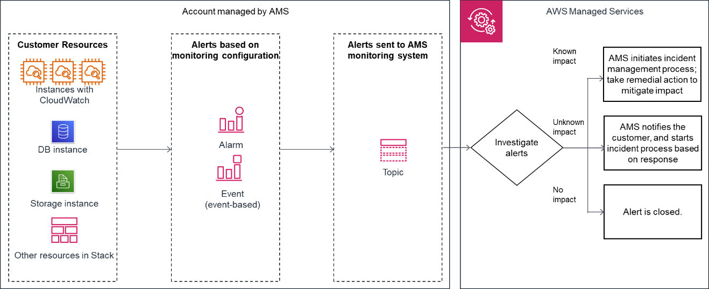

# How monitoring works

See the following graphics on monitoring architecture in AWS Managed Services (AMS).

The following diagram depicts the **AMS Accelerate** monitoring architecture.

After your resources are tagged based on the policy defined using Resource
tagger, and alarm definitions are deployed, the following list describes the AMS monitoring processes.

- Generation: At the time of account onboarding, AMS configures baseline monitoring (a
  combination of CloudWatch (CW) alarms, and CW event rules) for all your resources created in a managed account. The baseline
  monitoring configuration generates an alert when a CW alarm is triggered or a CW event is generated.
- Aggregation: All alerts generated by your resources are sent to the AMS monitoring system
  by directing them to an SNS topic in the account.

You can also configure how AMS groups Amazon EC2 alerts together. AMS either groups all alerts related to the same EC2 instance into a single incident, or creates one incident per alert,
depending on your preference. You can change this configuration at any time by working with your Cloud Service Delivery Manager or Cloud Architect.

- Processing: AMS analyzes the alerts and processes them based on their potential for impact. Alerts are
  processed as described next.
  - Alerts with known customer impact: These lead to the creation of a new incident report and
    AMS follows the incident management process.

  Example alert: An Amazon EC2 instance fails a system health check, AMS attempts to recover the instance by
  stopping and restarting it.
  - Alerts with uncertain customer impact: For these types of alerts, AMS sends an incident report, in many cases asking you to verify the impact before AMS takes action. However, if the infrastructure-related checks are passing, then AMS doesn't send an incident report to you.

  For example: An alert for >85% CPU utilization for more than 10 minutes on an Amazon EC2
  instance can't immediately be categorized as an incident since this behavior might be
  expected based on usage. In this example, AMS Automation performs infrastructure-related checks on the resource. If those checks pass, then AMS doesn't send an alert notification, even if CPU usage crossed 99%. If Automation detects that infrastructure-related checks are failing on the resource, then AMS sends an alert notification and checks if mitigation is needed. Alert notifications are discussed in detail in this section. AMS offers mitigation options in the notification. When you reply to the notification confirming that the alert is an incident AMS creates a new incident report and the AMS incident management process begins. Service notifications that receive a response of "no customer impact," or no response at all for three days, is marked as resolved and the corresponding alert is marked as resolved.
  - Alerts with no customer impact: If, after evaluation, AMS determines that the alert doesn't
    have customer impact, then the alert is closed.

  For example, AWS Health notifies of an EC2 instance requiring replacement but that instance has since been
  terminated.

## EC2 instance grouped notifications

You can configure AMS monitoring to group together alerts from the same EC2 instance into a single incident. Your Cloud Service Delivery Manager or Cloud Architect can configure this for you.
There are four parameters you can configure for each AMS-managed account.

1. **Scope**: Choose either **account-wide** or **tag-based**.
   - To specify a configuration that applies to every EC2 instance in that account, choose scope = **account-wide**.
   - To specify a configuration that applies only to EC2 instances in that account with a specific tag, choose scope = **tag-based**.

2. **Grouping rule**: Choose either **classic** or **instance**.
   - To configure instance-level grouping for every resource in your account, choose scope = **account-wide** and grouping rule = **instance**.
   - To configure specific resources in your account to use instance level grouping, tag those instances and then choose scope = **tag-based** and grouping rule =
     **instance** level.
   - To not use instance grouping for alerts in your account, choose grouping rule = **classic**.

3. **Engagement** option: Choose either **none**, **report only**, or **default**.
   - For AMS to not create incidents or run automations for alarms from those resources while the configuration is active, choose **none**.
   - For AMS to not create incidents or run automations for alarms from those resources while the configuration is active,
     and not run automated healing Systems Manager documents but to include records of these events in your reporting, choose **report only**.
     This may be useful if you want to reduce the volume of incident support cases you interact with and if some incidents from some resources do not require immediate attention, for example
     those in a non-production account.
   - For AMS to process your alerts, run automations, and create incident cases when needed, choose **default**.

4. **Resolve after**: Choose either **24 hours**, **48 hours**, or **72 hours**.
   Lastly, configure when incident cases are automatically closed. If the time from the last case correspondence reaches the configured **Resolve after** value, the incident is closed.

### Alert notification

As a part of the alert processing, based on the impact analysis, AWS Managed Services (AMS) creates an
incident and initiates the incident management process for remediation, when impact can be
determined. If impact can't be determined, then AMS sends an alert notification to the email address associated with your account through a service notification.
In some scenarios, this alert notification isn't sent. For example, if the infrastructure-related checks are passing for a high CPU utilization alert, then an alert notification isn't sent to you. For more information, see the diagram on AMS
monitoring architecture for alert handling process in [How monitoring works](how-monitoring-works.md "how-monitoring-works.md").

## Tag-based alert notification

Use tags to send alert notifications for your resources to different email addresses. It's a best practice to use tag-based alert notifications because notifications sent to a single email address
might cause confusion when multiple developer teams use the same account.
Tag-based alert notifications are not affected by the [EC2 instance grouped notifications](#how-monitoring-works-alert-notes-grouping "#how-monitoring-works-alert-notes-grouping") settings you choose.

With tag-based alert notifications you can:

- **Send alerts to a specific email address**: Tag resources that have alerts that must be sent to a specific email address with the `key = OwnerTeamEmail`, `value = `EMAIL_ADDRESS``.
- **Send alerts to multiple email addresses**: To use multiple email addresses, specify a comma-separated list of values. For example, `key = `OwnerTeamEmail``, `value = `EMAIL_ADDRESS_1`, `EMAIL_ADDRESS_2`, `EMAIL_ADDRESS_3`, ...`.
  The total number of characters for the value field cannot exceed 260.
- **Use a custom tag key**: To use a custom tag key, provide the custom tag key name to your CSDM in
  an email that explicitly gives consent to activate automated notifications for the tag-based communication.
  It's a best practice to use the same tagging strategy for contact tags across all your instances and resources.

###### Note

The key value `OwnerTeamEmail` doesn't have to be in camel case. However, tags are case sensitive and it's best practice
to use the recommended format.

The email address must be specified in full, with the "at sign" (@) to separate the local part from the domain.
Examples of invalid email addresses: `Team.AppATabc.xyz` or `john.doe`. For general guidance on your tagging strategy, see [Tagging AWS resources](../../../tag-editor/latest/userguide/tagging.md "../../../tag-editor/latest/userguide/tagging.md").
Don't add personally identifiable information (PII) in your tags. Use distribution lists or aliases wherever possible.

Tag-based alert notification is supported for resources from the following Amazon Services: EC2, Elastic Block Store (EBS), Elastic Load Balancing (ELB), Application Load Balancer (ALB), Network Load Balancer, Relational Database Service (RDS), OpenSearch, Elastic File System (EFS), FSx, and Site-to-Site VPN.
