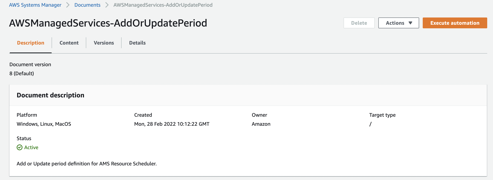
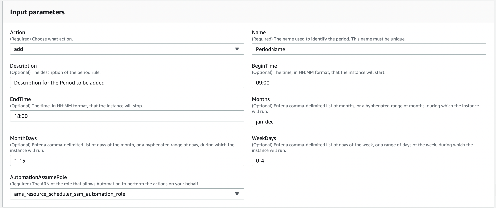
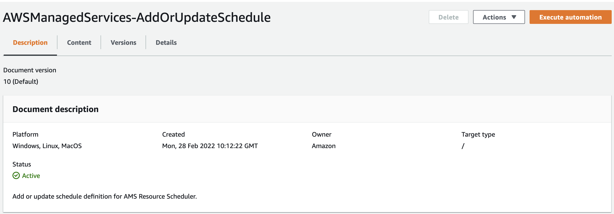
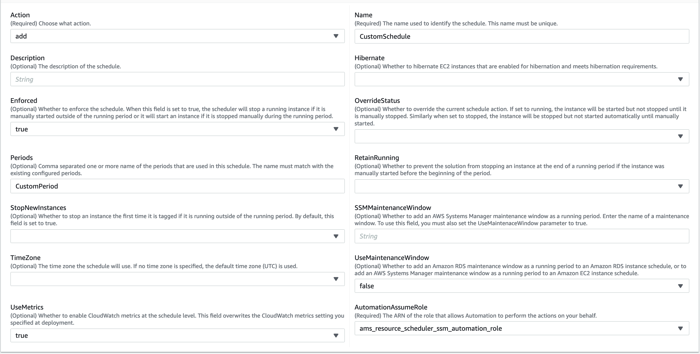
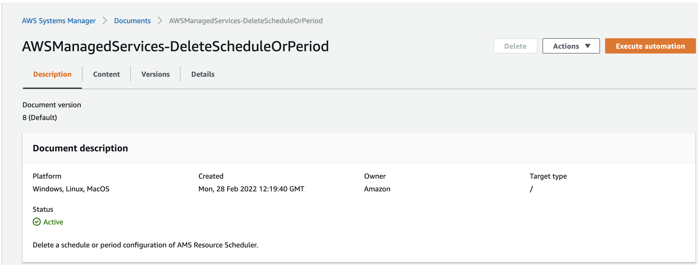
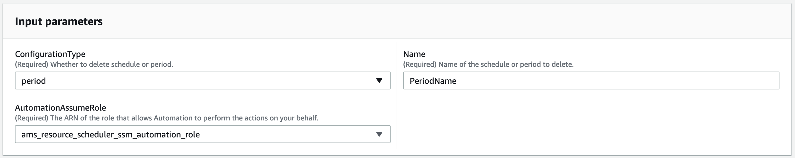
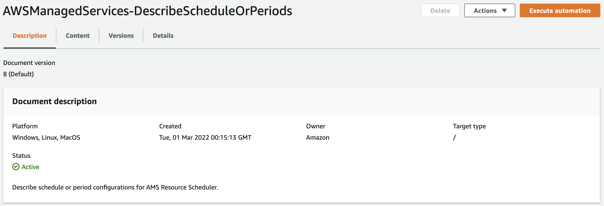
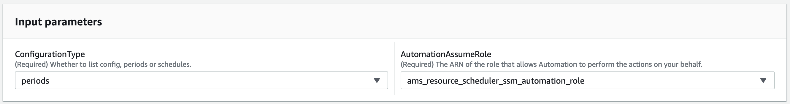

# Working with periods and schedules in AWS Managed Services Resource Scheduler

You can use AMS Resource Scheduler to add, update, or delete schedules or periods in AMS Accelerate accounts.

## Adding or updating periods in AMS Resource Scheduler

Add or update a Resource Scheduler period in your AMS accounts.

**Data you'll need:**

- **Action**: The type of operation to perform. Use "add" if you want to add a period or "update"
  if you want to update an existing period.
- **Name**: The name of the period. You must specify a unique value if you are adding a new period.
- **AutomationAssumeRole**: The ARN of the AWS Identity and Access Management (IAM) role that
  allows the runbook to add or update the period on your behalf. Specify the role as `ams_resource_scheduler_ssm_automation_role`.
- **Description** (Optional): A meaningful description for the period.
- **BeginTime** (Optional): The time in HH:MM format when you want to start the resources.
- **EndTime** (Optional): The time in HH:MM format when you want to stop the resources.
- **Months** (Optional): A comma-delimited list of months or a hyphenated range of months during which the resources
  should run.
- **MonthDays** (Optional): A comma-delimited list of days of the month or a hyphenated range of days during which the
  resources should run.
- **WeekDays** (Optional): A comma-delimited list of the days of the week or a range of days of the week during which the
  resources should run.

**How to do it:**

- View the document at [AWSManagedServices-AddOrUpdatePeriod](https://console.aws.amazon.com/systems-manager/automation/execute/AWSManagedServices-AddOrUpdatePeriod "https://console.aws.amazon.com/systems-manager/automation/execute/AWSManagedServices-AddOrUpdatePeriod") (you might have to choose your onboarded Region).

Specify requirements in the **Input parameters** section, then choose **Execute**. After the operation completes,
view results in the **Output** tab.

- AWS CLI:

Run the following command to start an automation. Replace `placeholders` with your own information.

```
aws ssm start-automation-execution --document-name "AWSManagedServices-AddOrUpdatePeriod" --document-version "\$DEFAULT"
     --parameters '{"Action":["`add`" or "`update`"], "Name":["`NAME`"],
    "Description":["`DESCRIPTION`"],"BeginTime":["`TIME`"], "EndTime":["`TIME`"],
    "Months":["`MONTH`"],"MonthDays":["`DAY`"], "WeekDays":["`DAY`"],
    "AutomationAssumeRole" : ["arn:aws:iam::`ACCOUNTID`:role/ams_resource_scheduler_ssm_automation_role"] }' --region `ONBOARDED_REGION`

```

**Example:**

The following example shows how you can add a new period using the AWS Systems Manager console. We have named the period **Period-Name**
and configured it to cover 9AM-6PM from Mon-Fri for first 15 days of every month.

1. View the AWS Systems Manager automation document at
   [AWSManagedServices-AddOrUpdatePeriod](https://console.aws.amazon.com/systems-manager/automation/execute/AWSManagedServices-AddOrUpdatePeriod "https://console.aws.amazon.com/systems-manager/automation/execute/AWSManagedServices-AddOrUpdatePeriod") (you might have to choose your onboarded Region).

 2. Provide values for the parameters.

 3. Click **Execute** and wait for automation to complete.

## Adding or updating schedules in AMS Resource Scheduler

Add or update a Resource Scheduler schedule in AMS Accelerate accounts.

**Data you'll need:**

- **Action**: The type of operation to perform. Use "add" if you want to add a schedule or "update"
  if you want to update an existing schedule.
- **Name**: The name of the schedule. You must specify a unique value if you are adding a new schedule.
- **AutomationAssumeRole**: The ARN of the AWS Identity and Access Management (IAM) role that
  allows the runbook to add or update the schedule on your behalf. Specify the role `ams_resource_scheduler_ssm_automation_role`.
- **Description** (Optional): A meaningful description for the schedule.
- **Schedules** (Optional): Specify a comma-delimited list of periods that are to be used with this schedule.
  Each period must have already been created.
- **RetainRunning** (Optional): Specify "true" to prevent Resource Scheduler from stopping a running resource at the end of a
  running period if the resource was manually started before the beginning of the running perod. By default, Resource Scheduler stops the resource.
- **StopNewInstances** (Optional): Specify "false" to prevent Resource Scheduler from stopping a resource the first time it
  is tagged if it is running outside of the running period. By default, Resource Scheduler stops the resource.
- **SSMMaintenanceWindow** (Optional): Specify a comma-delimited list of AWS Systems Manager (SSM) maintenance windows that
  you want to add as running periods for the schedule. You must also specify the "UseMaintenanceWindow" property to "true."
- **TimeZone** (Optional): Specify the time zone that you want Resource Scheduler to use. By default, Resource Scheduler
  uses UTC.
- **UseMaintenanceWindow** (Optional): Specify "true" if you want to Resource Scheduler to consider
  Amazon Relational Database Service (RDS) maintenance window as a running period to an Amazon RDS instance schedule, or to add
  AWS Systems Manager (SSM) maintenance windows as a running period to an Amazon EC2 instance schedule.
- **UseMetrics** (Optional): Specify "true" to enable CloudWatch metrics at the schedule level and "false" to disable
  CloudWatch metrics. Specifying this property overrides the CloudWatch metrics setting set at the stack level.

**How to do it:**

- View the document at
  [AWSManagedServices-AddOrUpdateSchedule](https://console.aws.amazon.com/systems-manager/automation/execute/AWSManagedServices-AddOrUpdateSchedule "https://console.aws.amazon.com/systems-manager/automation/execute/AWSManagedServices-AddOrUpdateSchedule") (you might have to choose your onboarded Region).

Specify requirements in the **Input parameters** section, and then choose **Execute**.
After the operation completes, view results in the **Output** tab.

- AWS CLI:

Run the following command to start an automation. Replace `placeholders` with your own information.

```
aws ssm start-automation-execution --document-name "AWSManagedServices-AddOrUpdateSchedule" --document-version "\$DEFAULT"
     --parameters '{"Action":[`"add" or "update"`], "Name":["`NAME`"], "Description":["`DESCRIPTION`"],
    "Hibernate":["`true` or `false`"],"Enforced":["`true` or `false`"],
    "OverrideStatus":["`running` or `stopped`"],"Periods":["`PERIOD-A`, `PERIOD-B`"],
    "RetainRunning":["`true` or `false`"],"StopNewInstances":["`true` or `false`"],
    "SSMMaintenanceWindow":["`WINDOW-NAME`"],"TimeZone":["`TIMEZONE`"],
    "UseMaintenanceWindow":["`true` or `false`"],"UseMetrics":["`true` or `false`"],
    "AutomationAssumeRole" : ["arn:aws:iam::`ACCOUNTID`:role/ams_resource_scheduler_ssm_automation_role"] }' --region `ONBOARDED_REGION`
```

**Example:**

The following example shows how to add a schedule for AMS Resource Scheduler. In this example you add a schedule nameed CustomSchedule using CustomPeriod.

1. View the AWS Systems Manager automation document at
   [AWSManagedServices-AddOrUpdateSchedule](https://console.aws.amazon.com/systems-manager/automation/execute/AWSManagedServices-AddOrUpdateSchedule "https://console.aws.amazon.com/systems-manager/automation/execute/AWSManagedServices-AddOrUpdateSchedule") (you might have to choose your onboarded Region).

 2. Provide values for the parameters.

 3. Click **Execute** and wait for automation to complete.

## Deleting periods or schedules in AMS Resource Scheduler

In order to delete Resource Scheduler periods or schedules in AMS Accelerate accounts, you need the following data:

- **ConfigurationType**: The type of configuration you want to delete. Use "period" if you want to
  delete periods or "schedule" if you want to delete schedules.
- **Name**: The name of the schedule or period that you want to delete.
- **AutomationAssumeRole**: The ARN of the AWS Identity and Access Management (IAM) role that
  allows the runbook to delete schedules or periods on your behalf. Specify the role `ams_resource_scheduler_ssm_automation_role`.

**How to do it:**

- View the document at
  [AWSManagedServices-DeleteScheduleOrPeriod](https://console.aws.amazon.com/systems-manager/automation/execute/AWSManagedServices-DeleteScheduleOrPeriod "https://console.aws.amazon.com/systems-manager/automation/execute/AWSManagedServices-DeleteScheduleOrPeriod") (you might3have to choose your onboarded Region).

Specify requirements in the **Input parameters** section, then choose **Execute**.
After the operation completes, view results in the **Output** tab.

- AWS CLI:

Run the following command to start an automation. Replace `placeholders` with your own information.

```
aws ssm start-automation-execution --document-name "AWSManagedServices-DeleteScheduleOrPeriod" --document-version "\$DEFAULT"
--parameters '{"ConfigurationType":[`"period" or "schedule"`],"Name":["`NAME`"],
    "AutomationAssumeRole":["arn:aws:iam::`ACCOUNTID`:role/ams_resource_scheduler_ssm_automation_role"]}' --region `ONBOARDED_REGION`
```

**Example:**

The following example shows how you can delete a period using the AWS Systems Manager console.

1. View the AWS Systems Manager automation document at
   [AWSManagedServices-DeleteScheduleOrPeriod](https://console.aws.amazon.com/systems-manager/automation/execute/AWSManagedServices-DeleteScheduleOrPeriod "https://console.aws.amazon.com/systems-manager/automation/execute/AWSManagedServices-DeleteScheduleOrPeriod") (you might have to choose your onboarded Region).

 2. Provide values for the parameters.

 3. Click **Execute** and wait for automation to complete.

## Describing periods or schedules in AMS Resource Scheduler

In order to describe (view a details on) a Resource Scheduler period or schedule in AMS Accelerate accounts, you need the following data:

- **ConfigurationType**: The type of configuration that you want to describe. Use "periods" if you want to
  describe all periods or "schedules" if you want to describe all schedules.
- **AutomationAssumeRole**: The ARN of the AWS Identity and Access Management (IAM) role that
  allows the runbook to describe schedules or periods on your behalf. Specify the role `ams_resource_scheduler_ssm_automation_role`.

**How to do it:**

- View the document at
  [AWSManagedServices-DescribeScheduleOrPeriods](https://console.aws.amazon.com/systems-manager/automation/execute/AWSManagedServices-DescribeScheduleOrPeriods "https://console.aws.amazon.com/systems-manager/automation/execute/AWSManagedServices-DescribeScheduleOrPeriods") (you might have to choose your onboarded Region):
  1.  Specify requirements in the **Input parameters** section and then choose **Execute**.
  2.  After the operation completes, view results in the **Output** tab.

- AWS CLI:
  1.  Run the following command to start an automation. Replace `placeholders` with your own information.

  ```
  aws ssm start-automation-execution --document-name "AWSManagedServices-DescribeScheduleOrPeriods" --document-version "\$DEFAULT"
                  --parameters '{"ConfigurationType":[`"period" or "schedule"`],"AutomationAssumeRole":["arn:aws:iam::`ACCOUNTID`:role/ams_resource_scheduler_ssm_automation_role"]}'
                  --region `ONBOARDED_REGION`
  ```

**Example:**

The following example shows how you can describe a period using the AWS Systems Manager console.

1. View the AWS Systems Manager automation document at
   [AWSManagedServices-DescribeScheduleOrPeriods](https://console.aws.amazon.com/systems-manager/automation/execute/AWSManagedServices-DescribeScheduleOrPeriods "https://console.aws.amazon.com/systems-manager/automation/execute/AWSManagedServices-DescribeScheduleOrPeriods") (you might have to choose your onboarded Region).

 2. Provide values for the parameters.

 3. Click **Execute** and wait for automation to complete.
