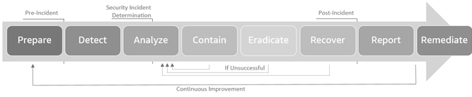

# How AMS Security Incident Response works

AWS Managed Services aligns to the NIST 800-61
[Computer Security Incident Handling Guide](https://csrc.nist.gov/publications/detail/sp/800-61/rev-2/final "https://csrc.nist.gov/publications/detail/sp/800-61/rev-2/final")
for Security Incident Response. By aligning to this industry standard, we provide a consistent approach to security event management and
adhere to best practices in securing and responding to security incidents in your cloud.

**Incident response lifecycle**

When detection identifies and generates a security alert, or you request security assistance, the AWS Managed Services
Operations team makes sure that there is a timely investigation, executes automations to perform data collection, triages and
analyzes, informs you of the analysis, performs investigation and any containment activities, and then posts event analysis.

The data collection, triage, analysis, and containment activities performed during the incident response vary depending on
the type of security event being investigated. Example Security Incident Response workflows for select scenarios are at the end of this document.

During incidents, AMS determines the correct course of action dynamically, which might result in documented steps being
re-ordered or bypassed as appropriate to make sure that the right outcome occurs.
