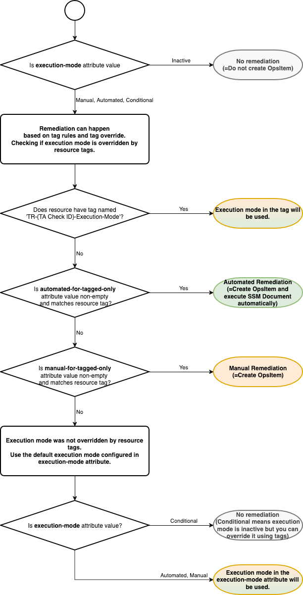

# Execution mode decision workflow

There are multiple levels to configure execution mode for your resources and each Trusted Advisor check. The following diagram shows how Trusted Remediator decides which execution mode
to use based on your
configurations:

