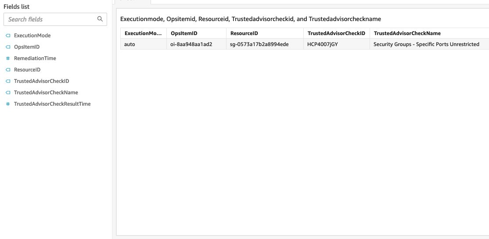
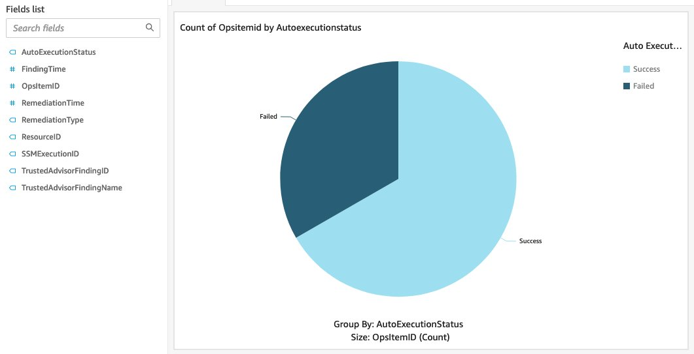

# Trusted Remediator integration with Quick Suite

You can integrate the Trusted Remediator logs stored in Amazon S3 with Quick Suite to build customized remediation report. Quick Suite integration is optional. This feature allows you to use the
logs to build custom reporting dashboards. To obtain on-request reports for Trusted Remediator, contact your CSDM. For more information on available Trusted Remediator reports, see
[Trusted Remediator reports](trusted-remediator-reports.md "trusted-remediator-reports.md").

For more information on visualizing data in Quick Suite, see [Visualizing data in Quick Suite](../../../quicksight/latest/user/working-with-visuals.md "../../../quicksight/latest/user/working-with-visuals.md").

## Add a dataset to Quick Suite for the Remediation item log

To add a dataset to Quick Suite for the Remediation item log, follow these steps:

1. Log in to Quick Suite console. You can create the Quick Suite report in any AWS Region that Quick Suite supports. However, for better performance and lower costs, it's a
   best practice to create the report in the Region where the Trusted Remediator logging bucket is located.
2. Choose **Datasets**.
3. Choose **S3**.
4. In the **New S3 data source**, enter the following values:
   - **Data source name:** `trusted-remediator-`delegated_administrator_account_id`-`account_region`-remediation-items`.
   - **Upload a manifest file:** Create a JSON file with the following content, and use it. When creating the file, replace `logging_bucket_name` in the URIPrefixes key.

   ```
   {
       "fileLocations": [
           {
               "URIPrefixes": [
                   "s3://{logging_bucket_name}/remediation_items/"
               ]
           }
       ],
       "globalUploadSettings": {
           "format": "JSON",
           "delimiter": ",",
           "textqualifier": "'",
           "containsHeader": "true"
       }
   }

   ```

   - Choose **Connect**.
   - From the **Finish dataset creation** window, choose **Visualize**.
   - Quick Suite opens the new analysis sheet page. You are now ready to create a new analysis using the Remediation item log.

The following is a sample analysis:



## Add a dataset to Quick Suite for the Automated remediation execution log

1. Log in to Quick Suite console. You can create the Quick Suite report in any AWS Region that Quick Suite supports. However, for better performance and lower costs, it's a
   best practice to create the report in the Region where the Trusted Remediator logging bucket is located.
2. Choose **Datasets**.
3. Choose **S3**.
4. In the **New S3 data source**, enter the following values:
   - **Data source name:** `trusted-remediator-`delegated_administrator_account_id`-`account_region`-remediation-executions`.
   - **Upload a manifest file:** Create a JSON file with the following content, and then use this file. When creating the file, replace `logging_bucket_name` in the URIPrefixes key.

   ```
   {
       "fileLocations": [
           {
               "URIPrefixes": [
                   "s3://{logging_bucket_name}/remediation_executions/"
               ]
           }
       ],
       "globalUploadSettings": {
           "format": "JSON",
           "delimiter": ",",
           "textqualifier": "'",
           "containsHeader": "true"
       }
   }

   ```

   - Choose **Connect**.
   - From the **Finish dataset creation** window, choose **Visualize**.
   - Quick Suite opens the new analysis sheet page. You are now ready to create a new analysis using the Remediation item log.

The following is a sample analysis:


