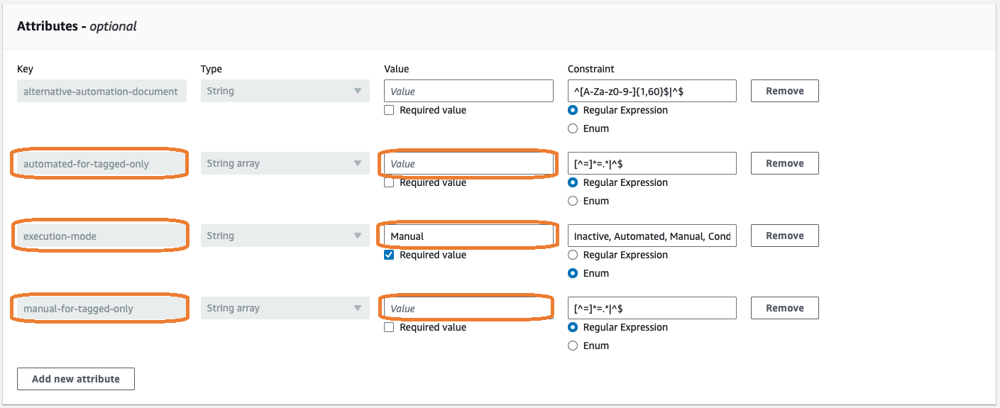
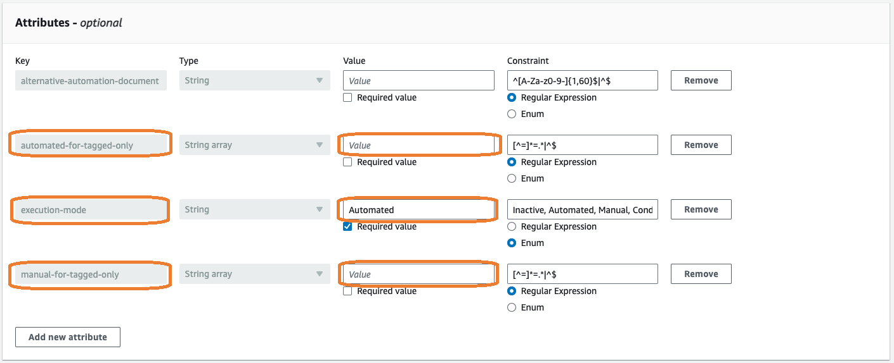
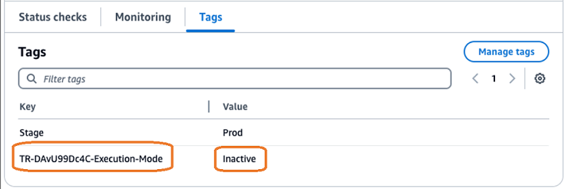
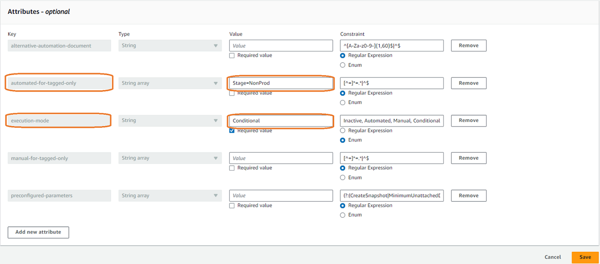

# Configure remediation tutorials

The following tutorials provide examples of creating common remediations in Trusted Remediator

## Remediate all resources manually

This example configures manual remediation for all Amazon EBS volumes with the Trusted Advisor check ID DAvU99Dc4C (Underutilized Amazon EBS Volumes).

###### Configure manual remediation for Amazon EBS volumes with check ID DAvU99Dc4C

1. Open the AWS AppConfig console at [https://console.aws.amazon.com/systems-manager/appconfig](https://console.aws.amazon.com/systems-manager/appconfig "https://console.aws.amazon.com/systems-manager/appconfig").

Make sure that you sign in as the **Delegated Administrator** account. 2. Select **Trusted Remediator** from the list of applications. 3. Choose the **Cost Optimization** configuration profile. 4. Select the **Underutilized Amazon EBS Volumes** flag. 5. For **execution-mode**, select **Manual**. 6. Make sure that the **automated-for-tagged-only** and **manual-for-tagged-only** attributes are blank. These attributes are used to
override the
default execution-mode for resources with matching tags.

The following is an example of the **Attributes** section with blank values for **automated-for-tagged-only** and
**manual-for-tagged-only** and **Manual** for **execution-mode**:

 7. Choose **Save** to update the value, and then choose **Save new version** to apply the changes. You must choose
**Save new version** for Trusted Remediator to recognize the change. 8. Make sure that your Amazon EBS volumes don't have a tag with the key`TR-DAvU99Dc4C-Execution-Mode`. This tag key overrides the default execution-mode for that
EBS Volume.

## Remediate all resources automatically, except for selected resources

This example configures automatic remediation for all Amazon EBS volumes with the Trusted Advisor check ID DAvU99Dc4C (Underutilized Amazon EBS Volumes), with the exception of specified volumes that won't be remediated (designated **Inactive**.

###### Configure automatic remediation for Amazon EBS volumes with check ID DAvU99Dc4C, with the exception of selected inactive resources

1. Open the AWS AppConfig console at [https://console.aws.amazon.com/systems-manager/appconfig](https://console.aws.amazon.com/systems-manager/appconfig "https://console.aws.amazon.com/systems-manager/appconfig").

Make sure that you sign in as the **Delegated Administrator** account. 2. Select **Trusted Remediator** from the list of applications. 3. Choose the **Cost Optimization** configuration profile. 4. Select the **Underutilized Amazon EBS Volumes** flag. 5. For **execution-mode**, select **Automated**. 6. Make sure that the **automated-for-tagged-only** and **manual-for-tagged-only** attributes are blank. These attributes are used to override the
default execution-mode for resources with matching tags.

The following is an example of the **Attributes** section with blank values for **automated-for-tagged-only** and
**manual-for-tagged-only** and **Automated** for **execution-mode**:

 7. Choose **Save** to update the value, and then choose **Save new version** to apply the changes. You must choose
**Save new version** for Trusted Remediator to recognize the change.

At this point, all Amazon EBS volumes are set for automatic remediation. 8. Override automatic remediation for selected Amazon EBS volumes:

    1. Open the Amazon EC2 console at [https://console.aws.amazon.com/ec2/](https://console.aws.amazon.com/ec2/ "https://console.aws.amazon.com/ec2/").
    2. Choose **Elastic Block Store**, **Volumes**.
    3. Choose **Tags**.
    4. Choose **Manage tags**.
    5. Add the following tag:

    	* **Key:** TR-DAvU99Dc4C-Execution-Mode
    	* **Value:** Inactive
    The following is an example of the **Tags** section showing the **Key** and **Value** fields:

    
    6. Repeat steps 2 through 5 for all Amazon EBS volumes that you want to exclude from remediation.

## Remediate tagged resources automatically

This example configures automatic remediation for all Amazon EBS volumes with the tag `Stage=NonProd` with the Trusted Advisor check ID DAvU99Dc4C (Underutilized Amazon EBS Volumes). All other resources without this tag aren't remediated.

###### Configure automatic remediation for Amazon EBS volumes with the tag `Stage=NonProd` for check ID DAvU99Dc4C

1. Open the AWS AppConfig console at [https://console.aws.amazon.com/systems-manager/appconfig](https://console.aws.amazon.com/systems-manager/appconfig "https://console.aws.amazon.com/systems-manager/appconfig").

Make sure that you sign in as the **Delegated Administrator** account. 2. Select **Trusted Remediator** from the list of applications. 3. Choose the **Cost Optimization** configuration profile. 4. Select the **Underutilized Amazon EBS Volumes** flag. 5. For **execution-mode**, select **Conditional**. 6. Set the **automated-for-tagged-only** to `Stage=NonProd`. This attribute overrides the default `execution-mode` for
resources with matching tags. Make sure that the **manual-for-tagged-only** attributes is blank.

The following is an example of the **Attributes** section with **automated-for-tagged-only** set to **Stage=NonProd**
and **Conditional** for **execution-mode**:

 7. Optionally, set the preconfigured-parameters to one of the following:

    * `CreateSnapshot=false` to not to create snapshot of the Amazon EBS volume before it's deleted
    * `MinimumUnattachedDays=10` to set minimum unattached days of the Amazon EBS volume to delete to be 10 days
    * `CreateSnapshot=false`, `MinimumUnattachedDays=10` for both of the above

8. Choose **Save** to update the value, and then choose **Save new version** to apply the changes. You must choose
   **Save new version** for Trusted Remediator to recognize the change.
9. Make sure that your Amazon EBS volumes don't have a tag with the key`TR-DAvU99Dc4C-Execution-Mode`. This tag key overrides the default execution-mode
   for that EBS Volume.
