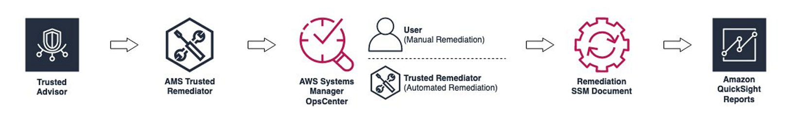

# Trusted Remediator in AMS

Trusted Remediator is an AWS Managed Services solution that automates the remediation of [AWS Trusted Advisor](https://aws.amazon.com/premiumsupport/technology/trusted-advisor/ "https://aws.amazon.com/premiumsupport/technology/trusted-advisor/"), [AWS Security Hub CSPM](https://aws.amazon.com/security-hub/ "https://aws.amazon.com/security-hub/"), and [AWS Compute Optimizer](https://aws.amazon.com/compute-optimizer/ "https://aws.amazon.com/compute-optimizer/") recommendations. Trusted Remediator creates recommendations
when Trusted Advisor, Security Hub CSPM and Compute Optimizer indicate opportunities for you to reduce costs, improve system
availability, optimize performance, or close security gaps for your AWS accounts. With
Trusted Remediator, you can address these security, performance, cost optimization, fault tolerance, and
service limit recommendations in a safe, standardized way that uses established best practices.
Trusted Remediator allows you to configure a remediation solution and runs automatically on a schedule
that you create, simplifying the remediation process. This streamlined approach addresses issues
consistently, efficiently, and without manual intervention.

## Trusted Remediator key benefits

The following are the key benefits of Trusted Remediator:

- **Improved security, performance, and cost optimization:** Trusted Remediator helps you to enhance your accounts' overall security posture,
  optimize resource utilization, and reduce operational costs.
- **Self-service setup and configuration:** You can configure Trusted Remediator to align with your requirements and preferences.
- **Automated Trusted Advisor checks, Security Hub CSPM controls, and AWS Compute Optimizer recommendations
  remediation:** After configuration, Trusted Remediator automatically runs the remediation
  actions for selected checks. This automation eliminates the need for manual
  intervention.
- **Best practice implementation:** Remediation actions are based on established best practices, so issues are addressed in a
  standardized and effective manner.
- **Scheduled execution:** You can choose the remediation schedule that aligns with your day-to-day operational workflows.

Trusted Remediator empowers you to proactively address identified issues in your AWS environments, helping you to adhere to best practices and maintain secure, high-performing, and
cost-effective cloud infrastructure.

## How Trusted Remediator works

The following is an illustration of the Trusted Remediator workflow:

Trusted Remediator assesses Trusted Advisor, Security Hub CSPM, and Compute Optimizer recommendations for your AWS accounts and
creates AWS Systems Manager [OpsItems](../../../systems-manager/latest/userguide/OpsCenter-working-with-OpsItems.md "../../../systems-manager/latest/userguide/OpsCenter-working-with-OpsItems.md")
in OpsCenter. Then, you can use Trusted Remediator automation documents to remediate the OpsItems
automatically or manually. The following are details for each type of remediation:

- **Automated remediation:** Trusted Remediator runs the automation document and monitors the run. After the automation document completes, Trusted Remediator
  resolves the Opsitem.
- **Manual remediation:** Trusted Remediator creates the OpsItem for you to review. After you review, you start the automation document.

Remediation logs are stored in an Amazon S3 bucket. You can use the data in the S3 bucket to build custom Quick Suite dashboards for reporting. AMS also provides
on-request reports for Trusted Remediator. To receive these reports, contact your CSDM. For more information, see
[Trusted Remediator reports](trusted-remediator-reports.md "trusted-remediator-reports.md").

## Key terms for Trusted Remediator

The following are terms that are useful to know when you use Trusted Remediator in AMS:

- **AWS Trusted Advisor, AWS Security Hub and AWS Compute Optimizer:** Cloud optimization services
  provided by AWS. Trusted Advisor, Security Hub CSPM, and Compute Optimizer inspect your AWS environment and provide
  recommendations based on best practices in the following six categories:

      + Cost optimization
      + Performance
      + Security
      + Fault tolerance
      + Operational excellence
      + Service limits

  For more information, see [AWS Trusted Advisor](../../../awssupport/latest/user/trusted-advisor.md "../../../awssupport/latest/user/trusted-advisor.md"), [AWS Security Hub](../../../securityhub/latest/userguide/what-are-securityhub-services.md "../../../securityhub/latest/userguide/what-are-securityhub-services.md") ,
  and [AWS Compute Optimizer](../../../compute-optimizer.md "../../../compute-optimizer.md").

- **Trusted Remediator:** An AMS remediation solution for [Trusted Advisor](https://aws.amazon.com/premiumsupport/technology/trusted-advisor/ "https://aws.amazon.com/premiumsupport/technology/trusted-advisor/") checks, [AWS Security Hub CSPM](https://aws.amazon.com/aws.amazon.com/security-hub/ "https://aws.amazon.com/aws.amazon.com/security-hub/") recommendations,
  and [AWS Compute Optimizer](https://aws.amazon.com/compute-optimizer/ "https://aws.amazon.com/compute-optimizer/") recommendations.
  Trusted Remediator helps you to safely remediate Trusted Advisor checks, Security Hub CSPM controls, and Compute Optimizer
  recommendations with known best practices to improve security, performance, and reduce
  costs. Trusted Remediator is easy to setup and configure. You configure once, and Trusted Remediator runs
  remediations on your preferred schedule (daily or weekly).
- **AWS Systems Manager SSM document:** A JSON or YAML file that defines the actions that AWS Systems Manager performs on your AWS resources. The SSM document
  serves as a declarative specification to automate operational tasks across multiple AWS resources and instances.
- **AWS Systems Manager OpsCenter OpsItem:** A cloud operational issue management resource that helps you track and resolve operational issues in your AWS
  environment. OpsItems provide a centralized view and management system for operational data and issues across AWS services and resources. Each OpsItem represents an
  operational issue, such as a potential security risk, a performance problem, or an operational incident.
- **Configuration:** A configuration is a set of attributes stored in
  [AWS AppConfig, a capability of AWS Systems Manager](../../../systems-manager/latest/userguide/appconfig.md "../../../systems-manager/latest/userguide/appconfig.md"). The Trusted Remediator application in AWS AppConfig helps to
  configure remediations at the account level. You can use the AWS AppConfig console or the API to edit configurations.
- **Execution mode:** Execution mode is a configuration attribute that
  determines how to run the remediation for each Trusted Advisor check result and recommendations
  from Compute Optimizer and Security Hub CSPM. There are four supported execution modes:
  **Automated**, **Manual**,
  **Conditional**, **Inactive**.
- **Resource override:** This feature uses resource tags to override a configuration for specific resources.
- **Remediation item log:** A log file in the Trusted Remediator remediation S3 log bucket. The remediation item log is created when remediation OpsItems
  are created. This log file contains manual execution remediation OpsItems and automated execution remediation OpsItems. Use this log file to track all remediation items.
- **Automated remediation execution log:** A log file in the Trusted Remediator remediation S3 log bucket. The automated remediation execution log is created
  when automated an SSM document run completes. This log contains SSM execution details for automated execution remediation OpsItems. Use this log file to track automated remediations.
