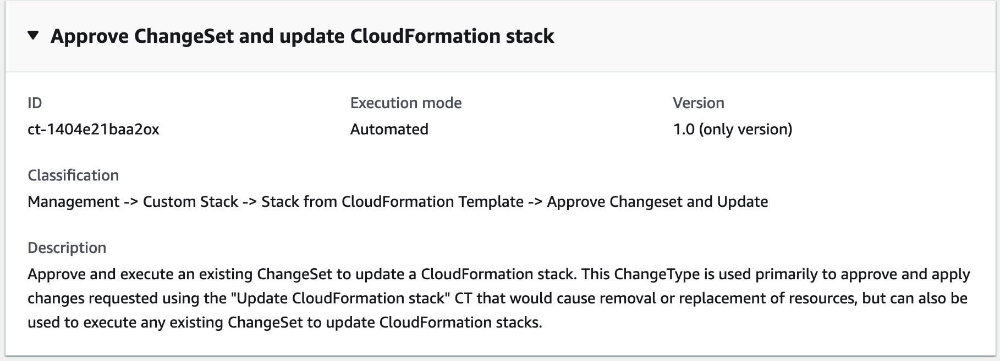
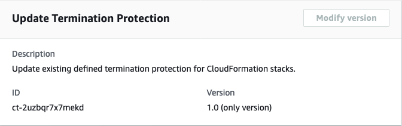

# AMS CloudFormation ingest

The AMS AWS CloudFormation ingest change type (CT) enables you to use your existing
CloudFormation templates, with some modifications, to deploy custom stacks in an AMS-managed VPC.

###### Topics

- [AWS CloudFormation Ingest Guidelines, Best Practices, and Limitations](cfn-author-templates.md "cfn-author-templates.md")
- [AWS CloudFormation Ingest: Examples](cfn-ingest-examples.md "cfn-ingest-examples.md")
- [Create CloudFormation ingest stack](#ex-cfn-ingest-create-col "#ex-cfn-ingest-create-col")
- [Update AWS CloudFormation ingest stack](#ex-cfn-ingest-update-col "#ex-cfn-ingest-update-col")
- [Approve a CloudFormation ingest stack changeset](#ex-cfn-ingest-approve-and-update-col "#ex-cfn-ingest-approve-and-update-col")
- [Update AWS CloudFormation stacks termination protection](#ex-cfn-term-pro-update-col "#ex-cfn-term-pro-update-col")
- [Automated IAM deployments using CFN ingest or stack update CTs in AMS](cfn-ingest-iam-deploy.md "cfn-ingest-iam-deploy.md")
  The AMS AWS CloudFormation ingest process involves the following:

- Prepare and upload your custom CloudFormation template to an S3 bucket, or provide
  the template inline when creating the RFC. If you are using an S3 bucket with a
  presigned URL; for more information, see
  [presign](../../../cli/latest/reference/s3/presign.md "../../../cli/latest/reference/s3/presign.md").
- Submit the CloudFormation ingest change type to AMS in an RFC. For the CFN ingest change type walkthrough, see
  [Create CloudFormation ingest stack](#ex-cfn-ingest-create-col "#ex-cfn-ingest-create-col"). For CFN ingest examples, see
  [AWS CloudFormation Ingest: Examples](cfn-ingest-examples.md "cfn-ingest-examples.md").
- Once your stack is created, you can update it, and remediate drift on it; additionally,
  should the update fail, you can explicitly approve and implement the update. All of these procedures are
  described in this section.

For information on CFN drift detection, see
[New – CloudFormation Drift Detection](https://aws.amazon.com/blogs/aws/new-cloudformation-drift-detection/ "https://aws.amazon.com/blogs/aws/new-cloudformation-drift-detection/").

###### Note

- This change type now has a version 2.0. Version 2.0 is automated; not manually executed. This enables the CT execution to go more quickly.
  Two new parameters are introduced with this version: **CloudFormationTemplate**, which enables
  you to paste a custom CloudFormation template into the RFC, and **VpcId**, which enables CloudFormation ingest to be used with AMS multi-account landing zone.
- Version 1.0 is a manual change type. This means that an AMS operator must take some action before the change type can successfully conclude.
  At minimum, a review is required. This version also requires the **CloudFormationTemplateS3Endpoint** parameter value to be a pre-signed URL.

## Create CloudFormation ingest stack


**To create a CloudFormation ingest stack using the console**

1. Navigate to the **Create RFC** page: In the left navigation pane of the AMS console click **RFCs** to open the RFCs list page, and then click **Create RFC**.
2. Choose a popular change type (CT) in the default **Browse change types** view, or select a CT in the
   **Choose by category** view.
   - **Browse by change type**: You can click on a popular CT in the **Quick create** area to immediately open the
     **Run RFC** page. Note that you cannot choose an older CT version with quick create.

   To sort CTs, use the **All change types** area in either the **Card** or **Table** view.
   In either view, select a CT and then click **Create RFC** to open the **Run RFC** page. If applicable,
   a **Create with older version** option appears next to the **Create RFC** button.
   - **Choose by category**: Select a category, subcategory, item, and operation and the CT details box opens with an option to
     **Create with older version** if applicable. Click **Create RFC** to open the **Run RFC** page.

3. On the **Run RFC** page, open the CT name area to see the CT details box.
   A **Subject** is required (this is filled in for you if you choose your CT in the **Browse change types** view). Open the
   **Additional configuration** area to add information about the RFC.

In the **Execution configuration** area, use available drop-down lists or enter values for the required parameters. To configure
optional execution parameters, open the **Additional configuration** area. 4. When finished, click **Run**. If there are no errors, the **RFC successfully created**
page displays with the submitted RFC details, and the initial **Run output**. 5. Open the **Run parameters** area to see the configurations you submitted. Refresh the page to update the RFC execution status.
Optionally, cancel the RFC or create a copy of it with the options at the top of the page.
**To create a CloudFormation ingest stack using the CLI**

1. Use either the Inline Create (you issue a `create-rfc` command with all RFC and execution parameters included), or
   Template Create (you create two JSON files, one for the RFC parameters and one for the execution parameters) and issue the `create-rfc`
   command with the two files as input. Both methods are described here.
2. Submit the RFC: `aws amscm submit-rfc --rfc-id `ID`` command with the returned RFC ID.

Monitor the RFC: `aws amscm get-rfc --rfc-id `ID`` command.
To check the change type version, use this command:

```
aws amscm list-change-type-version-summaries --filter Attribute=ChangeTypeId,Value=`CT_ID`
```

###### Note

You can use any `CreateRfc` parameters with any RFC whether or not they are part of the schema for the
change type. For example, to get notifications when the RFC status changes, add this line, `--notification "{\"Email\": {\"EmailRecipients\" : [\"email@example.com\"]}}"` to the
RFC parameters part of the request (not the execution parameters). For a list of all CreateRfc parameters, see the
[AMS Change Management API Reference](../ApiReference-cm/API_CreateRfc.md "../ApiReference-cm/API_CreateRfc.md").

1. Prepare the CloudFormation template that you will use to create the stack,
   and upload it to your S3 bucket. For important details, see
   [AWS CloudFormation Ingest Guidelines, Best Practices, and Limitations](cfn-author-templates.md "cfn-author-templates.md").
2. Create and submit the RFC to AMS:
   1. Create and save the execution parameters JSON file, include the CloudFormation template
      parameters that you want. The following example names it
      CreateCfnParams.json.

   Example Web application stack CreateCfnParams.json file:

   ```
   {
     "Name": "`cfn-ingest`",
     "Description": "`CFNIngest Web Application Stack`",
     "VpcId": "`VPC_ID`",
     "CloudFormationTemplateS3Endpoint": "`$S3_URL`",
     "TimeoutInMinutes": 120,
     "Tags": [
      {
       "Key":   "`Enviroment Type`"
       "Value": "`Dev`",
      },
      {
       "Key":   "`Application`"
       "Value": "`PCS`",
      }
     ],
     "Parameters": [
      {
       "Name": "`Parameter-for-S3Bucket-Name`",
       "Value":  "`BUCKET-NAME`"
      },
      {
       "Name": "`Parameter-for-Image-Id`",
       "Value":  "`AMI-ID`"
      }
     ],
   }
   ```

   Example SNS topic CreateCfnParams.json file:

   ```
   {
     "Name": "cfn-ingest",
     "Description": "`CFNIngest Web Application Stack`",
     "CloudFormationTemplateS3Endpoint": "`$S3_URL`",
     "Tags": [
       {"Key": "`Enviroment Type`", "Value": "`Dev`"}
     ],
     "Parameters": [
       {"Name": "`TopicName`", "Value": "`MyTopic1`"}
     ]
   }
   ```

3. Create and save the RFC parameters JSON file with the following content. The following example
   names it CreateCfnRfc.json file:

```
{
   "ChangeTypeId": "ct-36cn2avfrrj9v",
   "ChangeTypeVersion": "2.0",
   "Title": "`cfn-ingest`"
}
```

4. Create the RFC, specifying the CreateCfnRfc file and the CreateCfnParams file:

```
aws amscm create-rfc --cli-input-json file://CreateCfnRfc.json  --execution-parameters file://CreateCfnParams.json
```

You receive the ID of the new RFC in the response and can use it to submit and monitor the RFC. Until you submit it, the RFC remains in the editing state and does not start.

###### Note

This change type is at version 2.0 and is automated (not manually executed). This allows the
CT execution to go more quickly, and, a new
parameter, **CloudFormationTemplate**, allows you to paste into the RFC a custom CloudFormation template. Additionally,
In this version, we do not attach the default AMS security groups if the you specify your own security groups.
If you do not specify your own security groups in the request, AMS will attach the AMS default security groups.
In CFN Ingest v1.0, we always appended the AMS default security groups whether or not you provided your own
security groups.

AMS has enabled 17 AMS Self-Provisioned services for use in this change type. For information about supported resources,
see [CloudFormation Ingest Stack: Supported Resources](cfn-ingest-supp-services.md "cfn-ingest-supp-services.md").

###### Note

Version 2.0 accepts an S3 endpoint that is not a presigned URL.

If you use the previous version of this CT, the **CloudFormationTemplateS3Endpoint** parameter value must be a presigned URL.

Example command for generating a presigned S3 bucket URL (Mac/Linux):

```
export S3_PRESIGNED_URL=$(aws s3 presign DASHDASHexpires-in 86400 s3://`BUCKET_NAME`/`CFN_TEMPLATE`.json)
```

Example command for generating a presigned S3 bucket URL (Windows):

```
for /f %i in ('aws s3 presign DASHDASHexpires-in 86400 s3://`BUCKET_NAME`/`CFN_TEMPLATE`.json') do set S3_PRESIGNED_URL=%i
```

See also [Creating Pre-Signed URLs for Amazon S3 Buckets](../../../sdk-for-go/v1/developer-guide/s3-example-presigned-urls.md "../../../sdk-for-go/v1/developer-guide/s3-example-presigned-urls.md").

###### Note

If the S3 bucket exists in an AMS account, you must use your AMS
credentials for this command. For example, you may need to append `--profile saml` after obtaining your AMS AWS Security Token Service (AWS STS) credentials.

Related change types:
[Approve a CloudFormation ingest stack changeset](#ex-cfn-ingest-approve-and-update-col "#ex-cfn-ingest-approve-and-update-col"),
[Update AWS CloudFormation ingest stack](#ex-cfn-ingest-update-col "#ex-cfn-ingest-update-col")

To learn more about AWS CloudFormation, see [AWS Cloud​Formation](https://aws.amazon.com/cloudformation/ "https://aws.amazon.com/cloudformation/").
To see CloudFormation templates, open the AWS CloudFormation
[Template Reference](../../../AWSCloudFormation/latest/UserGuide/template-reference.md "../../../AWSCloudFormation/latest/UserGuide/template-reference.md").

The template is validated to ensure that it can be created in an AMS account. If
it passes validation, it's updated to include any resources or configurations
required for it to conform with AMS. This includes adding resources such as Amazon CloudWatch
alarms in order to allow AMS Operations to monitor the stack.

The RFC is rejected if any of the following are true:

- RFC JSON Syntax is incorrect or does not follow the given format.
- The provided S3 bucket presigned URL is not valid.
- The template is not valid AWS CloudFormation syntax.
- The template does not have defaults set for all parameter values.
- The template fails AMS validation. For AMS validation steps, see the information later in this topic.
  The RFC fails if the CloudFormation stack fails to create due to a resource creation issue.

To learn more about CFN validation and validator, see
[Template Validation](cfn-author-templates.md "cfn-author-templates.md") and [CloudFormation ingest stack: CFN validator examples](ex-cfn-ingest-validator.md "ex-cfn-ingest-validator.md").

## Update AWS CloudFormation ingest stack


**To update a CloudFormation Ingest Stack using the console**

1. Navigate to the **Create RFC** page: In the left navigation pane of the AMS console click **RFCs** to open the RFCs list page, and then click **Create RFC**.
2. Choose a popular change type (CT) in the default **Browse change types** view, or select a CT in the
   **Choose by category** view.
   - **Browse by change type**: You can click on a popular CT in the **Quick create** area to immediately open the
     **Run RFC** page. Note that you cannot choose an older CT version with quick create.

   To sort CTs, use the **All change types** area in either the **Card** or **Table** view.
   In either view, select a CT and then click **Create RFC** to open the **Run RFC** page. If applicable,
   a **Create with older version** option appears next to the **Create RFC** button.
   - **Choose by category**: Select a category, subcategory, item, and operation and the CT details box opens with an option to
     **Create with older version** if applicable. Click **Create RFC** to open the **Run RFC** page.

3. On the **Run RFC** page, open the CT name area to see the CT details box.
   A **Subject** is required (this is filled in for you if you choose your CT in the **Browse change types** view). Open the
   **Additional configuration** area to add information about the RFC.

In the **Execution configuration** area, use available drop-down lists or enter values for the required parameters. To configure
optional execution parameters, open the **Additional configuration** area. 4. When finished, click **Run**. If there are no errors, the **RFC successfully created**
page displays with the submitted RFC details, and the initial **Run output**. 5. Open the **Run parameters** area to see the configurations you submitted. Refresh the page to update the RFC execution status.
Optionally, cancel the RFC or create a copy of it with the options at the top of the page.
**To update a CloudFormation ingest stack using the CLI**

1. Use either the Inline Create (you issue a `create-rfc` command with all RFC and execution parameters included), or
   Template Create (you create two JSON files, one for the RFC parameters and one for the execution parameters) and issue the `create-rfc`
   command with the two files as input. Both methods are described here.
2. Submit the RFC: `aws amscm submit-rfc --rfc-id `ID`` command with the returned RFC ID.

Monitor the RFC: `aws amscm get-rfc --rfc-id `ID`` command.
To check the change type version, use this command:

```
aws amscm list-change-type-version-summaries --filter Attribute=ChangeTypeId,Value=`CT_ID`
```

###### Note

You can use any `CreateRfc` parameters with any RFC whether or not they are part of the schema for the
change type. For example, to get notifications when the RFC status changes, add this line, `--notification "{\"Email\": {\"EmailRecipients\" : [\"email@example.com\"]}}"` to the
RFC parameters part of the request (not the execution parameters). For a list of all CreateRfc parameters, see the
[AMS Change Management API Reference](../ApiReference-cm/API_CreateRfc.md "../ApiReference-cm/API_CreateRfc.md").

1. Prepare the AWS CloudFormation template that you want to use to update the stack, and
   upload it to your S3 bucket. For important details, see
   [AWS CloudFormation Ingest Guidelines, Best Practices, and Limitations](cfn-author-templates.md "cfn-author-templates.md").
2. Create and submit the RFC to AMS:
   1. Create and save the execution parameters JSON file, include the
      CloudFormation template parameters that you want. This example names it
      UpdateCfnParams.json.

   Example UpdateCfnParams.json file with inline parameter updates:

   ```
   {
     "StackId": "`stack-yjjoo9aicjyqw4ro2`",
     "VpcId": "`VPC_ID`",
     "CloudFormationTemplate": "{\"AWSTemplateFormatVersion\":\"`2010-09-09`\",\"Description\":\"`Create a SNS topic`\",\"Parameters\":{\"`TopicName`\":{\"Type\":\"String\"},\"DisplayName\":{\"Type\":\"String\"}},\"`Resources`\":{\"SnsTopic\":{\"Type\":\"AWS::SNS::Topic\",\"Properties\":{\"TopicName\":{\"Ref\":\"TopicName\"},\"DisplayName\":{\"Ref\":\"DisplayName\"}}}}}",
     "TemplateParameters": [
       {
         "Key": "TopicName",
         "Value": "`TopicNameCLI`"
       },
       {
         "Key": "DisplayName",
         "Value": "`DisplayNameCLI`"
       }
     ],
     "TimeoutInMinutes": 1440
   }
   ```

   Example UpdateCfnParams.json file with S3 bucket endpoint containing an
   updated CloudFormation template:

   ```
   {
     "StackId": "`stack-yjjoo9aicjyqw4ro2`",
     "VpcId": "`VPC_ID`",
     "CloudFormationTemplateS3Endpoint": "`s3_url`",
     "TemplateParameters": [
       {
         "Key": "TopicName",
         "Value": "`TopicNameCLI`"
       },
       {
         "Key": "DisplayName",
         "Value": "`DisplayNameCLI`"
       }
     ],
     "TimeoutInMinutes": `1080`
   }
   ```

3. Create and save the RFC parameters JSON file with the following content. This
   example names it UpdateCfnRfc.json file.

```
{
   "ChangeTypeId": "ct-361tlo1k7339x",
   "ChangeTypeVersion": "1.0",
   "Title": "`cfn-ingest-template-update`"
}
```

4. Create the RFC, specifying the UpdateCfnRfc file and the UpdateCfnParams file:

```
aws amscm create-rfc --cli-input-json file://UpdateCfnRfc.json  --execution-parameters file://UpdateCfnParams.json
```

You receive the ID of the new RFC in the response and can use it to submit and monitor the RFC. Until you submit it, the RFC remains in the editing state and does not start.

- This change type is now at version 2.0. Changes include removing the **AutoApproveUpdateForResources** parameter, which was used in version
  1.0 of this CT, and adding two new parameters: **AutoApproveRiskyUpdates** and **BypassDriftCheck**.
- If the S3 bucket exists in an AMS account, you must use your AMS credentials for this command. For example, you may need to append
  `--profile saml` after obtaining your AMS AWS Security Token Service (AWS STS) credentials.
- All `Parameter` values for resources in the CloudFormation template must have a value, either through a default or a custom value through
  the parameters section of the CT. You can override the parameter value by structuring the
  CloudFormation template resources to reference a Parameters key. For examples that show how to do, see
  [CloudFormation ingest stack: CFN validator examples](ex-cfn-ingest-validator.md "ex-cfn-ingest-validator.md").

IMPORTANT: Missing parameters not supplied explicitly in the form, default to the currently set values on the existing stack or template.

- For a list of which self-provisioned services you can add using AWS CloudFormation Ingest, see
  [CloudFormation Ingest Stack: Supported Resources](cfn-ingest-supp-services.md "cfn-ingest-supp-services.md").

To learn more about AWS CloudFormation, see
[AWS Cloud​Formation](https://aws.amazon.com/cloudformation/ "https://aws.amazon.com/cloudformation/").

The template is validated to ensure that it can be created in an AMS account. If
it passes validation, it's updated to include any resources or configurations
required for it to conform with AMS. This includes adding resources such as Amazon CloudWatch
alarms in order to allow AMS Operations to monitor the stack.

The RFC is rejected if any of the following are true:

- RFC JSON Syntax is incorrect or does not follow the given format.
- The provided S3 bucket presigned URL is not valid.
- The template is not valid AWS CloudFormation syntax.
- The template does not have defaults set for all parameter values.
- The template fails AMS validation. For AMS validation steps, see the
  information later in this topic.
  The RFC fails if the CloudFormation stack fails to create due to a resource creation
  issue.

To learn more about CFN validation and validator, see
[Template Validation](cfn-author-templates.md "cfn-author-templates.md") and
[CloudFormation ingest stack: CFN validator examples](ex-cfn-ingest-validator.md "ex-cfn-ingest-validator.md").

## Approve a CloudFormation ingest stack changeset


**To approve and update a CloudFormation ingest stack using
the console**

1. Navigate to the **Create RFC** page: In the left navigation pane of the AMS console click **RFCs** to open the RFCs list page, and then click **Create RFC**.
2. Choose a popular change type (CT) in the default **Browse change types** view, or select a CT in the
   **Choose by category** view.
   - **Browse by change type**: You can click on a popular CT in the **Quick create** area to immediately open the
     **Run RFC** page. Note that you cannot choose an older CT version with quick create.

   To sort CTs, use the **All change types** area in either the **Card** or **Table** view.
   In either view, select a CT and then click **Create RFC** to open the **Run RFC** page. If applicable,
   a **Create with older version** option appears next to the **Create RFC** button.
   - **Choose by category**: Select a category, subcategory, item, and operation and the CT details box opens with an option to
     **Create with older version** if applicable. Click **Create RFC** to open the **Run RFC** page.

3. On the **Run RFC** page, open the CT name area to see the CT details box.
   A **Subject** is required (this is filled in for you if you choose your CT in the **Browse change types** view). Open the
   **Additional configuration** area to add information about the RFC.

In the **Execution configuration** area, use available drop-down lists or enter values for the required parameters. To configure
optional execution parameters, open the **Additional configuration** area. 4. When finished, click **Run**. If there are no errors, the **RFC successfully created**
page displays with the submitted RFC details, and the initial **Run output**. 5. Open the **Run parameters** area to see the configurations you submitted. Refresh the page to update the RFC execution status.
Optionally, cancel the RFC or create a copy of it with the options at the top of the page.
**To approve and update a CloudFormation ingest stack using
the CLI**

1. Use either the Inline Create (you issue a `create-rfc` command with all RFC and execution parameters included), or
   Template Create (you create two JSON files, one for the RFC parameters and one for the execution parameters) and issue the `create-rfc`
   command with the two files as input. Both methods are described here.
2. Submit the RFC: `aws amscm submit-rfc --rfc-id `ID`` command with the returned RFC ID.

Monitor the RFC: `aws amscm get-rfc --rfc-id `ID`` command.
To check the change type version, use this command:

```
aws amscm list-change-type-version-summaries --filter Attribute=ChangeTypeId,Value=`CT_ID`
```

###### Note

You can use any `CreateRfc` parameters with any RFC whether or not they are part of the schema for the
change type. For example, to get notifications when the RFC status changes, add this line, `--notification "{\"Email\": {\"EmailRecipients\" : [\"email@example.com\"]}}"` to the
RFC parameters part of the request (not the execution parameters). For a list of all CreateRfc parameters, see the
[AMS Change Management API Reference](../ApiReference-cm/API_CreateRfc.md "../ApiReference-cm/API_CreateRfc.md").

1. Output the execution parameters JSON schema for this change type to a
   file in your current folder. This example names it CreateAsgParams.json:

```
aws amscm create-rfc --change-type-id "ct-1404e21baa2ox" --change-type-version "1.0" --title "`Approve Update`" --execution-parameters file://`PATH_TO_EXECUTION_PARAMETERS` --profile saml
```

2. Modify and save the schema as follows:

```
{
  "StackId": "`STACK_ID`",
  "VpcId": "`VPC_ID`",
  "ChangeSetName": "`UPDATE-ef81e2bc-03f6-4b17-a3c7-feb700e78faa`",
  "TimeoutInMinutes": `1080`
}

```

###### Note

If there are multiple resources in a stack, and you want to delete only a subset
of the stack resources, use the CloudFormation Update CT; see
[CloudFormation Ingest Stack: Updating](ex-cfn-ingest-update-col.md "ex-cfn-ingest-update-col.md"). You can also submit a Service request case and AMS engineers can help you craft the changeset, if needed.

To learn more about AWS CloudFormation, see [AWS CloudFormation](https://aws.amazon.com/cloudformation/ "https://aws.amazon.com/cloudformation/").

## Update AWS CloudFormation stacks termination protection

The following shows this change type in the AMS console.


How it works:

1. Navigate to the **Create RFC** page: In the left navigation pane of the AMS console click **RFCs** to open the RFCs list page, and then click **Create RFC**.
2. Choose a popular change type (CT) in the default **Browse change types** view, or select a CT in the
   **Choose by category** view.
   - **Browse by change type**: You can click on a popular CT in the **Quick create** area to immediately open the
     **Run RFC** page. Note that you cannot choose an older CT version with quick create.

   To sort CTs, use the **All change types** area in either the **Card** or **Table** view.
   In either view, select a CT and then click **Create RFC** to open the **Run RFC** page. If applicable,
   a **Create with older version** option appears next to the **Create RFC** button.
   - **Choose by category**: Select a category, subcategory, item, and operation and the CT details box opens with an option to
     **Create with older version** if applicable. Click **Create RFC** to open the **Run RFC** page.

3. On the **Run RFC** page, open the CT name area to see the CT details box.
   A **Subject** is required (this is filled in for you if you choose your CT in the **Browse change types** view). Open the
   **Additional configuration** area to add information about the RFC.

In the **Execution configuration** area, use available drop-down lists or enter values for the required parameters. To configure
optional execution parameters, open the **Additional configuration** area. 4. When finished, click **Run**. If there are no errors, the **RFC successfully created**
page displays with the submitted RFC details, and the initial **Run output**. 5. Open the **Run parameters** area to see the configurations you submitted. Refresh the page to update the RFC execution status.
Optionally, cancel the RFC or create a copy of it with the options at the top of the page.
How it works:

1. Use either the Inline Create (you issue a `create-rfc` command with all RFC and execution parameters included), or
   Template Create (you create two JSON files, one for the RFC parameters and one for the execution parameters) and issue the `create-rfc`
   command with the two files as input. Both methods are described here.
2. Submit the RFC: `aws amscm submit-rfc --rfc-id `ID`` command with the returned RFC ID.

Monitor the RFC: `aws amscm get-rfc --rfc-id `ID`` command.
To check the change type version, use this command:

```
aws amscm list-change-type-version-summaries --filter Attribute=ChangeTypeId,Value=`CT_ID`
```

###### Note

You can use any `CreateRfc` parameters with any RFC whether or not they are part of the schema for the
change type. For example, to get notifications when the RFC status changes, add this line, `--notification "{\"Email\": {\"EmailRecipients\" : [\"email@example.com\"]}}"` to the
RFC parameters part of the request (not the execution parameters). For a list of all CreateRfc parameters, see the
[AMS Change Management API Reference](../ApiReference-cm/API_CreateRfc.md "../ApiReference-cm/API_CreateRfc.md").

Only specify the parameters you want to change. Absent parameters retain the
existing values.

_INLINE CREATE_:

Issue the create RFC command with execution parameters provided inline (escape
quotation marks when providing execution parameters inline), and then submit the returned
RFC ID. For example, you can replace the contents with something like this:

```
aws amscm create-rfc \
--change-type-id "ct-2uzbqr7x7mekd" \
--change-type-version "1.0" \
--title "`Enable termination protection on CFN stack`" \
--execution-parameters "{\"DocumentName\":\"AWSManagedServices-ManageResourceTerminationProtection\",\"Region\":\"`us-east-1`\",\"Parameters\":{\"ResourceId\":[\"`stack-psvnq6cupymio3enl`\"],\"TerminationProtectionDesiredState\":[\"`enabled`\"]}}"
```

_TEMPLATE CREATE_:

1. Output the execution parameters for this change type to a JSON file; this
   example names it EnableTermProCFNParams.json:

```
aws amscm get-change-type-version --change-type-id "ct-2uzbqr7x7mekd" --query "ChangeTypeVersion.ExecutionInputSchema" --output text > EnableTermProCFNParams.json
```

2. Modify and save the EnableTermProCFNParams file, retaining only the parameters
   that you want to change. For example, you can replace the contents with something like this:

```
{
  "DocumentName": "AWSManagedServices-ManageResourceTerminationProtection",
  "Region": "`us-east-1`",
  "Parameters": {
    "ResourceId": ["`stack-psvnq6cupymio3enl`"],
    "TerminationProtectionDesiredState": ["`enabled`"]
  }
}
```

3. Output the RFC template to a file in your current folder; this example names it
   EnableTermProCFNRfc.json:

```
aws amscm create-rfc --generate-cli-skeleton > EnableTermProCFNRfc.json
```

4. Modify and save the EnableTermProCFNRfc.json file. For example, you can replace the contents with something like this:

```
{
    "ChangeTypeId": "ct-2uzbqr7x7mekd",
    "ChangeTypeVersion": "1.0",
    "Title": "`Enable termination protection on CFN instance`"
}
```

5. Create the RFC, specifying the EnableTermProCFNRfc file and the
   EnableTermProCFNParams file:

```
aws amscm create-rfc --cli-input-json file://EnableTermProCFNRfc.json  --execution-parameters file://EnableTermProCFNParams.json
```

You receive the ID of the new RFC in the response and can use it to submit and monitor the RFC. Until you submit it, the RFC remains in the editing state and does not start.

###### Note

There is a related CT for Amazon EC2, [EC2 stack: Updating termination protection](../ctref/ex-ec2-term-pro-update-col.md "../ctref/ex-ec2-term-pro-update-col.md").

To learn more about termination protection, see
[Protecting a stack from being deleted](../../../AWSCloudFormation/latest/UserGuide/using-cfn-protect-stacks.md "../../../AWSCloudFormation/latest/UserGuide/using-cfn-protect-stacks.md").
