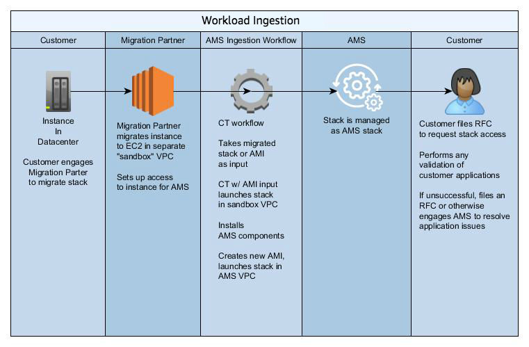
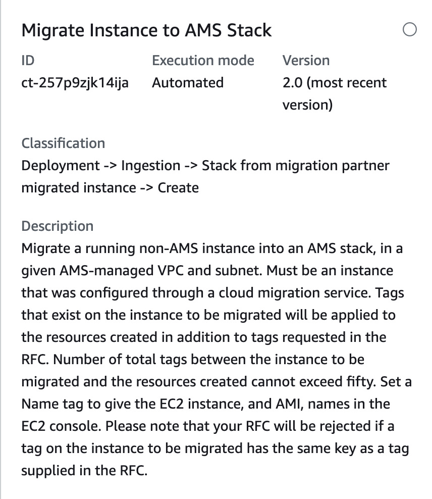

# AMS Workload Ingest (WIGS)

###### Topics

- [Migrating Workloads: Prerequisites for Linux and Windows](ex-migrate-instance-prereqs.md "ex-migrate-instance-prereqs.md")
- [How Migration Changes Your Resource](ex-migrate-changes.md "ex-migrate-changes.md")
- [Migrating Workloads: Standard Process](mp-migrate-stack-process.md "mp-migrate-stack-process.md")
- [Migrating workloads: CloudEndure landing zone (SALZ)](ex-migrate-instance-cloud-endure.md "ex-migrate-instance-cloud-endure.md")
- [AMS Tools account (migrating workloads)](tools-account.md "tools-account.md")
- [Migrating workloads: Linux pre-ingestion validation](ex-migrate-instance-linux-validation.md "ex-migrate-instance-linux-validation.md")
- [Migrating workloads: Windows pre-ingestion validation](ex-migrate-instance-win-validation.md "ex-migrate-instance-win-validation.md")
- [Workload Ingest Stack: Creating](#ex-workload-ingest-col "#ex-workload-ingest-col")
  Use the AMS workload ingest change type (CT) with an AMS cloud migration partner, to move your existing workloads into an AMS-managed VPC.
  Using AMS workload ingest, you can create a custom AMS AMI after moving migrated instances onto AMS. This section describes
  the process, pre-requisites, and steps that your migration partner and yourself take for AMS workload ingestion.

###### Important

The operating system must be supported by AMS workload ingest. For supported operating systems, see
[Migrating Workloads: Prerequisites for Linux and Windows](ex-migrate-instance-prereqs.md "ex-migrate-instance-prereqs.md").

Every workload and account is different. AMS will work with you to prepare for a successful result.

The following diagram depicts the AMS workload ingestion process.



## Workload Ingest Stack: Creating

Screenshot of this change type in the AMS console:


How it works:

1. Navigate to the **Create RFC** page: In the left navigation pane of the AMS console click **RFCs** to open the RFCs list page, and then click **Create RFC**.
2. Choose a popular change type (CT) in the default **Browse change types** view, or select a CT in the
   **Choose by category** view.
   - **Browse by change type**: You can click on a popular CT in the **Quick create** area to immediately open the
     **Run RFC** page. Note that you cannot choose an older CT version with quick create.

   To sort CTs, use the **All change types** area in either the **Card** or **Table** view.
   In either view, select a CT and then click **Create RFC** to open the **Run RFC** page. If applicable,
   a **Create with older version** option appears next to the **Create RFC** button.
   - **Choose by category**: Select a category, subcategory, item, and operation and the CT details box opens with an option to
     **Create with older version** if applicable. Click **Create RFC** to open the **Run RFC** page.

3. On the **Run RFC** page, open the CT name area to see the CT details box.
   A **Subject** is required (this is filled in for you if you choose your CT in the **Browse change types** view). Open the
   **Additional configuration** area to add information about the RFC.

In the **Execution configuration** area, use available drop-down lists or enter values for the required parameters. To configure
optional execution parameters, open the **Additional configuration** area. 4. When finished, click **Run**. If there are no errors, the **RFC successfully created**
page displays with the submitted RFC details, and the initial **Run output**. 5. Open the **Run parameters** area to see the configurations you submitted. Refresh the page to update the RFC execution status.
Optionally, cancel the RFC or create a copy of it with the options at the top of the page.

###### Note

If the RFC is rejected, the execution output includes a link to Amazon CloudWatch logs.
AMS Workload Ingest (WIGS) RFCs are rejected when requirements are not met; for example,
if anti-virus software is detected on the instance. The CloudWatch logs will include information
about the failed requirement and the actions to take for remediation.

How it works:

1. Use either the Inline Create (you issue a `create-rfc` command with all RFC and execution parameters included), or
   Template Create (you create two JSON files, one for the RFC parameters and one for the execution parameters) and issue the `create-rfc`
   command with the two files as input. Both methods are described here.
2. Submit the RFC: `aws amscm submit-rfc --rfc-id `ID`` command with the returned RFC ID.

Monitor the RFC: `aws amscm get-rfc --rfc-id `ID`` command.
To check the change type version, use this command:

```
aws amscm list-change-type-version-summaries --filter Attribute=ChangeTypeId,Value=`CT_ID`
```

###### Note

You can use any `CreateRfc` parameters with any RFC whether or not they are part of the schema for the
change type. For example, to get notifications when the RFC status changes, add this line, `--notification "{\"Email\": {\"EmailRecipients\" : [\"email@example.com\"]}}"` to the
RFC parameters part of the request (not the execution parameters). For a list of all CreateRfc parameters, see the
[AMS Change Management API Reference](../ApiReference-cm/API_CreateRfc.md "../ApiReference-cm/API_CreateRfc.md").

You can use the AMS CLI to create an AMS instance from a non-AMS instance migrated to an AMS account.

###### Note

Be sure you have followed the prerequisites; see
[Migrating Workloads: Prerequisites for Linux and Windows](ex-migrate-instance-prereqs.md "ex-migrate-instance-prereqs.md").

To check the change type version, use this command:

```
aws amscm list-change-type-version-summaries --filter Attribute=ChangeTypeId,Value=`CT_ID`
```

_INLINE CREATE_:

Issue the create RFC command with execution parameters provided inline (escape quotes when providing execution parameters inline), and then submit the returned RFC ID. For example, you can replace the contents with something like this:

```
aws amscm create-rfc --change-type-id "ct-257p9zjk14ija" --change-type-version "2.0" --title "AMS-WIG-TEST-NO-ACTION" --execution-parameters "{\"InstanceId\":\"`INSTANCE_ID`\",\"TargetVpcId\":\"`VPC_ID`\",\"TargetSubnetId\":\"`SUBNET_ID`\",\"TargetInstanceType\":\"`t2.large`\",\"ApplyInstanceValidation\":`true`,\"Name\":\"WIG-TEST\",\"Description\":\"`WIG-TEST`\",\"EnforceIMDSV2\":\"`false`\"}"
```

_TEMPLATE CREATE_:

1. 0utput the execution parameters JSON schema for this change type to a file; example names it MigrateStackParams.json:

```
aws amscm get-change-type-version --change-type-id "ct-257p9zjk14ija" --query "ChangeTypeVersion.ExecutionInputSchema" --output text > MigrateStackParams.json
```

2. Modify and save the execution parameters JSON file. For example, you can replace the contents with something like this:

```
{
"InstanceId":          "MIGRATED_INSTANCE_ID",
"TargetVpcId":         "VPC_ID",
"TargetSubnetId":      "SUBNET_ID",
"Name":                "Migrated-Stack",
"Description":         "Create-Migrated-Stack",
"EnforceIMDSV2":       "false"
}
```

3. Output the RFC template JSON file; example names it MigrateStackRfc.json:

```
aws amscm create-rfc --generate-cli-skeleton > MigrateStackRfc.json
```

4. Modify and save the MigrateStackRfc.json file. For example, you can replace the contents with something like this:

```
{
"ChangeTypeId":         "ct-257p9zjk14ija",
"ChangeTypeVersion":    "`2.0`",
"Title":                "`Migrate-Stack-RFC`"
}
```

5. Create the RFC, specifying the MigrateStackRfc file and the MigrateStackParams file:

```
aws amscm create-rfc --cli-input-json file://MigrateStackRfc.json  --execution-parameters file://MigrateStackParams.json
```

You receive the ID of the new RFC in the response and can use it to submit and monitor the RFC. Until you submit it, the RFC remains in the editing state and does not start.

The new instance appears in the Instance list for the application owner's account for the relevant VPC. 6. Once the RFC completes successfully, notify the application owner so he or she can log into the new instance and verify that the workload is operational.

###### Note

If the RFC is rejected, the execution output includes a link to Amazon CloudWatch logs.
AMS Workload Ingest (WIGS) RFCs are rejected when requirements are not met; for example,
if anti-virus software is detected on the instance. The CloudWatch logs will include information
about the failed requirement and the actions to take for remediation.

###### Note

Be sure you have followed the prerequisites; see
[Migrating Workloads: Prerequisites for Linux and Windows](ex-migrate-instance-prereqs.md "ex-migrate-instance-prereqs.md").

###### Note

If a tag on the instance being migrated has the same key as a tag supplied
in the RFC, the RFC fails.

###### Note

You can specify up to four Target IDs, Ports, and Availability Zones.

###### Note

If the RFC is rejected, the execution output includes a link to Amazon CloudWatch logs.
AMS Workload Ingest (WIGS) RFCs are rejected when requirements are not met; for example,
if anti-virus software is detected on the instance. The CloudWatch logs will include information
about the failed requirement and the actions to take for remediation.

###### Note

If the RFC is rejected, the execution output includes a link to Amazon CloudWatch logs.
AMS Workload Ingest (WIGS) RFCs are rejected when requirements are not met; for example,
if anti-virus software is detected on the instance. The CloudWatch logs will include information
about the failed requirement and the actions to take for remediation.

If needed, see [Workload ingestion (WIGS) failure](../userguide/rfc-troubleshoot.md#rfc-valid-execute-wigs "../userguide/rfc-troubleshoot.md#rfc-valid-execute-wigs").
