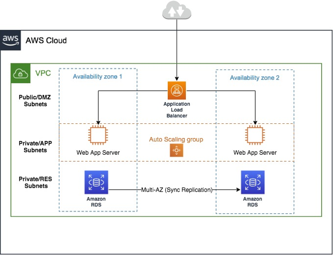

# CloudFormation Ingest examples: 3-tier Web application

Ingest a CloudFormation template for a standard 3-Tier Web Application.


This includes an Application Load Balancer, Application Load Balancer target group, Amazon EC2 Auto Scaling group, Amazon EC2 Auto Scaling group launch template, Amazon Relational Database Service (RDS for SQL Server) with a MySQL database,
AWS SSM Parameter store, and AWS Secrets Manager. Allow 30-60 minutes to walk through this example.

## Prerequisites

- Create a secret containing a username and password with corresponding values using the AWS Secrets Manager.
  You can refer to this

[sample JSON template (zip file)](samples/3-tier-cfn-ingest-2025.md "samples/3-tier-cfn-ingest-2025.md")

that contains the secret name
`ams-shared/myapp/dev/dbsecrets`, and replace it with your secret name. For information about using AWS Secrets Manager with AMS, see
[Using AWS Secrets Manager with AMS resources](secrets-manager.md "secrets-manager.md").

- Set up required parameters in the AWS SSM Parameter Store (PS). In this example, the `VPCId`
  and `Subnet-Id` of the Private and Public subnets are stored in the SSM PS in paths like
  `/app/DemoApp/PublicSubnet1a`, `PublicSubnet1c`, `PrivateSubnet1a`,
  `PrivateSubnet1c` and `VPCCidr`. Update the paths and parameter names and values for your needs.
- Create an IAM Amazon EC2 instance role with read permissions to the AWS Secrets Manager
  and SSM Parameter Store paths (the IAM role created and used in these examples is `customer-ec2_secrets_manager_instance_profile`).
  If you create IAM-standard policies like instance profile role, the role name must start with `customer-`. To create a
  new IAM role, (you can name it `customer-ec2_secrets_manager_instance_profile`, or something else) use the AMS change type
  Management | Applications | IAM instance profile | Create (ct-0ixp4ch2tiu04) CT, and attach the required policies. You can review the AMS IAM standard policies,
  `customer_secrets_manager_policy` and `customer_systemsmanager_parameterstore_policy`, in the AWS IAM console to be used as-is or as a reference.

## Ingest a CloudFormation template for a standard 3-Tier Web application

1. Upload the attached sample CloudFormation JSON template as a zip file,

[3-tier-cfn-ingest.zip](samples/3-tier-cfn-ingest-2025.md "samples/3-tier-cfn-ingest-2025.md") to an S3 bucket and generate a signed S3 URL to use in the CFN Ingest RFC.

For more information, see
[presign](../../../cli/latest/reference/s3/presign.md "../../../cli/latest/reference/s3/presign.md"). The
CFN template can also be copy/pasted into the CFN Ingest RFC when you submit the RFC through the AMS console. 2. Create a CloudFormation Ingest RFC (Deployment | Ingestion | Stack from CloudFormation template | Create (ct-36cn2avfrrj9v)), either via the AMS
console or the AMS CLI. The CloudFormation ingest automation process validates the CloudFormation template to ensure that the template has valid AMS-supported
resources, and adheres to security standards.

    * Using the console - For the change type, select **Deployment** -> **Ingestion** ->
     **Stack from CloudFormation Template** -> **Create**, and then add the following parameters as an example
     (note that the default for **MultiAZDatabase** is false):


    ```
    **CloudFormationTemplateS3Endpoint**: "`https://s3-ap-southeast-2.amazonaws.com/amzn-s3-demo-bucket/`3-tier-cfn-ingest.json?AWSAccessKeyId=#{`S3_ACCESS_KEY_ID`}&Expires=#{`EXPIRE_DATE`}&Signature=#{`SIGNATURE`}"
    **VpcId**: "`VPC_ID`"
    **TimeoutInMinutes**: `120`
    **IAMEC2InstanceProfile**: "`customer_ec2_secrets_manager_instance_profile`"
    **MultiAZDatabase**: "`true`"
    **WebServerCapacity**: "`2`"
    ```
    * Using the AWS CLI - For details about creating RFCs using the AWS CLI, see [Creating RFCs](../userguide/create-rfcs.md "../userguide/create-rfcs.md"). For example, run
     the following command:


    ```
    aws --profile=saml amscm create-rfc  --change-type-id ct-36cn2avfrrj9v --change-type-version "2.0" --title "`TEST_CFN_INGEST`" --execution-parameters "{\"CloudFormationTemplateS3Endpoint\":\"`https://s3-ap-southeast-2.amazonaws.com/my-bucket/`3-tier-cfn-ingest.json?AWSAccessKeyId=#{`S3_ACCESS_KEY_ID`}&Expires=#{`EXPIRE_DATE`}&Signature=#{`SIGNATURE`}\",\"TimeoutInMinutes\":120,\"Description\":\"`TEST`\",\”VpcId”\”:\”`VPC_ID`\”,\"Name\":\"`MY_TEST`\",\"Tags\":[{\"Key\":\"`env`\",\"Value\":\"`test`\"}],\"Parameters\":[{\"Name\":\"`IAMEC2InstanceProfile`\",\"Value\":\"`customer_ec2_secrets_manager_instance_profile`\"},{\"Name\":\"`MultiAZDatabase`\",\"Value\":\"`true`\"},{\"Name\":\"VpcId\",\"Value\":\"`VPC_ID`\"},{\"Name\":\"`WebServerCapacity`\",\"Value\":\"`2`\"}]}" --endpoint-url `https://amscm.us-east-1.amazonaws.com/operational/` --no-verify-ssl
    ```

Find the Application Load Balancer URL in the CloudFormation RFC execution output to access the website. For information
about accessing resources, see [Accessing instances](../userguide/access-instance.md "../userguide/access-instance.md").
