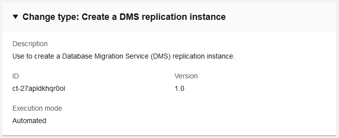

# 2: AWS DMS replication instance: Create

You can use the AMS console or API/CLI to create an AMS AWS DMS replication instance.

## Create AWS DMS replication instance

Screenshot of this change type in the AMS console:


How it works:

1. Navigate to the **Create RFC** page: In the left navigation pane of the AMS console click **RFCs** to open the RFCs list page, and then click **Create RFC**.
2. Choose a popular change type (CT) in the default **Browse change types** view, or select a CT in the
   **Choose by category** view.
   - **Browse by change type**: You can click on a popular CT in the **Quick create** area to immediately open the
     **Run RFC** page. Note that you cannot choose an older CT version with quick create.

   To sort CTs, use the **All change types** area in either the **Card** or **Table** view.
   In either view, select a CT and then click **Create RFC** to open the **Run RFC** page. If applicable,
   a **Create with older version** option appears next to the **Create RFC** button.
   - **Choose by category**: Select a category, subcategory, item, and operation and the CT details box opens with an option to
     **Create with older version** if applicable. Click **Create RFC** to open the **Run RFC** page.

3. On the **Run RFC** page, open the CT name area to see the CT details box.
   A **Subject** is required (this is filled in for you if you choose your CT in the **Browse change types** view). Open the
   **Additional configuration** area to add information about the RFC.

In the **Execution configuration** area, use available drop-down lists or enter values for the required parameters. To configure
optional execution parameters, open the **Additional configuration** area. 4. When finished, click **Run**. If there are no errors, the **RFC successfully created**
page displays with the submitted RFC details, and the initial **Run output**. 5. Open the **Run parameters** area to see the configurations you submitted. Refresh the page to update the RFC execution status.
Optionally, cancel the RFC or create a copy of it with the options at the top of the page.
How it works:

1. Use either the Inline Create (you issue a `create-rfc` command with all RFC and execution parameters included), or
   Template Create (you create two JSON files, one for the RFC parameters and one for the execution parameters) and issue the `create-rfc`
   command with the two files as input. Both methods are described here.
2. Submit the RFC: `aws amscm submit-rfc --rfc-id `ID`` command with the returned RFC ID.

Monitor the RFC: `aws amscm get-rfc --rfc-id `ID`` command.
To check the change type version, use this command:

```
aws amscm list-change-type-version-summaries --filter Attribute=ChangeTypeId,Value=`CT_ID`
```

###### Note

You can use any `CreateRfc` parameters with any RFC whether or not they are part of the schema for the
change type. For example, to get notifications when the RFC status changes, add this line, `--notification "{\"Email\": {\"EmailRecipients\" : [\"email@example.com\"]}}"` to the
RFC parameters part of the request (not the execution parameters). For a list of all CreateRfc parameters, see the
[AMS Change Management API Reference](../ApiReference-cm/API_CreateRfc.md "../ApiReference-cm/API_CreateRfc.md").

_INLINE CREATE_:

Issue the create RFC command with execution parameters provided inline (escape quotes when providing execution parameters inline), and then submit the returned RFC ID. For example, you can replace the contents with something like this:

```
aws --profile saml --region us-east-1 amscm create-rfc --change-type-id "ct-27apldkhqr0ol" --change-type-version "1.0" --title "`TestDMSRepInstance`" --execution-parameters "{\"Description\":\"`DMSTestRepInstance`\",\"VpcId\":\"`VPC-ID`\",\"Name\":\"`REP-INSTANCE-NAME`\",\"Parameters\":{\"InstanceClass\":\"`dms.t2.micro`\",\"ReplicationSubnetGroupIdentifier\":\"`TEST-REP-SG`\",\"SecurityGroupIds\":\"`SG-ID`, `SG-ID`\"},\"TimeoutInMinutes\":60,\"StackTemplateId\":\"stm-3n1j5hdrmiiiuqk6v\"}"
```

While your replication instance is being created, you can specify the source and target data stores.
The source and target data stores can be on an Amazon Elastic Compute Cloud (Amazon EC2) instance,
an AWS S3 Bucket, an Amazon Relational Database Service (Amazon RDS) DB instance, or an on-premises database.

_TEMPLATE CREATE_:

1. Output the execution parameters for this change type to a JSON file; this example names it CreateDmsRiParams.json:

```
aws amscm get-change-type-version --change-type-id "ct-27apldkhqr0ol" --query "ChangeTypeVersion.ExecutionInputSchema" --output text > CreateDmsRiParams.json
```

2. Modify and save the execution parameters CreateDmsRiParams.json file. For example, you can replace the contents with something like this:

```
{
"Description":          "`DMSTestRepInstance`",
"VpcId":                "`VPC_ID`",
"Name":                 "`Test RI`",
"StackTemplateId":      "stm-3n1j5hdrmiiiuqk6v",
"TimeoutInMinutes":     `60`,
"Parameters":   {
    "Description":                      "`DESCRIPTION`",
    "InstanceClass":                    "`dms.t2.micro`",
    "ReplicationSubnetGroupIdentifier": "`TEST-REP-SG`",
    "SecurityGroupIds":                 ["`SG-ID`, `SG-ID`"}
    }
}
```

3. Output the JSON template to a file in your current folder; this example names it CreateDmsRiRfc.json:

```
aws amscm create-rfc --generate-cli-skeleton > CreateDmsRiRfc.json
```

4. Modify and save the CreateDmsRiRfc.json file. For example, you can replace the contents with something like this:

```
{
"ChangeTypeVersion":    "`1.0`",
"ChangeTypeId":         "ct-27apldkhqr0ol",
"Title":                "`DMS-RI-Create-RFC`"
}
```

5. Create the RFC, specifying the execution parameters file and the CreateDmsRiRfc file:

```
aws amscm create-rfc --cli-input-json file://CreateDmsRiRfc.json --execution-parameters file://CreateDmsRiParams.json
```

You receive the ID of the new RFC in the response and can use it to submit and monitor the RFC. Until you submit it, the RFC remains in the editing state and does not start.

- You can add up to 50 tags, but to do so you must enable the **Additional configuration** view.
- You must create a replication instance on an EC2 instance in your AMS VPC that has sufficient storage and processing power to
  perform the tasks you assign and migrate data from your source database to the target database.
  The required size of this instance varies depending on the amount of data you need to migrate and the tasks that you need the
  instance to perform. The replication instance provides high availability and failover support using a Multi-AZ deployment when you
  select the `MultiAZ` option.
  For more information about replication instances, see [Working with an AWS DMS Replication Instance](../../../dms/latest/userguide/CHAP_ReplicationInstance.md "../../../dms/latest/userguide/CHAP_ReplicationInstance.md").
