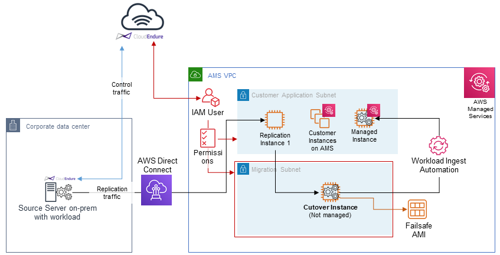

# Migrating workloads: CloudEndure landing zone (SALZ)

This section provides information on setting up an intermediate migration single-account landing zone (SALZ) for
CloudEndure (CE) cutover instances to be available for a workload ingest (WIGS) RFC.

To learn more about CloudEndure, see [CloudEndure Migration](https://aws.amazon.com/cloudendure/ "https://aws.amazon.com/cloudendure/").

###### Note

This is a predefined, security hardened, migration LZ and pattern.

Prerequisites:

- A customer AMS account
- Network and access integration between AMS account and the customer on-premise
- A CloudEndure account
- A pre-approval workflow for an AMS Security review and signoff, run with your CA
  and/or CSDM, (for example, misuse of the IAM user permanent credentials provides the ability
  to create/delete instances and security groups)

###### Note

Specific preparation and migration processes are described in this section.

Preparation: You and AMS operator:

1. Prepare a Request for Change (RFC) with the Management | Other | Other | Update
   change type to AMS for the following resources and updates. You can submit separate Other | Other Update RFCs, or one.
   For details on that RFC/CT, see [Other | Other Update](../ctref/ex-other-other-update-col.md "../ctref/ex-other-other-update-col.md") with these requests:
   1. Assign a secondary CIDR block in your AMS VPC; a temporary CIDR block that will be removed
      after the migration is completed.
      Ensure that the block will not conflict with any existing routes back to your on-premise network.
      For example, if your AMS VPC CIDR is 10.0.0.0/16,
      and there is a route back to your on-premise netword of 10.1.0.0/16, then the temporary secondary
      CIDR could be 10.255.255.0/24. For information on AWS CIDR blocks, see
      [VPC and Subnet Sizing](../../../vpc/latest/userguide/VPC_Subnets.md#VPC_Sizing "../../../vpc/latest/userguide/VPC_Subnets.md#VPC_Sizing").
   2. Create a new, private, subnet inside the initial-garden AMS VPC. Example name:
      `migration-temp-subnet`.
   3. Create a new route table for the subnet with only local VPC and NAT (Internet) routes, to
      avoid conflicts with the source server during instance cutover and possible outages.

   Ensure outbound traffic to the Internet is allowed for patch downloads, and so that AMS
   WIGS pre-requisites can be downloaded and installed. 4. Update your Managed AD security group to allow inbound and outbound traffic to/from
   `migration-temp-subnet`. Also request that your EPS load balancer (ELB) security group
   (ex: `mc-eps-McEpsElbPrivateSecurityGroup-M79OXBZEEX74`) be updated to allow the new,
   private, subnet (i.e. `migration-temp-subnet`).
   If the traffic from the dedicated CloudEndure (CE) subnet is not allowed on all three TCP ports,
   WIGS ingestion will fail. 5. Finally, request a new CloudEndure IAM policy and IAM user.
   The policy needs your correct account number, and the subnet IDs in the `RunInstances`
   statement should be: your <Customer Application Subnet(s) + Temp Migration Subnet>.

   To see an AMS pre-approved IAM CloudEndure policy: Unpack the
   [WIGS Cloud Endure Landing Zone Example](samples/wigs-ce-lz-examples.md "samples/wigs-ce-lz-examples.md")
   file and open the `customer_cloud_endure_policy.json`.

   ###### Note

   If you want a more permissive policy, discuss what you need with your
   CloudArchitect/CSDM and obtain, if needed, an AMS Security Review and Signoff
   before submitting an RFC implementing the policy.

2. Your preparation steps to use CloudEndure for AMS workload ingestion are done and, if your migration partner has completed their preparation steps,
   migration is ready to be performed. The WIGS RFC is submitted by your migration partner.

###### Note

IAM user keys won't be directly shared, but must be typed into the CloudEndure management console by
the AMS operator in a screen-sharing session.

Preparation: Migration Partner and AMS Operator:

1.  Create CloudEndure migration project.
    1. During project creation, have AMS type-in IAM user credentials in screen-sharing
       sessions.
    2. In **Replication Settings** -> **Choose the subnet where the Replication Servers will be launched**,
       select **customer-application-x** subnet.
    3. In **Replication Settings** -> **Choose the Security Groups to apply to the Replication Servers**,
       select both Sentinel security groups (Private Only and EgressAll).

2.  Define cutover options for the machines (instances).

        1. Subnet: **migration-temp-subnet**.
        2. Security Group: Both "Sentinel" security groups (Private Only and EgressAll).

        Cutover instances must be able to communicate to the AMS Managed AD and to AWS public endpoints.
        3. Elastic IP: **None**
        4. Public IP: **no**
        5. IAM role: **customer-mc-ec2-instance-profile**

        The IAM role must allow for SSM communication. Better to use AMS default.
        6. Set tags as per convention.

    Migration: Migration Partner:

3.  Create a dummy stack on AMS. You use the stack ID to gain access to the bastions.
4.  Install the CloudEndure (CE) agent on the source server. For details, see
    [Installing the Agents](https://docs.cloudendure.com/Content/Installing_the_CloudEndure_Agents/Installing_the_Agents/Installing_the_Agents.htm "https://docs.cloudendure.com/Content/Installing_the_CloudEndure_Agents/Installing_the_Agents/Installing_the_Agents.htm").
5.  Create local admin credentials on the source server.
6.  Schedule a short cutover window and click **Cutover**, when ready. This finalizes the migration and redirects users to the target AWS Region.
7.  Request stack Admin access to the dummy stack, see [Admin Access Request](../ctref/ex-access-admin-request-col.md "../ctref/ex-access-admin-request-col.md").
8.  Log into the bastion, then to the cutover instance using the local admin credentials you created.
9.  Create a failsafe AMI. For details on creating AMIs, see [AMI Create](../ctref/ex-ami-create-col.md "../ctref/ex-ami-create-col.md").
10. Prepare the instance for ingestion, see [Migrating Workloads: Prerequisites for Linux and Windows](ex-migrate-instance-prereqs.md "ex-migrate-instance-prereqs.md").
11. Run WIGS RFC against the instance, see [Workload Ingest Stack: Creating](ams-workload-ingest.md#ex-workload-ingest-col "ams-workload-ingest.md#ex-workload-ingest-col").
