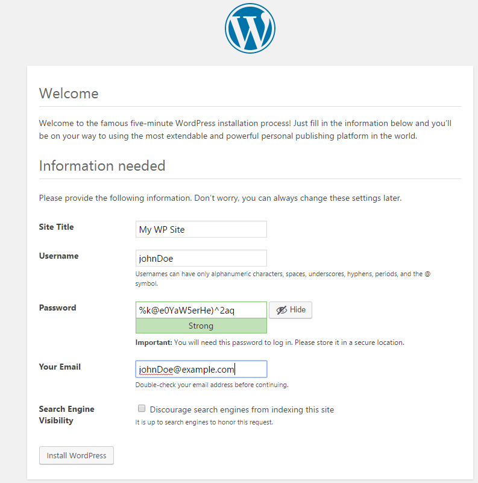

# Validate the Application Deployment

Navigate to the endpoint (LoadBalancerCName) of the previously-created load balancer, with the WordPress deployed path: /WordPress. For example:

```
http://stack-`ID-FOR-ELB`.us-east-1.elb.amazonaws.com/WordPress
```

You should see a page like this:


