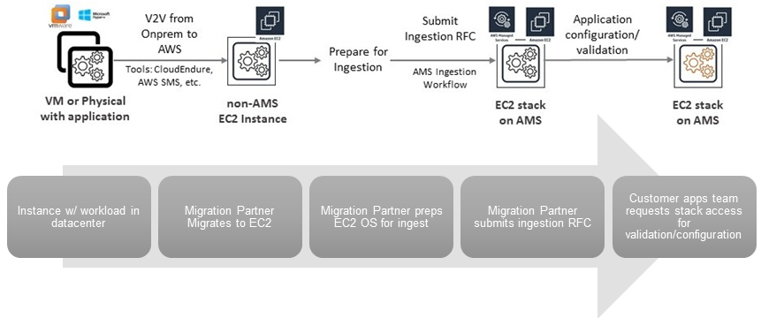

# Migrating Workloads: Standard Process

###### Note

Because two parties are required for this process, this section describes the tasks for each:
an AMS Cloud Migration Partner (migration partner), and an Application Owner (you).

1. Migration partner, Set Up:
   1. The migration partner submits a Service Request to AMS for an IAM role for the purpose
      of migrating your instance. For details on submitting service requests,
      see [Service Request Examples](../userguide/serv-req-mgmt-examples.md "../userguide/serv-req-mgmt-examples.md").
   2. The migration partner submits a
      [Admin Access Request](../ctref/ex-access-admin-request-col.md "../ctref/ex-access-admin-request-col.md").
      The AMS Operations team provides the migration partner access to your account through the requested IAM role.

2. Migration partner, Migrate Individual Workloads:
   1. The migration partner migrates your non-AWS instance to a subnet in your AMS account through native Amazon EC2 or other migration tooling, with
      the `customer-mc-ec2-instance-profile` IAM instance profile (must be in the account).
   2. The migration partner submits an RFC with the Deployment | Ingestion | Stack from migration partner migrated instance | Create CT (ct-257p9zjk14ija);
      for details on creating and submitting this RFC, see [Workload Ingest Stack: Creating](ams-workload-ingest.md#ex-workload-ingest-col "ams-workload-ingest.md#ex-workload-ingest-col").

   The execution output of the RFC returns an instance ID, IP address, and AMI ID.

   The migration partner provides you with the instance ID of the workload created in your account.

3. You, Access and Validate the Migration:
   1. Using the execution output provided you (AMI ID, instance ID, and IP address) by the migration partner, submit an access RFC and log into
      the newly-created AMS stack and verify that your application is working properly. For details,
      see [Requesting Instance Access](../ctref/ex-access-admin-request-col.md "../ctref/ex-access-admin-request-col.md").
   2. If satisfied, you can continue to use the launched instance as a 1-tier stack and/or
      use the AMI to create additional stacks, including Auto Scaling groups.
   3. If not satisfied with the migration, file a service request and reference the stack and RFC IDs; AMS will work with you to address your concerns.

 

CloudEndure landing zone workload ingest process is described next.
