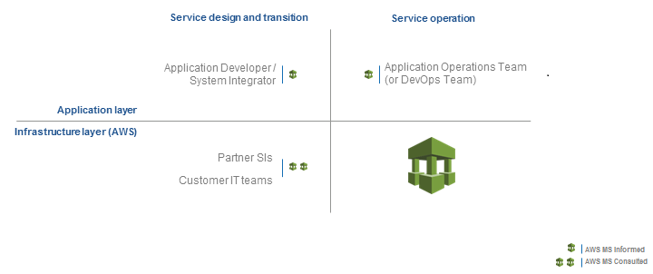

# What is my operating model?

As an AMS customer, your organization has decided to separate application and
infrastructure operations and use AMS for infrastructure operations. AMS will work
with your application design and development team along with your infrastructure design
team to ensure that your infrastructure operations run smoothly. The following graphic
illustrates this concept:

AMS takes responsibility for your AWS infrastructure operations while your
teams are responsible for your application operations. As the application and infrastructure
design teams, you must understand who will be operating the application once it has been
deployed to production in the AMS infrastructure. This guide covers common approaches
to infrastructure design as it relates to application deployment and maintenance.
