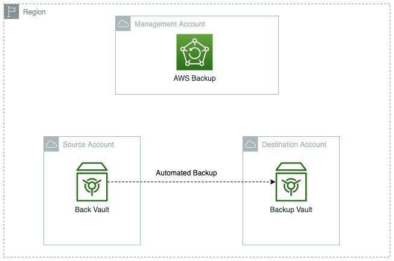

# Setting up cross account backups (intra-Region)

AWS Backup supports the ability to copy snapshots from one account to another within the same AWS Region as long as the two
accounts are within the same AWS Organization. As an example, in AMS Advanced multi-account landing zone (MALZ), you can set up cross account snapshot copy within the same
AWS Region using this quick-start.

For more information, see [AWS Backup and AWS Organizations bring cross-account backup feature](https://aws.amazon.com/about-aws/whats-new/2020/11/aws-backup-enables-aws-organizations-bring-cross-account-backup-feature/ "https://aws.amazon.com/about-aws/whats-new/2020/11/aws-backup-enables-aws-organizations-bring-cross-account-backup-feature/")

You copy snapshots cross account for disaster recovery (DR). You might have requirements to keep
snapshots within the same AWS Region, but across from the account boundaries, for data protection.


**Overview**:

At a high level, these are the steps for cross-account backups within AMS:

- Create destination account to host backups in the AWS Region where your AMS landing zone is hosted (step 1)
- Create a KMS key for encrypting backups in the destination account (step 3)
- Create a backup vault in the destination account of the same region as your AMS Advanced landing zone (step 4)
- Enable the cross account setting in your Management account (step 5)
- Create or modify the source account backup plan and rule(s) (step 6)

###### Note

Ensure that both the source and destination accounts are in the same Region. If you want to copy your backups cross region, contact your CA or CSDM.

**To enable and set up cross-account backups:**

1. Create a destination account to host backups; if you already have such an account, you can skip this step.
   To create the account, submit an RFC from your Management Payer account using the
   _Deployment | Managed landing zone | Management account | Create application account (with VPC)_ change type (ct-1zdasmc2ewzrs).
2. [Optional] If resources or snapshots are encrypted in the source account (for example, Prod), share the KMS key used for encryption
   with the destination account. To do this, submit an RFC using the
   _Management | Advanced stack components | KMS key | Update_ change type (ct-3ovo7px2vsa6n).
3. In the destination account, create a KMS Key to be used for Backup Vault encryption. To do this, submit an RFC using the
   _Deployment | Advanced stack components | KMS key | Create (auto)_ change type (ct-1d84keiri1jhg).
4. In the destination account, create a Backup Vault using the key created earlier. AWS Backup Vaults can be created by using the CFN ingest
   automated change type, _Deployment | Ingestion | Stack from CloudFormation Template | Create_ (ct-36cn2avfrrj9v). In the same request, the
   vault access policy needs to be modified to allow the source account(s) access to the vault. Here is an example policy:

Example CloudFormation template for a Backup Vault:

```
{
  "Description": "Test infrastructure",
  "Resources": {
  "BackupVaultForTesting": {
    "Type": "AWS::Backup::BackupVault",
    "Properties": {
      "BackupVaultName": "backup-vault-for-test",
      "EncryptionKeyArn" : "arn:aws:kms:us-east-2:123456789012:key/227d8xxx-aefx-44ex-a09x-b90c487b4xxx",
        "AccessPolicy" : {
          "Version": "2012-10-17",
          "Statement": [
            {
              "Sid": "AllowSrcAccountPermissionsToCopy",
              "Effect": "Allow",
              "Action": "backup:CopyIntoBackupVault",
              "Resource": "*",
              "Principal": {
                "AWS": ["arn:aws:iam::987654321098:root"]
              }
            }
          ]
        }
      }
    }
  }
}
```

5. From your Management Payer account, enable **Cross-Account backup**. To do this, submit an RFC using the
   _Management | AWS Backup | Backup plan | Enable cross account copy (Management account)_ change type (ct-2yja7ihh30ply).
6. Lastly, from the source account where backups are sourced, create the rule or rules of the backup plan that govern the backups to
   copy snapshots cross account. To do this, submit an RFC using the _Deployment | AWS Backup | Backup plan | Create_ change type(ct-2hyozbpa0sx0m).
   If you need to update an existing backup plan, submit an RFC using the
   _Management | Other | Other | Update_ change type (ct-0xdawir96cy7k) with this information:
   1. The backup plan name as well as the rule name to be updated.
   2. The destination/ICE account backup vault ARN.
   3. The retention days/months you would like to keep the snapshots in the target ICE vault for.
