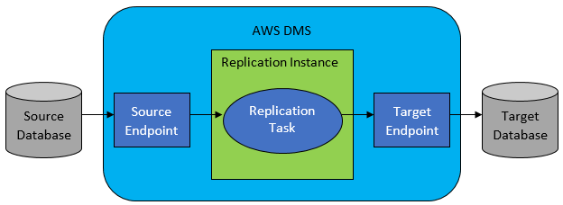

# AWS Database Migration Service (AWS DMS)

AWS Database Migration Service (AWS DMS) helps you migrate databases to AMS easily and securely. You can migrate your data to and from most widely
used commercial and open-source databases, such as Oracle, MySQL, and PostgreSQL. The service supports homogeneous migrations such as Oracle to Oracle,
and also heterogeneous migrations between different database platforms, such as Oracle to PostgreSQL or MySQL to Oracle. AWS DMS is an AWS service; the AMS
CTs help you create AWS DMS resources in your AMS-managed account

The following graphic depicts the workflow of an database migration.

###### Topics

- [AWS Database Migration Service (AWS DMS), before you begin](ex-create-dms-plan.md "ex-create-dms-plan.md")
- [AWS DMS, required data for setup](ex-create-dms-reqs.md "ex-create-dms-reqs.md")
- [AWS DMS setup tasks](ex-create-dms-all-tasks.md "ex-create-dms-all-tasks.md")
- [AWS DMS management](ex-create-dms-manage.md "ex-create-dms-manage.md")
