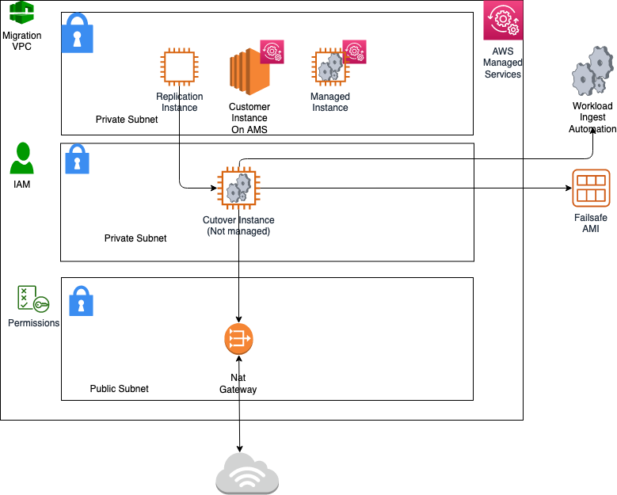

# Enable access to the new AMS Tools account

Once the tools account is created, AMS provides you with an account ID. Your next step is to configure access to the new account. Follow these steps.

1. Update the appropriate Active Directory groups to the appropriate account IDs.

New AMS-created accounts are provisioned with the ReadOnly role policy as well as a role to allow users to file RFCs.

The Tools account also has an additional IAM role and user available:

    * IAM role: `AWSManagedServicesMigrationRole`
    * IAM user: `customer_cloud_endure_user`

2. Request policies and roles to allow service integration team members to set up the next level of tools.

Navigate to the AMS console and file the following RFCs:

    1. Create KMS key. Use either
     [Create KMS Key (auto)](../ctref/ex-kms-key-create-auto-col.md "../ctref/ex-kms-key-create-auto-col.md") or
     [Create KMS Key (managed automation)](../ctref/ex-kms-key-create-rr-col.md "../ctref/ex-kms-key-create-rr-col.md").

    As you use KMS to encrypt ingested resources, using a single KMS key that is shared with the rest of the Multi-Account Landing Zone application accounts, provides security for
     ingested images where they can be decrypted in the destination account.
    2. Share the KMS key.

    Use the Management | Advanced stack components | KMS key | Share (managed automation) change type (ct-05yb337abq3x5) to request that the
     new KMS key be shared with your application accounts where ingested AMIs will reside.

Example graphic of a final account setup:

