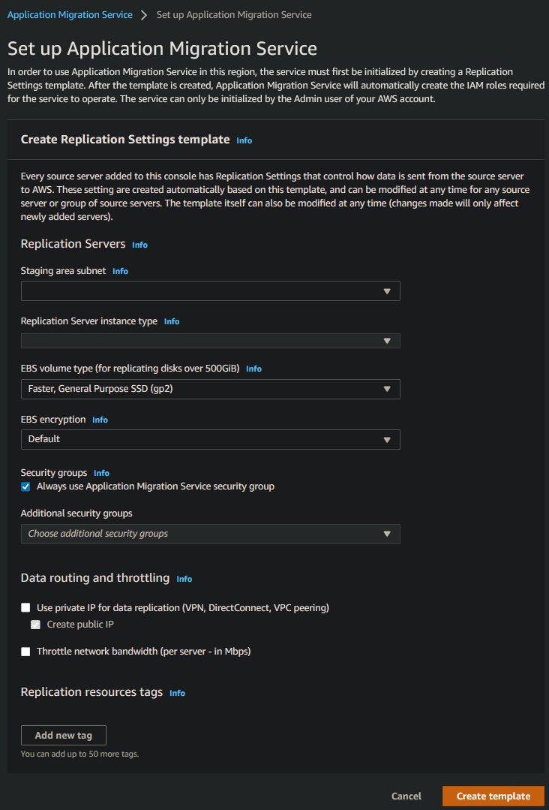

# AWS Application Migration Service (AWS MGN)

[AWS Application Migration Service](https://aws.amazon.com/application-migration-service/ "https://aws.amazon.com/application-migration-service/") (AWS MGN)
can be used in your MALZ Tools account through the `AWSManagedServicesMigrationRole` IAM role that is created automatically during
Tools account provisioning. You can use AWS MGN to migrate applications and databases that run on supported versions of Windows and Linux
[operating systems](../../../mgn/latest/ug/Supported-Operating-Systems.md "../../../mgn/latest/ug/Supported-Operating-Systems.md").

For the most up-to-date information on AWS Region support, see
[the AWS Regional Services List](https://aws.amazon.com/about-aws/global-infrastructure/regional-product-services/ "https://aws.amazon.com/about-aws/global-infrastructure/regional-product-services/").

If your preferred AWS Region is not currently supported by AWS MGN, or the operating system on which your applications run is
not currently supported by AWS MGN, consider using the
[CloudEndure Migration](https://console.cloudendure.com/#/register/register "https://console.cloudendure.com/#/register/register") in your Tools account instead.

**Requesting AWS MGN Initialization**

AWS MGN must be [initialized](../../../mgn/latest/ug/mandatory-setup.md "../../../mgn/latest/ug/mandatory-setup.md") by AMS
before first use. To request this for a new Tools account, submit a Management | Other | Other RFC from the Tools account with
these details:

```
RFC Subject=Please initialize AWS MGN in this account
RFC Comment=Please click 'Get started' on the MGN welcome page here:

    https://console.aws.amazon.com/mgn/home?region=MALZ_PRIMARY_REGION#/welcome using all default values
    to 'Create template' and complete the initialization process.
```

Once AMS successfully completes the RFC and initializes AWS MGN in your Tools account, you can use
`AWSManagedServicesMigrationRole` to edit the default template for your requirements.


